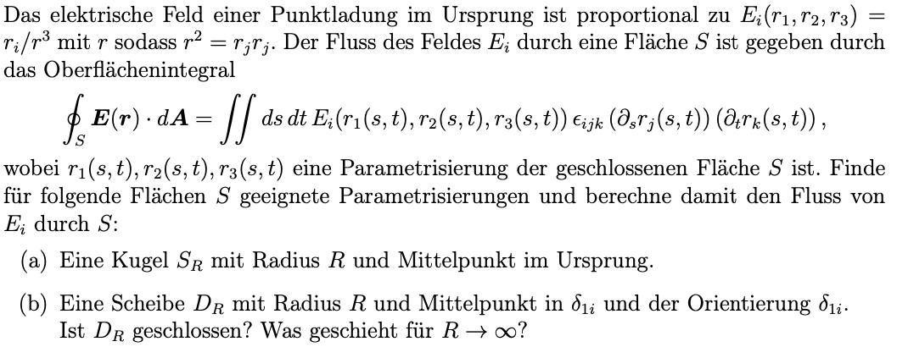
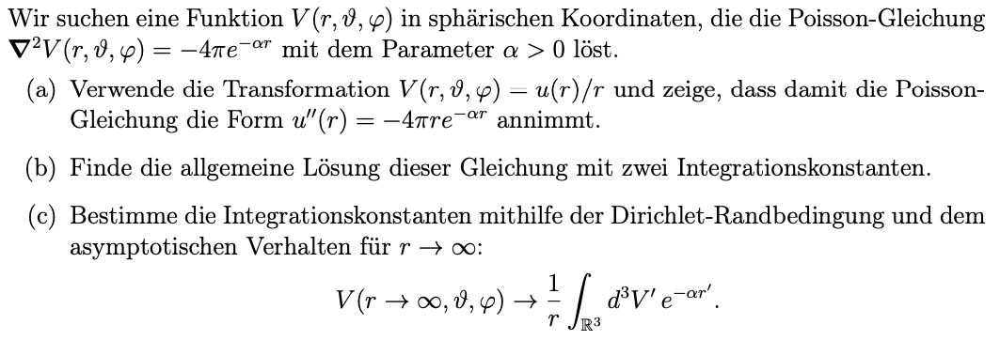
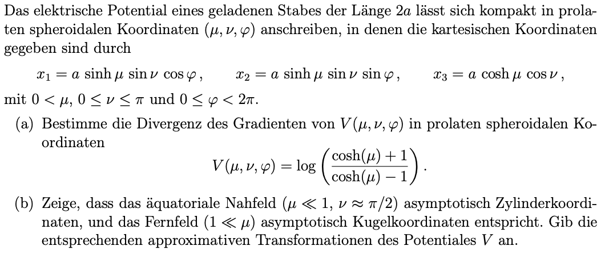

## 2. Problem Set - 16.03.2022
Elektrodynamik I - 136.015

### 4 Elektrischer Fluss

#### (a)
$$\oint_S\boldsymbol{E}(\boldsymbol{r})\cdot d\boldsymbol{A}=\int\int dsdt\, E_i(r_1(s,t),r_2(s,t),r_3(s,t))\epsilon_{ijk}(\partial_sr_j(s,t))(\partial_tr_k(s,t))$$
Bei $S$ handelt es sich um eine Kugel -> dreidimensionaler Raum -> bei $\vec{r}$ handelt es sich um Kugelkoordinaten:
$$r(\theta,\varphi)=\left[{\begin{array}{cc} r_1(\theta,\varphi) \\ r_2(\theta,\varphi) \\ r_3(\theta,\varphi) \\ \end{array} }\right]=\left[{\begin{array}{cc} r\cdot\sin{\theta}\cdot\cos{\varphi} \\ r\cdot\sin{\theta}\cdot\sin{\varphi} \\ r\cdot\cos{\theta} \\ \end{array} }\right]$$
Mit $\theta = s$, $\varphi=t$ und $r=R$ folgt:
$$\implies r(s,t)=\left[{\begin{array}{cc} r_1(s,t) \\ r_2(s,t) \\ r_3(s,t) \\ \end{array} }\right]=\left[{\begin{array}{cc} R\cdot\sin{s}\cdot\cos{t} \\ R\cdot\sin{s}\cdot\sin{t} \\ R\cdot\cos{s} \\ \end{array} }\right]$$
Die Terme $\partial_sr_j(s,t)$ und $\partial_tr_k(s,t)$ aus der Formel für den Fluss können daraus berechnet werden.
$$\partial_sr(s,t)=\left[{\begin{array}{cc} R\cdot\cos{s}\cdot\cos{t} \\ R\cdot\cos{s}\cdot\sin{t} \\ (-1)\cdot R\cdot\sin{s} \\ \end{array} }\right]$$
$$\partial_tr(s,t)=\left[{\begin{array}{cc} (-1)\cdot R\cdot\sin{s}\cdot\sin{t} \\ R\cdot\sin{s}\cdot\cos{t} \\ R\cdot0 \\ \end{array} }\right]$$
Um die Formel für den Fluss weiter zu berechnen, kann nun der Term $\epsilon_{ijk}(\partial_sr_j(s,t))(\partial_tr_k(s,t))$ (das Kreuzprodukt) aufgelöst werden.
$$\epsilon_{ijk}(\underbrace{\partial_sr_j(s,t)}_{\vec{a}})(\underbrace{\partial_tr_k(s,t)}_{\vec{b}})=\sum_{i,j,k=1}^3 \epsilon_{ijk}a_ib_j\vec{e}_k$$
$$=\epsilon_{ijk}a_jb_k+\epsilon_{ikj}a_kb_j+\epsilon_{jki}a_kb_i+\epsilon_{jik}a_ib_k+\epsilon_{kij}a_ib_j+\epsilon_{kji}a_jb_i$$
Nachdem $\partial_tr_3(s,t)$ bzw. in unserem Fall $b_k$ gleich $0$ ist, fallen zwei Terme direkt weg.
$$=\underbrace{\epsilon_{ijk}a_jb_k}_{=0}+\epsilon_{ikj}a_kb_j+\epsilon_{jki}a_kb_i+\underbrace{\epsilon_{jik}a_ib_k}_{=0}+\epsilon_{kij}a_ib_j+\epsilon_{kji}a_jb_i$$
Durch Einsetzen der Werte für gerade bzw. ungerade Permutationen folgt weiters:
$$=\underbrace{\epsilon_{ikj}}_{=(-1)}a_kb_j+\underbrace{\epsilon_{jki}}_{=(+1)}a_kb_i+\underbrace{\epsilon_{kij}}_{=(+1)}a_ib_j+\underbrace{\epsilon_{kji}}_{=(-1)}a_jb_i$$
$$=a_kb_i-a_kb_j+a_ib_j-a_jb_i$$
Mit den eingesetzten Werten für $a$ und $b$ ergibt sich
$$\begin{align}=(-R\cdot \sin{s})\cdot(-R\cdot\sin{s}\cdot\sin{t})-&(-R\cdot\sin{s})\cdot(R\cdot\sin{s}\cdot\cos{t})\\+(R\cdot\cos{s}\cdot\cos{t})\cdot(R\cdot\sin{s}\cdot\cos{t})-&(R\cdot\cos{s}\cdot\sin{t})\cdot(-R\cdot\sin{s}\cdot\sin{t})\end{align}$$
$$\begin{align}\epsilon_{ijk}(\partial_sr_j(s,t))(\partial_tr_k(s,t))=R^2\cdot\sin^2{s}\cdot\sin{t}+&R^2\cdot\sin^2{s}\cdot\cos{t}\\
+R^2\cdot\sin{s}\cdot\cos{s}\cdot\cos^2{t}+&R^2\cdot\sin{s}\cdot\cos{s}\cdot\sin^2{t}\end{align}$$
Folgend wird der Term $E_i(r_1(s,t),r_2(s,t),r_3(s,t))$ aufgelöst. Aus der Angabe folgt:
$$E_i(r_1,r_2,r_3)=\frac{r_i}{r^3}\,mit\,r^2=r_jr_j$$
$$r^2=R^2\cdot\sin^2{s}\cdot\cos^2{t}+ R^2\cdot\sin^2{s}\cdot\sin^2{t}+R^2\cdot\cos^2{s}$$
$$r^2=R^2\cdot(\underbrace{\sin^2{s}\cdot(\underbrace{\sin^2{t}+\cos^2{t}}_{=1})+\cos^2{s}}_{=1})$$
Somit gilt für $r^2=R^2$, wodurch $r=R$ gilt. Damit lässt sich widerum $r^3$ berechnen:
$$r^3=R^3\implies E_i(r_1,r_2,r_3)=\frac{r_i}{R^3}$$
Kombiniert mit der ersten Berechnung kann somit nun in die Formel für den Fluss eingesetzt werden:
$$\begin{align}E_i(r_1(s,t),r_2(s,t),r_3(s,t))&\epsilon_{ijk}(\partial_sr_j(s,t))(\partial_tr_k(s,t))=\\ r_i\cdot\frac{R^2}{R^3}\cdot(\underbrace{\sin^2{s}\cdot\sin{t}}_{\epsilon_{jki}a_kb_i}+&\underbrace{\sin^2{s}\cdot\cos{t}}_{\epsilon_{ikj}a_kb_j}\\
+\underbrace{\sin{s}\cdot\cos{s}\cdot\cos^2{t}}_{\epsilon_{kij}a_ib_j}+&\underbrace{\sin{s}\cdot\cos{s}\cdot\sin^2{t}}_{\epsilon_{kji}a_jb_i})\end{align}$$
$$\begin{align}=\frac{R^2}{R^3}\cdot((R\cdot\sin{s}\cdot\sin{t})\cdot(\sin^2{s}\cdot\sin{t})+&(R\cdot\sin{s}\cdot\cos{t})\cdot(\sin^2{s}\cdot\cos{t})\\
+(R\cdot\cos{s})\cdot(\sin{s}\cdot\cos{s}\cdot\cos^2{t}+&\sin{s}\cdot\cos{s}\cdot\sin^2{t}))\end{align}$$
$$\begin{align}=\underbrace{\frac{R^3}{R^3}}_{=1}\cdot((\sin^3{s}\cdot\sin^2{t})+&(\sin^3{s}\cdot\cos^2{t})+\\(\sin{s}\cdot\cos^2{s}\cdot\cos^2{t})+&(\sin{s}\cdot\cos^2{s}\cdot\sin^2{t}))\end{align}$$
$$\begin{align}=\sin^3{s}\cdot(\underbrace{\sin^2{t}+\cos^2{t}}_{=1})+\sin{s}\cdot\cos^2{s}\cdot(\underbrace{\sin^2{t}+\cos^2{t}}_{=1})\end{align}$$
$$E_i(r_1(s,t),r_2(s,t),r_3(s,t))\epsilon_{ijk}(\partial_sr_j(s,t))(\partial_tr_k(s,t))=\sin^3{s}+\sin{s}\cdot{\cos^2{s}}$$
Der resultierende Term wird nun in die ganze Formel für den Fluss eingesetzt:
$$\oint_S\boldsymbol{E}(\boldsymbol{r})\cdot d\boldsymbol{A}=\int\int dsdt\,(\sin^3{s}+\sin{s}\cdot{\cos^2{s}})$$
Als erstes wird die Integration nach $s$ durchgeführt:
$$\int_s\sin^3{s}+\sin{s}\cdot{\cos^2{s}}\,ds=\int_s\sin{s}(\underbrace{\sin^2{s}+\cos^2{s}}_{=1})\,ds$$
$$\int_s\sin{s}\,ds=-\cos{s}$$
Als zweites erfolgt die Integration nach $t$:
$$\int_t-\cos{s}\,dt=-t\cdot\cos{s}$$
Mit den Grenzen $\theta\in[0,\pi]$ und $\varphi\in[0,2\pi]$ sowie den Beziehungen $\theta=s$ und $\varphi=t$ für Kugelkoordinaten folgt final:
$$-t\cdot\cos{s}\vert_{s\in[0,\pi]\,t\in[0,2\pi]}=-t\cdot\underbrace{\cos{\pi}}_{=-1}-(-t\cdot\underbrace{\cos{0}}_{=1})\vert_{t\in[0,2\pi]}=2t\vert_{t\in[0,2\pi]}$$
$$=2\cdot2\pi-0=\underline{\underline{4\pi}}$$
$$\implies \oint_S\boldsymbol{E}(\boldsymbol{r})\cdot d\boldsymbol{A}=4\pi$$

#### (b)
$$\oint_D\boldsymbol{E}(\boldsymbol{r})\cdot d\boldsymbol{A}=\int\int dsdt\, E_i(r_1(s,t),r_2(s,t),r_3(s,t))\epsilon_{ijk}(\partial_sr_j(s,t))(\partial_tr_k(s,t))$$
Bei $D$ handelt es sich um eine Scheibe mit Radius R. Dadurch kann der Vektor $\vec{r}$ in Polarkoordinaten angenommen werden:
$$r(r,\varphi)=\left[{\begin{array}{cc} r_1(r,\varphi)\\r_2(r,\varphi)\\r_3(r,\varphi)\end{array} }\right]=\left[{\begin{array}{cc} 1\\r\cdot\cos{\varphi}\\r\cdot\sin{\varphi}\end{array} }\right]$$
Mit $\varphi = s$ und $r=t$ folgt:
$$\implies r(s,t)=\left[{\begin{array}{cc} r_1(s,t)\\r_2(s,t)\\r_3(s,t)\end{array} }\right]=\left[{\begin{array}{cc} 1\\s\cdot\cos{t}\\s\cdot\sin{t}\end{array} }\right]$$
Betrachtet man nun erneut die Formel für den Fluss aus der Angabe, können im nächsten Schritt die Terme $\partial_sr(st)$ und $\partial_tr(s,t)$ berechnet werden:
$$\partial_sr(s,t)=\left[{\begin{array}{cc} 0\\\cos{t}\\\sin{t}\end{array} }\right]$$
$$\partial_sr(s,t)=\left[{\begin{array}{cc} 0\\-s\cdot\sin{t}\\s\cdot\cos{t}\end{array} }\right]$$
Wie bereits in Unterpunkt 4a) können wir nun wieder den Term $\epsilon_{ijk}(\underbrace{\partial_sr_j(s,t)}_{\vec{a}})(\underbrace{\partial_tr_k(s,t)}_{\vec{b}})$ auflösen:
$$\epsilon_{ijk}(\underbrace{\partial_sr_j(s,t)}_{\vec{a}})(\underbrace{\partial_tr_k(s,t)}_{\vec{b}})=\sum_{i,j,k=1}^3 \epsilon_{ijk}a_ib_j\vec{e}_k$$
$$=\epsilon_{ijk}a_jb_k+\epsilon_{ikj}a_kb_j+\epsilon_{jki}a_kb_i+\epsilon_{jik}a_ib_k+\epsilon_{kij}a_ib_j+\epsilon_{kji}a_jb_i$$
Nachdem in unserem Fall $a_i$ und $b_i$ gleich Null sind, reduziert sich der Ausdruck zu:
$$=\epsilon_{ijk}a_jb_k+\epsilon_{ikj}a_kb_j$$
Durch Einsetzen der Werte für gerade bzw. ungerade Permutationen folgt weiters:
$$=\underbrace{\epsilon_{ijk}}_{=+1}a_jb_k+\underbrace{\epsilon_{ikj}}_{=-1}a_kb_j$$
Nun können die Werte für $a$ und $b$ wieder eingesetzt werden:
$$=a_jb_k-a_kb_j=s\cdot\cos{t}\cdot\cos{t}-(-s)\cdot\sin{t}\cdot\sin{t}$$
$$=s\cdot(\underbrace{\sin^2{t}+\cos^2{t}}_{=1})=s$$
In Vektorschreibweise entspricht das:
$$=\left[{\begin{array}{cc} s\\0\\0\end{array} }\right]$$
Für $r^2$ gilt gemäß der Angabe $r^2=r_j\cdot r_j$, womit $r^2$ berechnet werden kann als:
$$r^2=r_j(s,t)\cdot r_j(s,t)$$
$$=\left[{\begin{array}{cc} 1\\s\cdot\cos{t}\\s\cdot\sin{t}\end{array} }\right]\cdot\left[{\begin{array}{cc} 1\\s\cdot\cos{t}\\s\cdot\sin{t}\end{array} }\right]=1+s^2\cdot\cos^2{t}+s^2\cdot\sin^2{t}$$
$$r^2=1+s^2\cdot(\underbrace{\sin^2{t}+\cos^2{t}}_{=1})=1+s^2$$
Daraus folgt für $r$:
$$r=\sqrt{r^2}=\sqrt{s^2+1}$$
Somit kann $r^3$ bestimmt werden als:
$$r^3=(\sqrt{s^2+1})^3=(s^2+1)^{\frac{3}{2}}$$
Um die Berechnung der Formel für den Fluss weiter zu führen, ergibt sich der Term $r_i\cdot\epsilon_{ijk}\cdot(\partial_sr_j(s,t))\cdot(\partial_tr_k(s,t))$ zu:
$$=\frac{r_i}{r^3}\cdot\epsilon_{ijk}\cdot(\partial_sr_j(s,t))\cdot(\partial_tr_k(s,t))=\frac{r_i}{r^3}\cdot \left[{\begin{array}{cc} s\\0\\0\end{array} }\right]=\frac{1}{r^3}\cdot\left[{\begin{array}{cc} s\\0\\0\end{array} }\right]\cdot\left[{\begin{array}{cc} 1\\s\cdot\cos{t}\\s\cdot\sin{t}\end{array} }\right]$$
$$=\frac{s}{r^3}=\frac{s}{(s^2+1)^{\frac{3}{2}}}$$
Nun kann das Doppelintegral der Formel für den Fluss berechnet werden:
$$\int_0^{2\pi}\int_0^R\frac{s}{(s^2+1)^{\frac{3}{2}}}dsdt$$
Durch die Substitution von $s^2+1$ durch $u$, mit $\frac{du}{ds}=2\cdot s\implies ds=\frac{1}{2\cdot s}du$, ergibt sich für das innere Integral:
$$=\int_0^{2\pi}\frac{1}{2}\cdot\int_0^R\frac{1}{u^{\frac{3}{2}}}dsdt$$
Mit der Potenzregel ($\int u^ndu=\frac{u^{n+1}}{n+1}$) für Integrationen folgt:
$$=\int_0^{2\pi}\frac{1}{2}\cdot\int_0^R\frac{u^{-\frac{1}{2}}}{-\frac{1}{2}}du=\int_0^{2\pi}\frac{1}{2}\cdot\int_0^R-\frac{2}{\sqrt{u}}du=\int_0^{2\pi}\underbrace{-\frac{2}{2}}_{=-1}\cdot(\frac{1}{\sqrt{s^2+1}})\Biggl|_0^Rdt$$
$$=\int_0^{2\pi}(-1\cdot\frac{1}{\sqrt{R^2+1}})-(-1)\,dt$$
Nun folgt die Integration nach $t$:
$$=t\cdot(-\frac{1}{\sqrt{R^2+1}}+1)\Biggl|_0^{2\pi}=t\cdot(-\frac{1}{\sqrt{R^2+1}}+\frac{\sqrt{R^2+1}}{\sqrt{R^2+1}})\Biggl|_0^{2\pi}=t\cdot(\frac{-1+\sqrt{R^2+1}}{\sqrt{R^2+1}})\Biggl|_0^{2\pi}$$
$$\oint_D\boldsymbol{E}(\boldsymbol{r})\cdot d\boldsymbol{A}=2\pi\cdot\frac{-1+\sqrt{R^2+1}}{\sqrt{R^2+1}}$$
Für $R\rightarrow\infty$ entspricht der Fluss somit $2\pi$.
Bezüglich der Geschlossenheit der Scheibe $D_R$ gilt: Die Scheibe $D_R$ ist **nicht geschlossen**, da sie einen Rand besitzt und somit offen ist. (laut dem 2. Plenum)

### 5 Poisson-Gleichung in sphärischen Koordinaten

#### (a)
Gemäß der Angabe wird die folgende Transformation verwendet:
$$V(r,\vartheta,\varphi)=\frac{u(r)}{r}$$
Gesucht ist eine Funktion, welche die Poisson-Gleichung $\nabla^2V(r,\vartheta,\varphi)$ löst.
Der Term $\nabla^2V(r,\vartheta,\varphi)$ kann auch als Divergenz des Gradienten interpretiert werden (siehe u.a. Beispiel 6):
$$\nabla^2V(r,\vartheta,\varphi)=\nabla\cdot(\nabla V(r,\vartheta,\varphi))$$
Wie bereits in Beispiel 6 erläutert können Gradient und Divergenz gemäß dem 1. Plenum auch geschrieben werden als:
$$\nabla V=\frac{1}{h_i}\cdot\frac{\partial}{\partial u_i}$$
$$\nabla\cdot V=\frac{1}{H}\cdot\partial_j(\frac{H}{h_j}F_j)\,mit\,H=H(r,\nu,\varphi)$$
Mit den in der Angabe beschriebenen sphärischen Koordinaten (=Kugelkoordinaten) kann $H$ berechnet werden:
$$\vec{x}=\left[{\begin{array}{cc} r\cdot\sin{\vartheta}\cdot\cos{\varphi}\\r\cdot\sin{\vartheta}\cdot\sin{\varphi}\\r\cdot\cos{\vartheta}\end{array} }\right]$$
Die Berechnung der einzelnen $h$ erfolgt analog zu dem Vorgehen in Beispiel 6:
$$\partial_rx_1=\sin{\vartheta}\cdot\cos{\varphi}$$
$$\partial_rx_2=\sin{\vartheta}\cdot\sin{\varphi}$$
$$\partial_rx_3=\cos{\vartheta}$$
$$(\partial_rx_i)\cdot(\partial_rx_i)=\sin^2{\vartheta}\cdot\cos^2{\varphi}+\sin^2{\vartheta}\cdot\sin^2{\varphi}+\cos^2{\vartheta}$$
$$=\underbrace{\sin^2{\vartheta}\cdot(\underbrace{\sin^2{\varphi}+\cos^2{\varphi}}_{=1})+\cos^2{\vartheta}}_{=1}=1$$
$$h_r=1$$
---
$$\partial_{\vartheta}x_1=r\cdot\cos{\vartheta}\cdot\cos{\varphi}$$
$$\partial_{\vartheta}x_2=r\cdot\cos{\vartheta}\cdot\sin{\varphi}$$
$$\partial_{\vartheta}x_3=-r\cdot\sin{\vartheta}$$
$$(\partial_{\vartheta}x_i)\cdot(\partial_{\vartheta}x_i)=r^2\cdot\cos^2{\vartheta}\cdot\cos^2{\varphi}+r^2\cos^2{\vartheta}\cdot\sin^2{\varphi}+r^2\sin^2{\vartheta}$$
$$=r^2\cdot\cos^2{\vartheta}\cdot(\underbrace{\sin^2{\varphi}+\cos^2{\varphi}}_{=1})+r^2\cdot\sin^2{\vartheta}=r^2\cdot(\underbrace{\sin^2{\vartheta}+\cos^2{\vartheta}}_{=1})=r^2$$
$$h_{\vartheta}=r$$
---
$$\partial_{\varphi}x_1=-r\cdot\sin{\vartheta}\cdot\sin{\varphi}$$
$$\partial_{\varphi}x_2=r\cdot\sin{\vartheta}\cdot\cos{\varphi}$$
$$\partial_{\varphi}x_3=0$$
$$(\partial_rx_i)\cdot(\partial_rx_i)=r^2\cdot\sin^2{\vartheta}\cdot\sin^2{\varphi}+r^2\sin^2{\vartheta}\cdot\cos^2{\varphi}+0$$
$$=r^2\cdot\sin^2{\vartheta}\cdot(\underbrace{\sin^2{\varphi}+\cos^2{\varphi}}_{=1})=r^2\cdot\sin^2{\vartheta}$$
$$h_{\varphi}=r\cdot\sin{\vartheta}$$
---
Somit folgt für den Gradient:
$$\nabla V=\frac{1}{h_r}\cdot\frac{\partial V}{\partial u_r}=\frac{1}{1}\cdot(\frac{u'(r)}{r}+u(r)\cdot r^{-2}\cdot(-1))$$
$$=u'(r)\cdot r^{-1}-u(r)\cdot r^{-2}$$
Für die Divergenz ergibt sich:
$$\nabla\cdot V=\frac{1}{H}\cdot\partial_r(\frac{H}{h_r}\nabla V)=\frac{1}{H}\cdot\partial_r(\frac{H}{h_r}\cdot\frac{1}{h_r}\cdot\frac{\partial V}{\partial u_r})$$
$$=\frac{1}{r^2\cdot\sin{\vartheta}}\cdot\partial_r(\frac{r^2\cdot\sin{\vartheta}}{1}\cdot(u'(r)\cdot r^{-1}-u(r)\cdot r^{-2}))$$
$$=\frac{1}{r^2}\cdot\partial_r(r^2\cdot(\frac{u'(r)}{r}-\frac{u(r)}{r^2})))$$
$$=\frac{1}{r^2}\cdot\partial_r(r\cdot u'(r)-u(r))$$
$$=\frac{1}{r^2}\cdot(u'(r)+r\cdot u''(r)-u'(r))$$
$$=\frac{r}{r^2}\cdot u''(r)=\frac{1}{r}\cdot u''(r)$$
Gemäß der Angabe soll nun eine Funktion $u(r)$ gefunden werden, für die gilt:
$$\nabla^2V(r,\vartheta,\varphi)=-4\pi e^{-\alpha r}$$
Mit unseren Berechnungen ergibt sich also:
$$\frac{1}{r}\cdot u''(r)=-4\pi e^{-\alpha r}\implies u''(r)=-4\pi re^{-\alpha r}$$

#### (b)
$$u'(r)=\int u''(r)dr=-4\pi\int r\cdot e^{-\alpha r}dr$$
Im ersten Integrationsschritt können wir partiell integrieren:
$$\int f'g=fg-\int fg'$$
$$f'=e^{-\alpha r} \rightarrow f=-\frac{e^{-\alpha r}}{\alpha}$$
$$g=r\rightarrow g'=1$$
Daraus folgt:
$$=-\frac{e^{-\alpha r}}{\alpha}\cdot r-\int-\frac{e^{-\alpha r}}{\alpha}\cdot1\,dr=-\frac{e^{-\alpha r}}{\alpha}\cdot r+\int\frac{e^{-\alpha r}}{\alpha}dr$$
Mit Hilfe der Substitution nach $u=-\alpha r$ und $\frac{du}{dr}=-\alpha\rightarrow dr=-\frac{1}{\alpha}du$ folgt:
$$=-\frac{1}{\alpha^2}\int e^udu=-\frac{1}{\alpha^2}e^u$$
Mit der Rücksubstitution ergibt sich:
$$=-\frac{1}{\alpha^2}e^{-\alpha r}$$
Eingesetzt in den Term für $u'(r)$ folgt:
$$u'(r)=-4\pi\cdot(-\frac{e^{-\alpha r}}{\alpha}\cdot r-\frac{1}{\alpha^2}e^{-\alpha r})+C_1$$
$$=\frac{4\pi}{\alpha}\cdot(\frac{1}{\alpha}e^{-\alpha r}+e^{-\alpha r}\cdot r)+C_1$$
---
Nun ergibt sich $u(r)=\int u'(r)dr$:
$$u(r)=\int u'(r)dr=\int\frac{4\pi}{\alpha}\cdot(\frac{1}{\alpha}e^{-\alpha r}+e^{-\alpha r}\cdot r)\,dr$$
$$=\frac{4\pi}{\alpha}\cdot\int\frac{1}{\alpha}e^{-\alpha r}+e^{-\alpha r}\cdot r\,dr$$
$$=\frac{4\pi}{\alpha^2}\cdot\int e^{-\alpha r}+e^{-\alpha r}\cdot r\cdot\alpha\,dr$$
$$=\frac{4\pi}{\alpha^2}\cdot\int e^{-\alpha r}\cdot(\alpha\cdot r+1)\,dr$$
Wir können nun wieder partiell integrieren:
$$f'=e^{-\alpha r}\rightarrow f=-\frac{e^{-\alpha r}}{\alpha}$$
$$g=\alpha\cdot r+1\rightarrow g'=\alpha$$
$$=-\frac{(\alpha\cdot r+1)\cdot e^{-\alpha r}}{\alpha}-\int-\alpha\cdot\frac{e^{-\alpha r}}{\alpha}dr=-\frac{(\alpha\cdot r+1)\cdot e^{-\alpha r}}{\alpha}+\int e^{-\alpha r}dr$$
Mit der Substitution von der ersten Integration folgt erneut:
$$=-\frac{(\alpha\cdot r+1)\cdot e^{-\alpha r}}{\alpha}-\frac{e^{-\alpha r}}{\alpha}$$
Somit ergibt sich für die Integration final:
$$u(r)=\frac{4\pi}{\alpha^2}\cdot(-\frac{(\alpha\cdot r+1)\cdot e^{-\alpha r}}{\alpha}-\frac{e^{-\alpha r}}{\alpha})$$
$$=\frac{4\pi}{\alpha^2}\cdot(-\frac{(\alpha\cdot r+2)\cdot e^{-\alpha r}}{\alpha})$$
$$u(r)=-\frac{4\pi\cdot e^{-\alpha r}}{\alpha^3}\cdot(\alpha\cdot r+2)+r\cdot C_1+C_2$$

### 6 Geladener Stab

#### (a)
Aus der Angabe kann der Vektor $\vec{x}$ folgendermaßen angeschrieben werden:
$$\vec{x}(\mu,\nu,\varphi)=\left[{\begin{array}{cc}x_1(\mu,\nu,\varphi)\\x_2(\mu,\nu,\varphi)\\x_3(\mu,\nu,\varphi)\end{array}}\right]=\left[{\begin{array}{cc}a\cdot\sinh{\mu}\cdot\sin{\nu}\cdot\cos{\varphi}\\a\cdot\sinh{\mu}\cdot\sin{\nu}\cdot\sin{\varphi}\\a\cdot\cosh{\mu}\cdot\cos{\nu}\end{array}}\right]$$
Die Divergenz des Gradienten von $V(\mu,\nu,\varphi)$ kann angeschrieben werden als
$$\boldsymbol{\nabla}\cdot(\boldsymbol{\nabla}\boldsymbol{V}(\mu,\nu,\varphi))=\partial_i\partial_i(\log{\frac{\cosh{\mu}+1}{\cosh{\mu}-1}})$$
Der Term $\partial_i\partial_i$ entspricht dabei dem Laplaceoperator und kann auch angeschrieben werden als:
$$\boldsymbol{\nabla}^2(\log{\frac{\cosh{\mu}+1}{\cosh{\mu}-1}})$$
Zuerst kann der Termin $\log{\frac{\cosh{\mu}+1}{\cosh{\mu}-1}}$ vereinfacht werden:
$$\log{\frac{\cosh{\mu}+1}{\cosh{\mu}-1}}=\log\frac{\frac{e^{\mu}+e^{-\mu}}{2}+1}{\frac{e^{\mu}+e^{-\mu}}{2}-1}=\log\frac{\frac{e^{\mu}+e^{-\mu}+2}{2}}{\frac{e^{\mu}+e^{-\mu}-2}{2}}=\log\frac{e^{\mu}+e^{-\mu}+2}{e^{\mu}+e^{-\mu}-2}$$
Durch $\frac{e^\mu}{e^\mu}$ erweitert folgt:
$$\log(\frac{e^{\mu}+e^{-\mu}+2}{e^{\mu}+e^{-\mu}-2}\cdot\frac{e^\mu}{e^\mu})=\log{\frac{e^{\mu}\cdot e^\mu+e^{-\mu}\cdot e^\mu+2\cdot e^\mu}{\underbrace{e^{\mu}\cdot e^\mu}_{e^{2\cdot\mu}}+\underbrace{e^{-\mu}\cdot e^\mu}_{=e^{0}=+1}-\underbrace{2\cdot e^\mu}_{=-2\cdot e^\mu}}}=\log{\frac{e^{2\cdot\mu}+2\cdot e^{\mu}+1}{e^{2\cdot\mu}-2\cdot e^{\mu}+1}}$$
$$=\log{\frac{(e^\mu+1)^2}{(e^\mu-1)^2}}$$
Weiter vereinfacht, durch die für den Logarithmus gültigen Rechenregeln, ergibt sich:
$$=2\cdot\log{(e^\mu+1)}-2\cdot\log{(e^\mu-1)}$$
Mit den Berechnungen des 1. Plenums kann man den Gradienten auch schreiben als:
$$(\nabla f)_i=\frac{1}{h_i}\cdot\frac{\partial}{\partial u_i}$$
Analog kann die Divergenz beschrieben werden als:
$$\nabla\cdot F=\frac{1}{H}\cdot\partial_j(\frac{H}{h_j}F_j)\,mit\,H=H(r,\nu,\varphi)$$
Folgend können in unserem Fall $h_{\mu}$,$h_{\nu}$ und $h_{\varphi}$ berechnet werden.
Wir beginnen mit der Herleitung von $h_\mu$:
$$\partial_\mu x_1=a\cdot\cosh{\mu}\cdot\sin{\nu}\cdot\cos{\varphi}$$
$$\partial_\mu x_2=a\cdot\cosh{\mu}\cdot\sin{\nu}\cdot\sin{\varphi}$$
$$\partial_\mu x_3=a\cdot\sinh{\mu}\cdot\cos{\nu}$$
$$(\partial\mu x_i)\cdot(\partial\mu x_i)=h_\mu^2=a^2\cdot\cosh^2{\mu}\cdot\sin^2{\nu}\cdot\cos^2{\varphi}+a^2\cdot\cosh^2{\mu}\cdot\sin^2{\nu}\cdot\sin^2{\varphi}+a^2\cdot\sinh^2{\mu}\cdot\cos^2{\nu}$$
$$=a^2\cdot\cosh^2{\mu}\cdot\sin^2{\nu}\cdot(\underbrace{\sin^2{\varphi}+\cos^2{\varphi}}_{=1})+a^2\cdot\sinh^2{\mu}\cdot\cos^2{\nu}$$
$$=a^2\cdot\cosh^2{\mu}\cdot\sin^2{\nu}+a^2\cdot\sinh^2{\mu}\cdot\cos^2{\nu}$$
$$=a^2\cdot(\cosh^2{\mu}\cdot\sin^2{\nu}+\sinh^2{\mu}\cdot\cos^2{\nu})$$
Im zweiten Schritt berechnen wir $h_\nu$:
$$\partial_\nu x_1=a\cdot\sinh{\mu}\cdot\cos{\nu}\cdot\cos{\varphi}$$
$$\partial_\nu x_2=a\cdot\sinh{\mu}\cdot\cos{\nu}\cdot\sin{\varphi}$$
$$\partial_\nu x_3=a\cdot\cosh{\mu}\cdot(-\sin{\nu})$$
$$(\partial\nu x_i)\cdot(\partial\nu x_i)=h_\nu^2=a^2\cdot\sinh^2{\mu}\cdot\cos^2{\nu}\cdot\cos^2{\varphi}+a^2\cdot\sinh^2{\mu}\cdot\cos^2{\nu}\cdot\sin^2{\varphi}+a^2\cdot\cosh^2{\mu}\cdot\sin^2{\nu}$$
$$=a^2\cdot\sinh^2{\mu}\cdot\cos^2{\nu}\cdot(\underbrace{\sin^2{\varphi}+\cos^2{\varphi}}_{=1})+a^2\cdot\cosh^2{\mu}\cdot\sin^2{\nu}$$
$$=a^2\cdot(\sinh^2{\mu}\cdot\cos^2{\nu}+\cosh^2{\mu}\cdot\sin^2{\nu})$$
Als letztes wird $h_\varphi$ berechnet:
$$\partial_\varphi x_1=a\cdot\sinh{\mu}\cdot\sin{\nu}\cdot(-\sin{\varphi})$$
$$\partial_\varphi x_2=a\cdot\sinh{\mu}\cdot\sin{\nu}\cdot\cos{\varphi}$$
$$\partial_\varphi x_3=0$$
$$(\partial\varphi x_i)\cdot(\partial\varphi x_i)=h_\varphi^2=a^2\cdot\sinh^2{\mu}\cdot\sin^2{\nu}\cdot\sin^2{\varphi}+a^2\cdot\sinh^2{\mu}\cdot\sin^2{\nu}\cdot\cos^2{\varphi}$$
$$=a^2\cdot\sinh^2{\mu}\cdot\sin^2{\nu}\cdot(\underbrace{\sin^2{\varphi}+\cos^2{\varphi}}_{=1})$$
$$=a^2\cdot\sinh^2{\mu}\cdot\sin^2{\nu}$$$$h_\varphi=\sqrt{h_\varphi^2}=a\cdot\sinh{\mu}\cdot\sin{\nu}$$
Für $H$ ergibt sich somit:
$$H=h_\mu\cdot h_\nu\cdot h_\varphi$$
Nachdem $h_\mu$ und $h_\nu$ gleich sind, kann die Formel vereinfacht werden zu:
$$H=h_\mu^2\cdot h_\varphi$$
$$=a^2\cdot(\sinh^2{\mu}\cdot\cos^2{\nu}+\cosh^2{\mu}\cdot\sin^2{\nu})\cdot a\cdot\sinh{\mu}\cdot\sin{\nu}$$
$$=a^3\cdot\sinh^3{\mu}\cdot\cos^2{\nu}\cdot\sin{\nu}+a^3\cdot\sin^3{\nu}\cdot\cosh^2{\mu}\cdot\sin{\nu}$$
Mit den obrigen Berechnungen können wir nun die Divergenz des Gradienten von $V(\mu,\nu,\varphi)$ anschreiben als:
$$\boldsymbol{\nabla}^2\boldsymbol{V}=\frac{1}{H}\partial_j(\frac{H}{h_j}\cdot\frac{1}{h_j}\cdot\underbrace{\frac{\partial V}{\partial u_j}}_{\frac{\partial V(\mu,\nu,\varphi)}{\partial\mu}})\,mit\,j=\mu$$
Für $\frac{\partial V(\mu,\nu,\varphi)}{\partial\mu}$ kann nun berechnet werden:
$$\frac{\partial V(\mu,\nu,\varphi)}{\partial \mu}=2\cdot\frac{1}{e^\mu+1}\cdot e^\mu-2\cdot\frac{1}{e^\mu-1}\cdot e^\mu=2\cdot e^\mu\cdot(\frac{1}{e^\mu+1}-\frac{1}{e^\mu-1})$$
$$=2\cdot e^\mu\cdot\frac{(e^\mu-1)-(e^\mu+1)}{(e^\mu+1)\cdot(e^\mu-1)}=2\cdot e^\mu\cdot\frac{-2}{(e^{2\cdot\mu}-1)}=-4\cdot\frac{e^\mu}{e^{2\cdot\mu}-1}$$
Eingesetzt in die Formel für $\boldsymbol{\nabla}^2\boldsymbol{V}$ folgt:
$$\boldsymbol{\nabla}^2\boldsymbol{V}=\frac{1}{H}\cdot\partial_\mu(\frac{H}{h_\mu}\cdot\frac{1}{h_\mu}\cdot(-4\cdot\frac{e^\mu}{e^{2\cdot\mu}-1}))$$
$$=\frac{1}{H}\cdot\partial_\mu(\frac{h_\mu^2\cdot h_\varphi}{h_\mu^2}\cdot(-4\cdot\frac{e^\mu}{e^{2\cdot\mu}-1}))=-\frac{4}{H}\cdot\partial_\mu(h_\varphi\cdot\frac{e^\mu}{e^{2\cdot\mu}-1})$$
$$=-\frac{4\cdot a\cdot\sin{\nu}}{a^3\cdot\sinh^3{\mu}\cdot\cos^2{\nu}\cdot\sin{\nu}+a^3\cdot\sin^3{\nu}\cdot\cosh^2{\mu}\cdot\sin{\nu}}\cdot\partial_\mu(\sinh{\mu}\cdot\frac{e^\mu}{e^{2\cdot\mu}-1})$$
$$=-\frac{4}{a^2\cdot(\sinh^3{\mu}\cdot\cos^2{\nu}+\sin^3{\nu}\cdot\cosh^2{\mu})}\cdot\partial_\mu(\underbrace{\sinh{\mu}}_{=\frac{e^\mu-e^{-\mu}}{2}}\cdot\frac{e^\mu}{e^{2\cdot\mu}-1})$$
$$=-\frac{4}{a^2\cdot(\sinh^3{\mu}\cdot\cos^2{\nu}+\sin^3{\nu}\cdot\cosh^2{\mu})}\cdot\partial_\mu(\frac{e^\mu-e^{-\mu}}{2}\cdot\frac{e^\mu}{e^{2\cdot\mu}-1})$$
$$=-\frac{4}{a^2\cdot(\sinh^3{\mu}\cdot\cos^2{\nu}+\sin^3{\nu}\cdot\cosh^2{\mu})}\cdot\partial_\mu(\underbrace{\frac{e^{2\cdot\mu}-1}{2\cdot(e^{2\cdot\mu}-1)}}_{=\frac{1}{2}})$$
Nachdem der Term $\partial_\mu(\frac{1}{2})$ Null ergibt, folgt für $\boldsymbol{\nabla}^2\boldsymbol{V}$ final:
$$=-\frac{4}{a^2\cdot(\sinh^3{\mu}\cdot\cos^2{\nu}+\sin^3{\nu}\cdot\cosh^2{\mu})}\cdot\partial_\mu(\underbrace{\frac{1}{2}}_{=0})=\underline{\underline{0}}$$
$$\implies\boldsymbol{\nabla}^2\boldsymbol{V}=0$$

#### (b)
Aus der Angabe kann der Vektor $\vec{x}$ folgendermaßen angeschrieben werden (siehe Unterpunkt 6)a) ):
$$\vec{x}(\mu,\nu,\varphi)=\left[{\begin{array}{cc}x_1(\mu,\nu,\varphi)\\x_2(\mu,\nu,\varphi)\\x_3(\mu,\nu,\varphi)\end{array}}\right]=\left[{\begin{array}{cc}a\cdot\sinh{\mu}\cdot\sin{\nu}\cdot\cos{\varphi}\\a\cdot\sinh{\mu}\cdot\sin{\nu}\cdot\sin{\varphi}\\a\cdot\cosh{\mu}\cdot\cos{\nu}\end{array}}\right]$$
Für ein **Nahfeld** gilt gemäß der Angabe $\mu<<1$ und $\nu\approx\frac{\pi}{2}$.
Aufgrund des annähernd linearen Verlaufes von $\sinh$, mit Anstieg $k=1$, für alle Werte unter 1, kann man schreiben:
$$\sinh{\mu}\approx\mu$$
Der $\cosh$ auf der anderen Seite ist für Werte um $0$ ungefähr gleich $1$. Daher kann man schreiben:
$$\cosh{\mu}\approx1$$
Betrachtet man den Vektor $\vec{x}$ vor dem Hintergrund, dass $\nu\approx\frac{\pi}{2}$ ist, kann man die betroffenen Terme schreiben als:
$$\sin{\nu}\approx1$$
$$\cos{\nu}\approx0$$
Diese Angaben können nun in den Vektor $\vec{x}$ eingesetzt werden, wodurch folgt:
$$\vec{x}(\mu,\nu,\varphi)=\left[{\begin{array}{cc}a\cdot\underbrace{\sinh{\mu}}_{\approx\mu}\cdot\underbrace{\sin{\nu}}_{\approx1}\cdot\cos{\varphi}\\a\cdot\underbrace{\sinh{\mu}}_{\approx\mu}\cdot\underbrace{\sin{\nu}}_{\approx1}\cdot\sin{\varphi}\\a\cdot\underbrace{\cosh{\mu}}_{\approx1}\cdot\underbrace{\cos{\nu}}_{\approx0}\end{array}}\right]=\left[{\begin{array}{cc}a\cdot\mu\cdot\cos{\varphi}\\a\cdot\mu\cdot\sin{\varphi}\\a\cdot\underbrace{\cos{\nu}}_{\approx0}\end{array}}\right]$$
Die Differenz von $\nu$ zu $\frac{\pi}{2}$ kann ausgedrückt werden als:
$$\cos{\frac{\pi}{2}}=0$$
$$\cos{\nu}=0+\Delta$$
Dadurch lässt sich der Vektor $\vec{x}$ anschreiben als:
$$=\left[{\begin{array}{cc}a\cdot\mu\cdot\cos{\varphi}\\a\cdot\mu\cdot\sin{\varphi}\\a\cdot\Delta\end{array}}\right]$$
Verglichen mit Zylinderkoordinaten $\left[{\begin{array}{cc}r\cdot\cos{\varphi}\\r\cdot\sin{\varphi}\\h\end{array}}\right]$ ergeben sich die Zusammenhänge:
$$r=a\cdot\mu$$
$$h=a\cdot\Delta$$
Nachdem es sich um ein Nahfeld und somit um den unmittelbaren Bereich bei der Quelle handelt, kann man die Höhe vernachlässigen.

Für das Potential $V(\mu,\nu,\varphi)$ folgt daraus:
$$V(\mu,\nu,\varphi)=\log{\frac{\overbrace{\cosh{\mu}}^{\approx1}+1}{\underbrace{\cosh{\mu}}_{\approx1}-1}}=\log{\frac{1+1}{1-1}}=\log{\infty}=\underline{\underline{\infty}}$$
Die Lösung divergiert somit.

Für das **Fernfeld** gilt gemäß Angabe $1<<\mu$. Somit können für $\sinh$ und $\cosh$ die asymptotischen Funktionen eingesetzt werden, welche definiert sind als:
$$\sinh{\mu}=\cosh{\mu}=\frac{1}{2}\cdot e^{\mu}$$
$$\sin{\nu}=\sin{\nu}$$
$$\cos{\nu}=\cos{\nu}$$
Betrachten wir den Vektor $\vec{x}$ unter diesen Bedingungen folgt:
$$\vec{x}(\mu,\nu,\varphi)=\left[{\begin{array}{cc}a\cdot\underbrace{\sinh{\mu}}_{=\frac{1}{2}\cdot e^{\mu}}\cdot\sin{\nu}\cdot\cos{\varphi}\\a\cdot\underbrace{\sinh{\mu}}_{=\frac{1}{2}\cdot e^{\mu}}\cdot\sin{\nu}\cdot\sin{\varphi}\\a\cdot\underbrace{\cosh{\mu}}_{=\frac{1}{2}\cdot e^{\mu}}\cdot\cos{\nu}\end{array}}\right]=\left[{\begin{array}{cc}a\cdot\frac{1}{2}\cdot e^{\mu}\cdot\sin{\nu}\cdot\cos{\varphi}\\a\cdot\frac{1}{2}\cdot e^{\mu}\cdot\sin{\nu}\cdot\sin{\varphi}\\a\cdot\frac{1}{2}\cdot e^{\mu}\cdot\cos{\nu}\end{array}}\right]$$
Verglichen mit Kugelkoordinaten der Form $\left[{\begin{array}{cc}a\cdot\sin{\nu}\cdot\cos{\varphi}\\a\cdot\sin{\nu}\cdot\sin{\varphi}\\a\cdot\cos{\nu}\end{array}}\right]$ ergeben sich somit folgende Zusammenhänge für ein Fernfeld:
$$r=a\cdot\frac{1}{2}\cdot e^\mu$$
Für das Potential $V(\mu,\nu,\varphi)$ folgt daraus:
$$V(\mu,\nu,\varphi)=\log{\frac{\overbrace{\cosh{\mu}}^{\frac{1}{2}\cdot e^\mu}+1}{\underbrace{\cosh{\mu}}_{\frac{1}{2}\cdot e^\mu}-1}}$$
Nachdem $1<<\mu$ gilt, kann daraus die Beziehung $1<<\frac{1}{2}\cdot e^\mu$ abgeleitet werden. Unter dieser Annahme ergibt sich für das Potential im Fernfeld:
$$V(\mu,\nu,\varphi)=\log{\frac{\frac{1}{2}\cdot e^\mu}{\frac{1}{2}\cdot e^\mu}}=\log{1}=\underline{\underline{0}}$$

### Allgemeine Formeln
Mit dem Levi-Civita-Symbol $\epsilon_{ijk}$ schreibt sich das Kreuzprodukt als
$$\vec{a}\times \vec{b}=\sum_{i,j,k=1}^3 \epsilon_{ijk}a_ib_j\vec{e}_k$$
