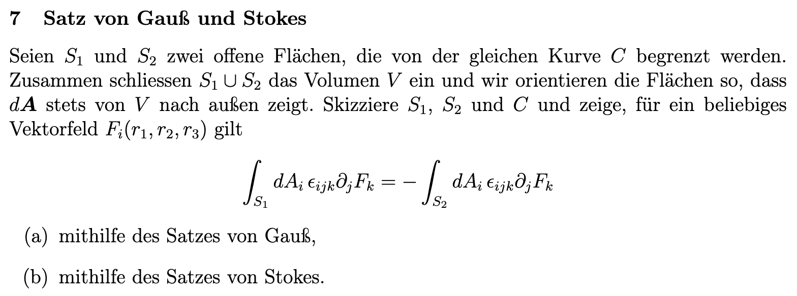
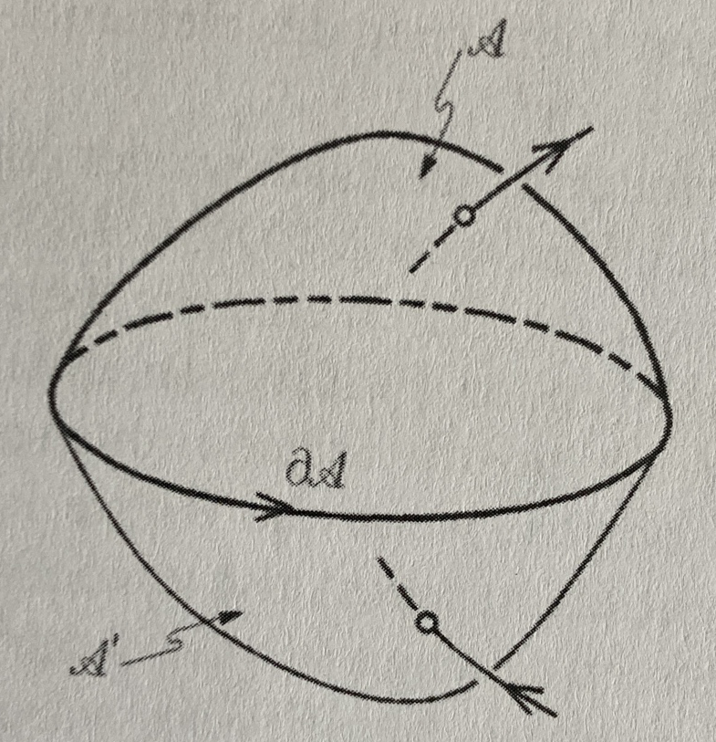
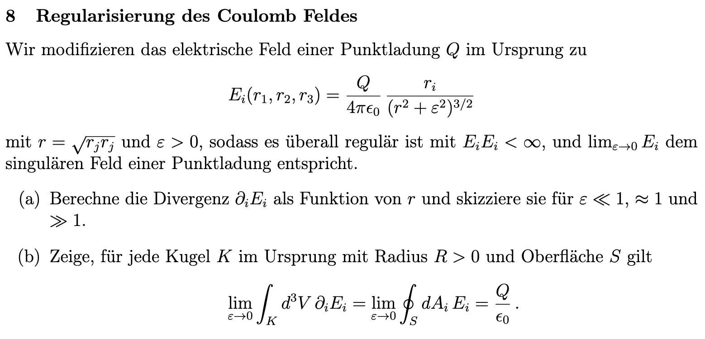
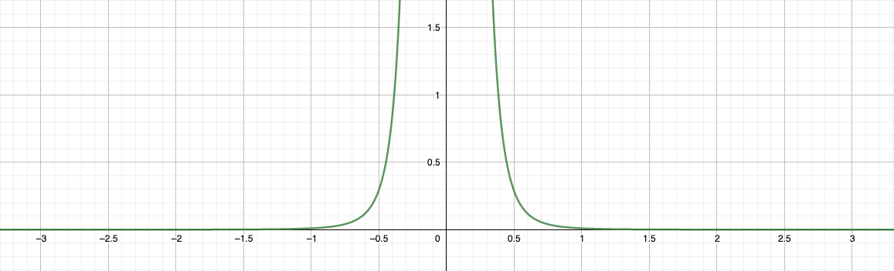
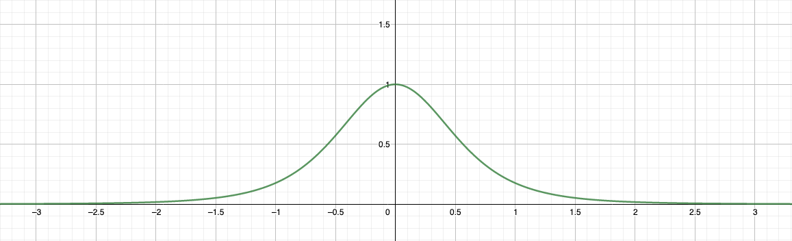
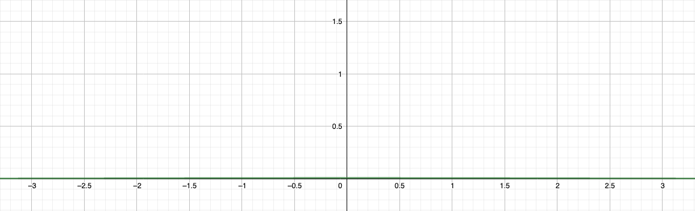
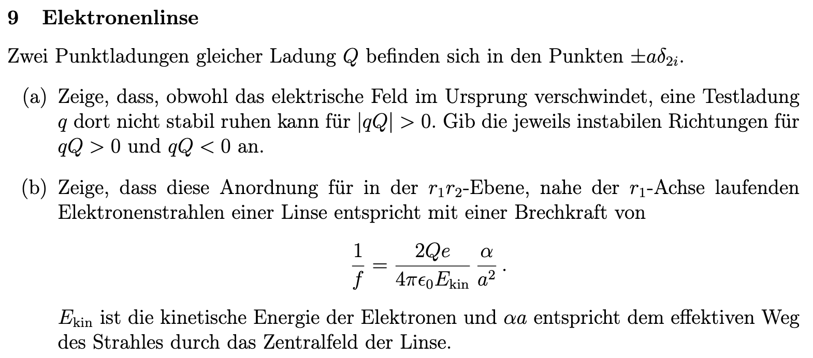
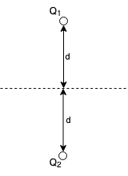

## 3. Problem Set - 23.03.2022
Elektrodynamik I - 136.015

### 7 Satz von Gauß und Stokes

#### a)

Quelle: Vorlesungen über die Grundlagen der Elektrotechnik - Band 2, Adalbert Prechtl, Seite 14. $A=S_1$, $A'=S_2$ und $\partial A=C$. (Der untere Pfeil muss theoretisch invertiert werden.)

Der Satz von Gauß besagt, dass das Volumensintegral einer Divergenz eines Vektorfeldes gleichbedeutend mit dem Integral des Randes multipliziert mit dem Normalvektor und dem Vektorfeld selbst ist. Er ist für ein Vektorfeld $\vec{F}$ mit dem Volumen $V$ und dem Rand $\partial V$ definiert als:
$$\int_Vdiv\,\vec{F}\,dV=\oint_{A}\vec{F}\,d\vec{A}$$
Gemäß der Angabe ist die Gültigkeit der folgende Beziehung zu zeigen:
$$\int_{S_1}dA_i\cdot\epsilon_{ijk}\cdot\partial_jF_k=-\int_{S_2}dA_i\cdot\epsilon_{ijk}\cdot\partial_jF_k$$
$$\int_{S_1}\underbrace{\epsilon_{ijk}\cdot\partial_jF_k}_{=rot\vec{F}}\cdot dA_i+\int_{S_2}\underbrace{\epsilon_{ijk}\cdot\partial_jF_k}_{=rot\vec{F}}\cdot dA_i=0$$
Diese Beziehung betrifft die Fläche eines Volumens. Gemäß des Satzes von Gauß können wir jedoch mit dem Volumen $V$ auch schreiben:
$$=\int_V\underbrace{\partial_i(\epsilon_{ijk}\cdot(\partial_jF_k))}_{=div(rot\vec{F})}\,dV$$
Nachdem gilt $div(rot\vec{F})=0$, (Beweis siehe Anhang) ergibt sich auch dieser Term zu $0$, womit die folgende Beziehung gezeigt wurde: (für die Gültigkeit muss $\vec{F}$ mindestens zweimal stetig differenzierbar sein. -> Satz von Schwarz)
$$\int_{S_1}rot\vec{F}\,d\vec{A}+\int_{S_2}rot\vec{F}\,d\vec{A}=\int_Vdiv(rot\vec{F})d\vec{V}=0$$

#### b)
Der Satz von Stokes verknüpft ein Oberflächenintegral über eine (gekrümmte) Fläche mit einem Kurvenintegral über den Rand der Fläche. Er is definiert als:
$$\int_Arot\vec{F}\,d\vec{A}=\oint_{C}\vec{F}\,d\vec{r}$$
$$\int_{ \partial A=C_1}F_i\,dx_i=\int_{A}\epsilon_{ijk}\cdot\partial_jF_k\,dA_i$$
$$\int_{C_2}F_i\,dx_i=\int_{A'}\epsilon_{ijk}\cdot\partial_jF_k\,dA_i$$
Aufgrund des gegensinnigen Durchlaufes von $C_1$ und $C_2$ folgt:
$$\int_{C_1}F_i\,dx_i=-\int_{C_2}F_i\,dx_i$$
$$=\int_{C_1}F_i\,dx_i+\int_{C_2}F_i\,dx_i=0$$
$$\implies\int_{A}\epsilon_{ijk}\cdot\partial_jF_k\,dA_i+\int_{A'}\epsilon_{ijk}\cdot\partial_jF_k\,dA_i=0$$

### 8 Regularisierung des Coulomb Feldes

#### a)
Gemäß der Angabe soll die Divergenz $\partial_iE_i$ als Funktion von $r$ berechnet werden:
$$\partial_iE_i=\partial_i\Biggl(\frac{Q}{4\pi\epsilon_0}\cdot\frac{r_i}{(r^2+\epsilon^2)^{\frac{3}{2}}}\Biggl)$$
Durch die Linearität der Ableitung und die Beziehung $r=\sqrt{r_j\cdot r_j}$ aus der Angabe folgt:
$$=\frac{Q}{4\pi\epsilon_0}\cdot\partial_i\Biggl(\frac{r_i}{(r_jr_j+\epsilon^2)^{\frac{3}{2}}}\Biggl)=\frac{Q}{4\pi\epsilon_0}\cdot\partial_i\Biggl(r_i\cdot{(r_jr_j+\epsilon^2)^{-\frac{3}{2}}}\Biggl)$$
Im Weiteren kann nun die Produktregel für Ableitungen angewandt werden:
$$=\frac{Q}{4\pi\epsilon_0}\cdot\Biggl(\underbrace{\partial_ir_i}_{=\delta_{ii}=n}\cdot(r_jr_j+\epsilon^2)^{-\frac{3}{2}}+r_i\cdot\partial_i((r_jr_j+\epsilon^2)^{-\frac{3}{2}})\Biggl)$$
Durch Anwenden der Kettenregel auf den zweiten Teil des Termes folgt:
$$=\frac{Q}{4\pi\epsilon_0}\cdot\Biggl(n\cdot(r_jr_j+\epsilon^2)^{-\frac{3}{2}}+r_i\cdot(-\frac{3}{2})\cdot(r_jr_j+\epsilon^2)^{-\frac{5}{2}}\cdot\partial_i(r_jr_j)\Biggl)$$
Nun kann $\partial_i(r_jr_j)$ gemäß der Produktregel aufgelöst werden:
$$\partial_i(r_jr_j)=\partial_ir_j\cdot r_j+r_j\cdot\partial_ir_j=2\cdot r_j\cdot\underbrace{\partial_ir_j}_{=\delta_{ij}}=2\cdot \underbrace{r_j\cdot\delta_{ij}}_{=r_i}=2\cdot r_i$$
Gesamt ergibt sich somit:
$$=\frac{Q}{4\pi\epsilon_0}\cdot\Biggl(n\cdot(r_jr_j+\epsilon^2)^{-\frac{3}{2}}-\cancel{2}\cdot\frac{3}{\cancel{2}}\cdot r_i^2\cdot(r_jr_j+\epsilon^2)^{-\frac{5}{2}}\Biggl)$$
$n$ steht für die Anzahl der Dimensionen. Entsprechend können wir in unserem Fall  $n=3$ einsetzen:
$$=\frac{Q}{4\pi\epsilon_0}\cdot\Biggl(3\cdot(r_jr_j+\epsilon^2)^{-\frac{3}{2}}-3\cdot r_i^2\cdot(r_jr_j+\epsilon^2)^{-\frac{5}{2}}\Biggl)$$
$$=3\cdot\frac{Q}{4\pi\epsilon_0}\cdot\Biggl((r_jr_j+\epsilon^2)^{-\frac{3}{2}}-r_i^2\cdot(r_jr_j+\epsilon^2)^{-\frac{5}{2}}\Biggl)$$
Umgeformt kann man nun also schreiben:
$$=3\cdot\frac{Q}{4\pi\epsilon_0}\cdot\Biggl((r_jr_j+\epsilon^2)^{\frac{2}{2}}\cdot(r_jr_j+\epsilon^2)^{-\frac{5}{2}}-r_i^2\cdot(r_jr_j+\epsilon^2)^{-\frac{5}{2}}\Biggl)$$
$$=3\cdot\frac{Q}{4\pi\epsilon_0}\cdot(r_jr_j+\epsilon^2)^{-\frac{5}{2}}\cdot\Biggl((r_jr_j+\epsilon^2)-r_i^2\Biggl)$$
$$=3\cdot\frac{Q}{4\pi\epsilon_0}\cdot(r_jr_j+\epsilon^2)^{-\frac{5}{2}}\cdot\Biggl((\cancel{r_jr_j}+\epsilon^2)-\cancel{r_i^2}\Biggl)$$
$$\partial_iE_i=3\cdot\frac{Q}{4\pi\epsilon_0}\cdot\frac{\epsilon^2}{(r^2+\epsilon^2)^{\frac{5}{2}}}$$
Somit ergeben sich die Skizzen zu:

mit $\epsilon \ll 1$.

mit $\epsilon = 1$.

mit $\epsilon \gg 1$.

#### b)
Gemäß der Angabe soll die Gültigkeit der folgenden Beziehung gezeigt werden: (Es handelt sich hier um eine Anwendung des Satzes von Gauß; siehe Beispiel 7a)
$$\lim_{\epsilon\rightarrow0}\int_Kd^3V\partial_iE_i=\lim_{\epsilon\rightarrow0}\oint_SdA_iE_i=\frac{Q}{\epsilon_0}$$
Um die Gültigkeit zu zeigen, kann im ersten Schritt $E_i$ aus der Angabe eingesetzt werden:
$$\lim_{\epsilon\rightarrow0}\oint_SdA_iE_i=\lim_{\epsilon\rightarrow0}\oint_SdA_i\cdot\Biggl(\frac{Q}{4\pi\epsilon_0}\cdot\frac{r_i}{(r^2+\epsilon^2)^{\frac{3}{2}}}\Biggl)$$
Weiters können wir die Formel für das Flächenelement einer Kugel einsetzen:
$$dA=r^2\cdot\sin{\vartheta}\cdot d\vartheta d\varphi$$
Somit ergibt sich mit den Integrationsgrenzen für die Berechnung der Oberfläche einer Kugel:
$$=\lim_{\epsilon\rightarrow0}\int_0^{2\pi}\int_0^\pi r^2\cdot\sin{\vartheta}\cdot\Biggl(\frac{Q}{4\pi\epsilon_0}\cdot\frac{r_i}{(r^2+\epsilon^2)^{\frac{3}{2}}}\Biggl)d\vartheta d\varphi$$
Gemäß der Linearität der Integration und der Beziehung $r^2=r_j\cdot r_j$, kann der Term umgeformt werden zu:
$$=\frac{Q}{4\pi\epsilon_0}\cdot\lim_{\epsilon\rightarrow0}\int_0^{2\pi}\int_0^\pi\sin{\vartheta}\cdot\frac{\overbrace{r^2\cdot r_i}^{=r_i^3}}{(r^2+\epsilon^2)^{\frac{3}{2}}}\,d\vartheta d\varphi$$
$$=\frac{Q}{4\pi\epsilon_0}\cdot\lim_{\epsilon\rightarrow0}\frac{r_i^3}{(r^2+\epsilon^2)^{\frac{3}{2}}}\cdot\int_0^{2\pi}\int_0^\pi\sin{\vartheta}\,d\vartheta d\varphi$$
Nun können die Integrale berechnet werden:
$$=\frac{Q}{4\pi\epsilon_0}\cdot\lim_{\epsilon\rightarrow0}\frac{r_i^3}{(r^2+\epsilon^2)^{\frac{3}{2}}}\cdot\int_0^{2\pi}-\cos{\vartheta}\Biggl|_0^\pi\,d\varphi$$
$$=\frac{Q}{4\pi\epsilon_0}\cdot\lim_{\epsilon\rightarrow0}\frac{r_i^3}{(r^2+\epsilon^2)^{\frac{3}{2}}}\cdot\int_0^{2\pi}\underbrace{1-(-1)}_{=2}\,d\varphi$$
$$=\frac{Q}{4\pi\epsilon_0}\cdot\lim_{\epsilon\rightarrow0}\frac{r_i^3}{(r^2+\epsilon^2)^{\frac{3}{2}}}\cdot(2\cdot\varphi)\Biggl|_0^{2\pi}$$
$$=\frac{Q}{4\pi\epsilon_0}\cdot\lim_{\epsilon\rightarrow0}\frac{r_i^3}{(r^2+\epsilon^2)^{\frac{3}{2}}}\cdot4\pi$$
$$=\frac{Q}{\cancel{4\pi}\epsilon_0}\cdot\lim_{\epsilon\rightarrow0}\frac{r_i^3}{(r^2+\epsilon^2)^{\frac{3}{2}}}\cdot\cancel{4\pi}$$
Zusammengefasst ergibt sich die Berechnung zu:
$$=\frac{Q}{\epsilon_0}\cdot\lim_{\epsilon\rightarrow0}\frac{r_i^3}{(r^2+\epsilon^2)^{\frac{3}{2}}}$$
Mit dem Limes folgt somit final:
$$=\frac{Q}{\epsilon_0}\cdot\frac{r_i^3}{(r^{\cancel{2}})^{\frac{3}{\cancel{2}}}}=\frac{Q}{\epsilon_0}\cdot\underbrace{\frac{r_i^3}{r^3}}_{=1}=\underline{\underline{\frac{Q}{\epsilon_0}}}$$
Das Volumensintegral kann nun auch berechnet werden: (Mit Unterstützung von Wolfram Alpha berechnet, nachdem die Information aus dem Plenum, dass das Integral ebenfalls auszurechnen sei, etwas kurzfristig kam.)
$$\lim_{\epsilon\rightarrow0}\int_Kd^3V\partial_iE_i$$
$$=\lim_{\epsilon\rightarrow0}\int_K3\cdot\frac{Q}{4\pi\epsilon_0}\cdot\frac{\epsilon^2}{(r^2+\epsilon^2)^{\frac{5}{2}}}\,d^3V$$
$$=\lim_{\epsilon\rightarrow0}\int_0^{2\pi}\int_0^\pi\int_0^R3\cdot\frac{Q}{4\pi\epsilon_0}\cdot\frac{\epsilon^2}{(r^2+\epsilon^2)^{\frac{5}{2}}}\,drd\vartheta d\varphi$$
$$=\lim_{\epsilon\rightarrow0}3\cdot\frac{Q\cdot\epsilon^2}{4\pi\epsilon_0}\cdot\int_0^{2\pi}\int_0^\pi\sin{\vartheta\cdot\frac{R^3\cdot\sqrt{\epsilon^2+R^2}}{3\cdot(\epsilon^4+2R^2\epsilon^2+R^4)}}d\vartheta d\varphi$$
$$=\lim_{\epsilon\rightarrow0}\cancel{3}\cdot\frac{Q\cdot\epsilon^2}{4\pi\epsilon_0}\cdot\frac{R^3\cdot\sqrt{\epsilon^2+R^2}}{\cancel{3}\cdot(R^2+\epsilon^2)^2}\cdot\int_0^{2\pi}2\,d\varphi$$
$$=\lim_{\epsilon\rightarrow0}\frac{Q\cdot\epsilon^2}{\cancel{4\pi}\epsilon_0}\cdot\frac{R^3\cdot\sqrt{\epsilon^2+R^2}}{(R^2+\epsilon^2)^2}\cdot\cancel{4\pi}=\underline{\underline{\frac{Q}{\epsilon_0}}}$$

### 9 Elektronenlinse

#### a)

Das elektrische Feld einer Punktladung ist definiert als:
$$\boldsymbol{E}(\boldsymbol{r})=\frac{Q}{4\pi\epsilon_0\epsilon_r}\cdot\frac{\boldsymbol{r}}{|r|^3}$$
In unserem Fall entspricht $\boldsymbol{r}$ dabei:
$$\boldsymbol{r}=\left[{\begin{array}{cc} x \\ y\pm d \\\end{array} }\right]$$
Für unsere beiden Punktladungen entspricht die Formel somit:
$$\boldsymbol{E}(\boldsymbol{r})=\frac{1}{4\pi\epsilon_0\epsilon_r}\cdot\Biggl(q_1\cdot\frac{\left[{\begin{array}{cc} x \\ y+d \\\end{array} }\right]}{(\sqrt{x^2+(y+d)^2})^3}+q_2\cdot\frac{\left[{\begin{array}{cc} x \\ y-d \\\end{array} }\right]}{(\sqrt{x^2+(y-d)^2})^3}\Biggl)$$
Nachdem im ersten Schritt das Verschwinden des elektrischen Feldes im Ursprung bewiesen werden soll, können wir $x=0$ und $y=0$ setzen. Zusätzlich sind gemäß der Angabe die Ladungen von $Q_1$ und $Q_2$ gleich. ($q_1=q_2=Q$) Dadurch folgt:
$$\boldsymbol{E}(x,0)=\frac{Q}{4\pi\epsilon_0\epsilon_r}\cdot\Biggl(\frac{\left[{\begin{array}{cc} x \\ d \\\end{array} }\right]}{(\sqrt{x^2+d^2})^3}+\frac{\left[{\begin{array}{cc} x \\ -d \\\end{array} }\right]}{(\sqrt{x^2+d^2})^3}\Biggl)$$
$$=\frac{Q}{4\pi\epsilon_0\epsilon_r}\cdot\Biggl(\frac{x\cdot \vec{e}_x+d\cdot\vec{e}_y}{(x^2+d^2)^{\frac{3}{2}}}+\frac{x\cdot\vec{e}_x-d\cdot \vec{e}_y}{(x^2+d^2)^{\frac{3}{2}}}\Biggl)$$
$$=\frac{Q}{\cancel{4}\pi\epsilon_0\epsilon_r}\cdot\frac{\cancel{2}\cdot x\cdot \vec{e}_x}{(x^2+d^2)^{\frac{3}{2}}}=\frac{Q}{2\pi\epsilon_0\epsilon_r}\cdot\frac{x\cdot \vec{e}_x}{(x^2+d^2)^{\frac{3}{2}}}$$
Für den Ursprung (also mit $x=0$) folgt somit:
$$E(0,0)=\frac{Q}{2\pi\epsilon_0\epsilon_r}\cdot\frac{0\cdot \vec{e}_x}{(0^2+d^2)^{\frac{3}{2}}}=0$$
Im zweiten Schritt soll bewiesen werden, dass eine Testladung $q$ trotz Verschwinden des Feldes nicht stabil im Ursprung ruhen kann.
Die Stabilität kann über die auf die Testladung wirkende Kraft gezeigt werden. Gemäß dem 3. Plenum gilt: $F'(0)>0$ -> instabil
$$F=q\cdot E=\frac{q\cdot Q}{2\pi\epsilon_0}\cdot\frac{x}{(x^2+d^2)^{\frac{3}{2}}}\cdot \vec{e}_x$$
$F'(x)$ entspricht dabei dem zweiten Taylorpolynom. Die Taylorreihe ist in diesem Fall:
$$T_F(0)=F(0)+F'(0)\cdot(x-0)$$
$$F'(x)=\frac{q\cdot Q}{2\pi\epsilon_0}\cdot\frac{(x^2+d^2)^{\frac{3}{2}}-x\cdot\frac{3}{\cancel{2}}\cdot(x^2+d^2)^{\frac{1}{2}}\cdot\cancel{2}\cdot x}{(x^2+d^2)^3}$$
$$=\frac{q\cdot Q}{2\pi\epsilon_0}\cdot\frac{(x^2+d^2)^{\frac{3}{2}}-3\cdot x^2\cdot(x^2+d^2)^{\frac{1}{2}}}{(x^2+d^2)^3}$$
Für $x=0$ entspricht $F'(x)$ somit:
$$F'(0)=\frac{q\cdot Q}{2\pi\epsilon_0}\cdot\frac{d^3}{d^6}=\frac{q\cdot Q}{2\pi\epsilon_0}\cdot\frac{1}{d^3}$$
Dieser Ausdruck ist positiv, womit gemäß der obrigen Bedingungen die Situation der Testladung im Ursprung **instabil** ist.

Der Vollständigkeit halber ergibt sich für $T_F(0)$:
$$T_F(0)=0+\frac{q\cdot Q}{2\pi\epsilon_0}\cdot\frac{1}{d^3}$$
Daraus folgt, dass für $q\cdot Q > 0$ $\vec{e}_x$ instabil ist. Für $q\cdot Q < 0$ ist $\vec{e}_y$ die instabile Richtung.

### Anhang
$div(rot\vec{F})=0$:
Ein Vektor $\vec{F}$, eine Divergenz $div\vec{F}$ und eine Rotation $rot\vec{F}$ können angenommen werden als:
$$\vec{F}=\left[{\begin{array}{cc} F_x \\ F_y \\ F_z \\ \end{array} }\right]$$
$$div\vec{F}=\frac{\partial F_x}{\partial x}+\frac{\partial F_y}{\partial y}+\frac{\partial F_z}{\partial z}$$
$$rot\vec{F}=\left[{\begin{array}{cc} r_x \\ r_y \\ r_z \\ \end{array} }\right]=\left[{\begin{array}{cc} \frac{\partial F_z}{\partial y}-\frac{\partial F_y}{\partial z} \\ \frac{\partial F_x}{\partial z}-\frac{\partial F_z}{\partial x} \\ \frac{\partial F_y}{\partial x}-\frac{\partial F_x}{\partial y} \\ \end{array} }\right]$$
Somit folgt:
$$div(rot\vec{F})=div\left[{\begin{array}{cc} r_x \\ r_y \\ r_z \\ \end{array} }\right]=\frac{\partial r_x}{\partial x}+\frac{\partial r_y}{\partial y}+\frac{\partial r_z}{\partial z}$$
$$=\frac{\partial}{\partial x}\cdot\Biggl(\frac{\partial F_z}{\partial y}-\frac{\partial F_y}{\partial z}\Biggl)+\frac{\partial}{\partial y}\cdot\Biggl(\frac{\partial F_x}{\partial z}-\frac{\partial F_z}{\partial x}\Biggl)+\frac{\partial}{\partial z}\cdot\Biggl(\frac{\partial F_y}{\partial x}-\frac{\partial F_x}{\partial y}\Biggl)$$
$$=\frac{\partial^2F_z}{\partial_y\partial_x}-\frac{\partial^2F_y}{\partial_z\partial_x}+\frac{\partial^2F_x}{\partial_z\partial_y}-\frac{\partial^2F_z}{\partial_x\partial_y}+\frac{\partial^2F_y}{\partial_x\partial_z}-\frac{\partial^2F_x}{\partial_y\partial_z}$$
Mit dem Satz von Schwarz gilt nun:
$$\frac{\partial^2F_z}{\partial_x\partial_y}=\frac{\partial^2F_z}{\partial_y\partial_x}, etc.$$
Somit ergibt sich für den Ausdruck gesamt $0$, da sich die Terme gegenseitig aufheben.