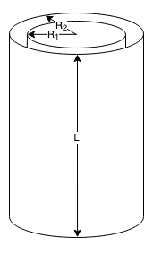
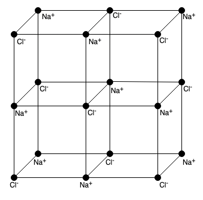
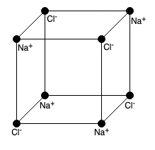
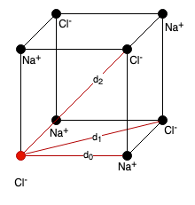

## 4. Problem Set - 30.03.2022
Elektrodynamik I - 136.015

### 10 Leidener Flasche
![[2022-03-30_Angabe_10.png]]

#### a)

Wie bereits in der dritten Übung gezeigt, gilt der Satz vom elektrischen Hüllenfluss:
$$\oint_SdA_iE_i=\frac{Q}{\epsilon_0}$$
Damit soll das elektrische Feld in allen Bereichen ermittelt werden.
Für den ersten Bereich $r<R_1$ gilt:
$$E_i(r,\varphi,z)\Biggl\vert_{r<R_1}=0$$
Nachdem bei einem Radius von $r<R_1$ keine Ladung eingeschlossen ist, gilt für die Ladung $Q=0$, womit sich auch der eingangs definierte Term für das elektrische Feld zu Null ergibt.

Für den zweiten Bereich $R_1<r<R_2$ gilt $Q=+\frac{q}{2}$ und demnach folgt für den elektrischen Fluss:
$$E\cdot\int dA=\frac{Q}{2}\cdot\frac{1}{\epsilon_0}=\frac{Q}{2\cdot\epsilon_0}$$
Das elektrische Feld kann nun als Produkt des elektrischen Flusses und der durchtretenden Fläche berechnet werden. Die Mantelfläche des Zylinders ist:
$$A=2\pi\cdot r\cdot L$$
Somit ergibt sich final für das elektrische Feld in diesem Bereich:
$$E_i(r,\varphi,z)\Biggl\vert_{R_1<r<R_2}=\frac{Q}{2\cdot\epsilon_0}\cdot\Biggl(\underbrace{\int dA}_{=A}\Biggl)^{-1}=\frac{Q}{2\cdot\epsilon_0}\cdot\frac{1}{2\pi\cdot r\cdot L}=\frac{Q}{4\pi\cdot\epsilon_0\cdot r\cdot L}$$

Analog dazu ist die umschlossene Ladung im Bereich $R_2<r$ gleich $Q=+\frac{q}{2}-\frac{q}{2}=0$, womit sich das elektrische Feld erneut zu $0$ ergibt.
$$E_i(r,\varphi,z)\Biggl\vert_{R_2<r}=0$$

#### b)
Die gefragte Arbeit ist allgemein das Produkt aus Kraft und Weg:
$$W_1=\int_CF\,ds$$
In unserem Fall entspricht das elektrische Feld der ladungsbezogenen Kraft. Also folgt:
$$W_1=\int_Cq\cdot E\,ds=\int_{R_1}^{R_2}\frac{q\cdot Q}{4\pi\cdot\epsilon_0\cdot r\cdot L}\,dr=\frac{q\cdot Q}{4\pi\cdot\epsilon_0\cdot L}\cdot\ln{\left(\frac{R_2}{R_1}\right)}$$Die Arbeit ist hierbei **wegunabhängig**. Sie hängt lediglich von Anfangs- und Endpunkt ab. Die Begründung liegt in dem konservativen Kraftfeld, welches dadurch gekennzeichnet ist, dass es rotationsfrei ist. Darin hängt das Potential direkt mit der potentiellen Energie zusammen, wodurch es egal ist, auf welchem Wege von einem Potentialwert zu einem anderen Potentialwert gewechselt wird.

#### c)
Mit den voran gegangenen Berechnung und den Informationen aus der Angabe folgt für die zu verrichtende mechanische Arbeit $W_2$:
$$W_2=\underbrace{\int_{R_2}^Lq\cdot E_{Zyl}\,ds}_{zylindrisches \,Feld}+\underbrace{\int_L^{\infty}q\cdot E_{Pkt}\,ds}_{Punktladung}$$
(In den voran gegangenen Unterpunkten wurde die positive Ladung im inneren Zylinder angenommen, wodurch im äußeren Zylinder die negative Ladung $-\frac{Q}{2}$ ist.)
$$=\int_{R_2}^L\frac{q\cdot(-Q)}{4\pi\cdot\epsilon_0\cdot r\cdot L}\,dr+\int_L^{\infty}\underbrace{q\cdot\frac{(-Q)}{2}\cdot\frac{1}{4\pi\cdot\epsilon_0}\cdot\frac{1}{r^2}}_{=\frac{q\cdot(-Q)}{8\pi\cdot\epsilon_0}\cdot\frac{1}{r^2}}\,dr$$
$$=-\frac{q\cdot Q}{4\pi\cdot\epsilon_0}\cdot\Biggl(\frac{1}{L}\cdot\underbrace{(\ln{(L)}-\ln{(R_2)})}_{=\ln{\left(\frac{L}{R_2}\right)}}+\frac{1}{2}\cdot\Biggl(\underbrace{\underbrace{-\frac{1}{\infty}}_{=0}-\Biggl(-\frac{1}{L}\Biggl)\Biggl)}_{=\frac{1}{L}}\Biggl)$$
$$=-\frac{q\cdot Q}{4\pi\cdot\epsilon_0\cdot L}\cdot\Biggl(\ln{\left(\frac{L}{R_2}\right)+\frac{1}{2}}\Biggl)$$

### 11 Nanokristalle
![[2022-03-30_Angabe_11.png]]
#### a)

Die frei werdende Energie kann im Falle zweier sich nähernder Ionen, wie folgt berechnet werden:
$$W=\int_{\infty}^{a_0}\vec{F_c}\,d\vec{r}$$
Wie bereits in Beispiel 10 erläutert entspricht die Arbeit (bzw. in diesem Fall die Energie) der Kraft multipliziert mit dem Weg. $a_0$ entspricht dabei dem in der Angabe beschriebene
n Abstand von $282.01pm$.
Für die Kraft kann in unserem Fall die Formel für die Kraft zwischen zwei Punktladungen eingesetzt werden. Daraus folgt:
$$W=\int_{\infty}^{a_0}\frac{Q_1\cdot Q_2}{4\pi\cdot\epsilon_0}\cdot\frac{1}{r^2}\,dr$$
 Mit der Linearität der Integration ergibt sich:
 $$=\frac{Q_1\cdot Q_2}{4\pi\cdot\epsilon_0}\cdot\int_{\infty}^{a_0}\frac{1}{r^2}\,dr$$
 Nun kann die Integration über die Potenzregel erfolgen. Die Potenzregel ist definiert mit $\int r^2\,dr=\frac{r^{n+1}}{n+1}$. In unserem Fall ist $n=-2$. Somit folgt für unsere Integration:
 $$=\frac{Q_1\cdot Q_2}{4\pi\cdot\epsilon_0}\cdot\left(\frac{r^{-1}}{-1}\right)\Biggl\vert_{\infty}^{a_0}=\frac{Q_1\cdot Q_2}{4\pi\cdot\epsilon_0}\cdot\left(-\frac{1}{r}\right)\Biggl\vert_{\infty}^{a_0}$$
 $$=-\frac{Q_1\cdot Q_2}{4\pi\cdot\epsilon_0}\cdot(\frac{1}{a_0}-\underbrace{\frac{1}{\infty}}_{=0})$$ $$=-\frac{Q_1\cdot Q_2}{4\pi\cdot\epsilon_0}\cdot\frac{1}{a_0}$$
Nun können für die Ladungen $Q_1$ und $Q_2$ die Werte $+e$ (für $Na^+$) und $-e$ (für $Cl^-$) eingesetzt werden:
$$=-\frac{e\cdot(-e)}{4\pi\cdot\epsilon_0}\cdot\frac{1}{a_0}=\frac{e^2}{4\pi\cdot\epsilon_0}\cdot\frac{1}{a_0}$$
Durch Einsetzen der Zahlenwerte für $e$, $\epsilon_0$ und $a_0$ kann nun ein finales Ergebnis ermittelt werden:
$$=\frac{(1.602176634\cdot 10^{-19})^2}{4\pi\cdot8.854187812\cdot10^{-12}}\cdot\frac{1}{282.01\cdot10^{-12}}=5.10608eV$$

#### b)

Gemäß der Vorlesung kann für die potentielle Energie mehrerer Ionen die folgende Formel genutzt werden:
$$W=\frac{1}{2}\cdot\frac{1}{4\pi\cdot\epsilon_0}\cdot\sum_{i,j=1}^N\frac{q_i\cdot q_j}{|x_i^m-xj^m|}$$

Im ersten Schritt können wir die Abstände der Ionen auf ein Referenz-Ion ermitteln. Als Referenz-Ion können wir beispielsweise das $Cl^-$ Ion vorne links wählen:

Mit dem Abstand $d_0$ als Grundlage, können die Diagonalen $d_1$ und $d_2$ ermittelt werden.
Nachdem $d_1$ die Diagonale eines Quadrates mit der Seitenlänge $d_0$ ist, folgt über den Satz von Pythagoras für $d_1$:
$$d_1=\sqrt{d_0^2+d_0^2}=\sqrt{2\cdot d_0^2}=\sqrt{2}\cdot d_0$$
Daraus kann nun $d_2$ abgeleitet werden. Es entspricht der Diagonale des Dreiecks mit der Kantenlänge $d_1$ und der Höhe $d_0$. Entsprechend folgt über den Satz von Pythagoras:
$$d_2=\sqrt{d_1^2+d_0^2}=\sqrt{(\sqrt{2}\cdot d_0)^2+d_0^2}=\sqrt{2\cdot d_0^2+d_0^2}=\sqrt{3}\cdot d_0$$
Nachdem die Abstände unseres Referenz-Ions bestimmt wurden, können wir nun in die eingangs beschriebene Formel einsetzen:
$$W_{Cl^-}=\frac{1}{2}\cdot\frac{-e}{4\pi\cdot\epsilon_0}\cdot\Biggl(\underbrace{3\cdot\frac{e}{d_0}}_{3\cdot Na^+}-\underbrace{3\cdot\frac{e}{\sqrt{2}\cdot d_0}}_{3\cdot Cl^-}+\underbrace{\frac{e}{\sqrt{3}\cdot d_0}}_{1\cdot Na^+}\Biggl)$$
Für die gesamte Energie folgt somit für den 2 x 2 x 2 Würfel:
$$W_{ges}=8\cdot W_{Cl^-}=\cancel{8}\cdot\frac{-e^2}{\cancel{8}\pi\cdot\epsilon_0}\cdot\Biggl(\frac{3}{d_0}-\frac{3}{\sqrt{2}\cdot d_0}+\frac{1}{\sqrt{3}\cdot d_0}\Biggl)$$
Mit den eingesetzten Werten aus Unterpunkt 11a und $d_0=a_0$ folgt somit:
$$\begin{align}W_{ges}=-\frac{1.602176634\cdot10^{-19}}{\pi\cdot8.854187812\cdot10^{-12}}&\cdot\Biggl(\frac{3}{282.01\cdot10^{-12}}\\-\frac{3}{\sqrt{2}\cdot282.01\cdot10^{-12}}+&\frac{1}{\sqrt{3}\cdot282.01\cdot10^{-12}}\Biggl)=-29.7384eV\end{align}$$
Allgemein gilt, dass ein negatives Ergebnis bedeutet, dass **Energie aufgewendet** werden muss, um Ionen zu einander zu bringen. Dies ist der Fall bei gleich geladenen Ionen. Bei ungleich geladenen Ionen wird hingegen bei der Annäherung **Energie freigesetzt**.

### 12 Elektronenkanone - Testaufgabe 2019
![[2022-03-30_Angabe_12.png]]
#### a)
Das elektrische Potential ist die Fähigkeit eines elektrischen Feldes Arbeit an einer elektrischen Ladung zu verrichten. Als erster Schritt für die Ermittlung des Potentials müssen die einzelnen Potentiale der Komponenten bestimmt werden.

Begonnen bei der Kugel entspricht das Potential:
$$V_{Kugel}=-\int_{-\infty}^{D+x_3}E_{Kugel}\,dr$$
Das elektrische Feld kann, wie bereits in der restlichen Übung erwähnt, wie folgt berechnet werden:
$$E_{Kugel}=\frac{Q}{4\pi\cdot\epsilon_0\cdot r^2}$$
Eingesetzt in die Formel des Potentials folgt damit:
$$V_{Kugel}=-\frac{Q}{4\pi\cdot\epsilon_0}\cdot\int_{-\infty}^{D+x_3}\frac{1}{r^2}\,dr=-\frac{Q}{4\pi\cdot\epsilon_0}\cdot\Biggl(\frac{1}{D+x_3}-\underbrace{\frac{1}{-\infty}}_{=0}\Biggl)$$
$$V_{Kugel}=-\frac{Q}{4\pi\cdot\epsilon_0}\cdot\frac{1}{D+x_3}$$
Nun kann das Potential der Lochblend bestimmt werden. Analog zu der Kugel gehen wir wieder von dem elektrischen Feld aus. Im ersten Schritt müssen dazu die Rahmenparameter bestimmt werden:
$$x=\left[{\begin{array}{cc} 0 \\ 0 \\ x_3 \\ \end{array} }\right]$$
$$x'=\left[{\begin{array}{cc} r\cdot\sin{\varphi} \\ r\cdot\cos{\varphi} \\ 0 \\ \end{array} }\right]$$
Nun kann das elektrische Feld berechnet werden:
$$E_{Lochblende}=\int_{R_1}^{R_2}\int_0^{2\pi}\frac{Q}{4\pi\cdot\epsilon_0\cdot A}\cdot\frac{x^i-x^{'i}}{(|x^i-x^{'i}|)^3}\cdot r\,d\varphi dr$$
$$=\int_{R_1}^{R_2}\int_0^{2\pi}\frac{Q}{4\pi\cdot\epsilon_0\cdot A}\cdot\frac{r}{\left(\sqrt{r^2+x_3^2}\right)^3}\cdot\left[{\begin{array}{cc} 0-r\cdot\sin{\varphi} \\ 0-r\cdot\cos{\varphi} \\ x_3 \\ \end{array} }\right]\,d\varphi dr$$
$$=\int_{R_1}^{R_2}\frac{Q}{4\pi\cdot\epsilon_0\cdot A}\cdot\frac{r}{\left(\sqrt{r^2+x_3^2}\right)^3}\cdot\left[{\begin{array}{cc} +r\cdot\cos{\varphi} \\ -r\cdot\sin{\varphi} \\ x_3\cdot\varphi \\ \end{array} }\right]\,dr\Biggl\vert_0^{2\pi}$$
$$=\int_{R_1}^{R_2}\frac{Q}{4\pi\cdot\epsilon_0\cdot A}\cdot\frac{r}{\left(\sqrt{r^2+x_3^2}\right)^3}\cdot\left(\left[{\begin{array}{cc} +r\cdot\cos{2\pi} \\ -r\cdot\sin{2\pi} \\ x_3\cdot2\pi \\ \end{array} }\right]-\left[{\begin{array}{cc} +r\cdot\cos{0} \\ -r\cdot\sin{0} \\ x_3\cdot0 \\ \end{array} }\right]\right)\,dr$$
$$=\int_{R_1}^{R_2}\frac{Q}{4\pi\cdot\epsilon_0\cdot A}\cdot\frac{r}{\left(\sqrt{r^2+x_3^2}\right)^3}\cdot\left[{\begin{array}{cc} 0 \\ 0 \\ x_3\cdot2\pi \\ \end{array} }\right]\,dr$$
Für die zweite Integration können wir substituieren:
$$u=r^2+x_3^2\rightarrow du=2\cdot r\,dr\rightarrow dr=\frac{du}{2\cdot r}$$
$$=\int_{R_1}^{R_2}\frac{Q}{4\pi\cdot\epsilon_0\cdot A}\cdot\frac{\cancel{r}}{\left(\sqrt{u}\right)^3}\cdot\left[{\begin{array}{cc} 0 \\ 0 \\ x_3\cdot2\pi \\ \end{array} }\right]\cdot\frac{du}{2\cdot \cancel{r}}$$
Mit der Potenzregel folgt: ($\int r^n\,dr=\frac{r^{n+1}}{n+1}$)
$$=-\frac{Q}{\cancel{4\pi}\cdot\epsilon_0\cdot A}\cdot\frac{\cancel{2}}{\sqrt{u}}\cdot\left[{\begin{array}{cc} 0 \\ 0 \\ x_3\cdot\cancel{2\pi} \\ \end{array} }\right]\cdot\frac{1}{\cancel{2}}\Biggl\vert_{R_1}^{R_2}$$
Rücksubstituiert ergibt sich:
$$=-\frac{Q}{2\cdot\epsilon_0\cdot A}\cdot\frac{1}{\sqrt{r^2+x_3^2}}\cdot\left[{\begin{array}{cc} 0 \\ 0 \\ x_3 \\ \end{array} }\right]\Biggl\vert_{R_1}^{R_2}$$
$$=-\frac{Q}{2\cdot\epsilon_0\cdot A}\cdot\frac{1}{\sqrt{R_2^2+x_3^2}}\cdot\left[{\begin{array}{cc} 0 \\ 0 \\ x_3 \\ \end{array} }\right]+\frac{Q}{2\cdot\epsilon_0\cdot A}\cdot\frac{1}{\sqrt{R_1^2+x_3^2}}\cdot\left[{\begin{array}{cc} 0 \\ 0 \\ x_3 \\ \end{array} }\right]$$
Umgeschrieben entspricht das:
$$=\frac{Q}{2\cdot\epsilon_0\cdot A}\cdot x_3\cdot\left(-\frac{1}{\sqrt{R_2^2+x_3^2}}+\frac{1}{\sqrt{R_1^2+x_3^2}}\right)\cdot\vec{e}_3$$
Nachdem somit das elektrische Feld der Lochblende berechnet wurde, muss vor der Berechnung des Potentials noch die Fläche der Lochblende bestimmt werden. Diese entspricht:
$$A=(R_2^2-R_1^2)\cdot\pi$$
Nun kann das elektrische Potential der Lochblende berechnet werden: (gemäß dem 4. Plenum als unbestimmtes Integral)
$$V_{Lochblende}=-\int E_{Lochblende}\,dx_3=-\int\frac{Q}{2\cdot\epsilon_0\cdot A}\cdot x_3\cdot\left(-\frac{1}{\sqrt{R_2^2+x_3^2}}+\frac{1}{\sqrt{R_1^2+x_3^2}}\right)\,dx_3$$
$$=-\int\frac{Q}{2\cdot\epsilon_0\cdot A}\cdot\left(\frac{x_3}{\sqrt{R_1^2+x_3^2}}\right)\,dx_3+\int\frac{Q}{2\cdot\epsilon_0\cdot A}\cdot\left(\frac{x_3}{\sqrt{R_2^2+x_3^2}}\right)\,dx_3$$
Es kann nun erneut substituiert werden:
$$u_1=R_1^2+x_3^2\rightarrow du_1=2\cdot x_3\,dx_3\rightarrow dx_3=\frac{du_1}{2\cdot x_3}$$
$$u_2=R_2^2+x_3^2\rightarrow du_2=2\cdot x_3\,dx_3\rightarrow dx_3=\frac{du_2}{2\cdot x_3}$$
Damit folgt:
$$=\int\frac{Q}{2\cdot\epsilon_0\cdot A}\cdot\left(\frac{\cancel{x_3}}{\sqrt{u_2}}\right)\cdot\frac{du_2}{2\cdot\cancel{x_3}}-\int\frac{Q}{2\cdot\epsilon_0\cdot A}\cdot\left(\frac{\cancel{x_3}}{\sqrt{u_1}}\right)\cdot\frac{du_1}{2\cdot\cancel{x_3}}$$
$$=\int\frac{Q}{4\cdot\epsilon_0\cdot A}\cdot\left(\frac{1}{\sqrt{u_2}}\right)\cdot du_2-\int\frac{Q}{4\cdot\epsilon_0\cdot A}\cdot\left(\frac{1}{\sqrt{u_1}}\right)\cdot du_1$$
Mit der Potenzregel für Integrationen folgt:
$$=\frac{Q}{\cancel{4}\cdot\epsilon_0\cdot A}\cdot\left(\cancel{2}\cdot\sqrt{u_2}-\cancel{2}\cdot\sqrt{u_1}\right)+C$$
Rücksubstituiert ergibt sich somit für das Potential:
$$V_{Lochblende}=\frac{Q}{2\cdot\epsilon_0\cdot A}\cdot\left(\sqrt{R_2^2+x_3^2}-\sqrt{R_1^2+x_3^2}\right)+C$$
Nun kann noch die Fläche der Lochblende eingesetzt werden:
$$V_{Lochblende}=\frac{Q}{2\cdot\epsilon_0}\cdot\left(\frac{\sqrt{R_2^2+x_3^2}-\sqrt{R_1^2+x_3^2}}{(R_2^2-R_1^2)\cdot\pi}\right)+C$$
Die Kombination der elektrischen Potentiale der Kugel und der Lochblende ergibt somit final:
$$V=V_{Kugel}+V_{Lochblende}=\frac{Q}{2\pi\cdot\epsilon_0}\cdot\left(\frac{\sqrt{R_2^2+x_3^2}-\sqrt{R_1^2+x_3^2}}{(R_2^2-R_1^2)}\right)-\frac{Q}{4\pi\cdot\epsilon_0}\cdot\frac{1}{D+x_3}$$

#### b)