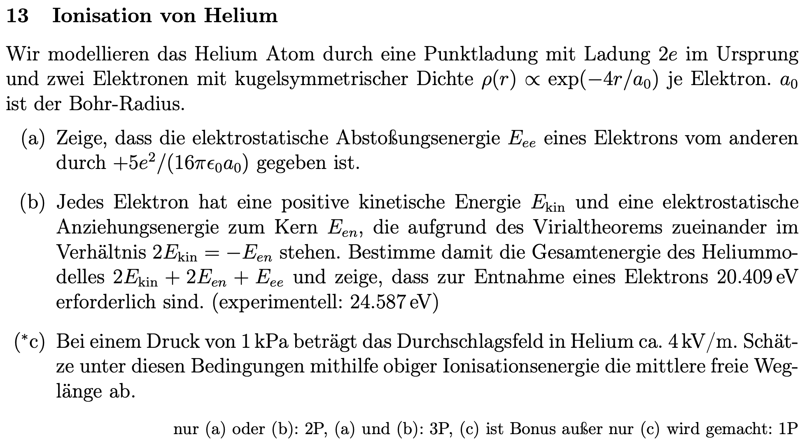
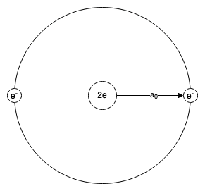
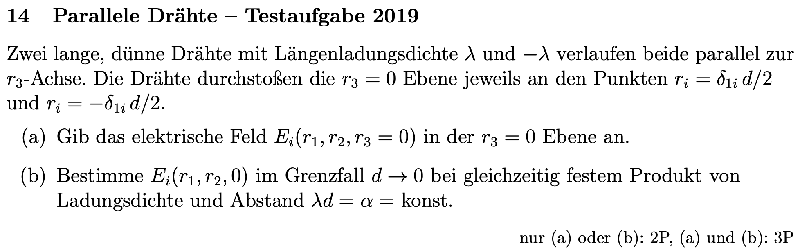
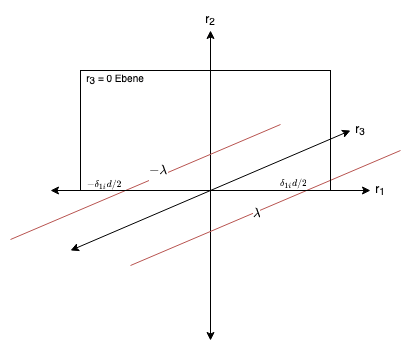
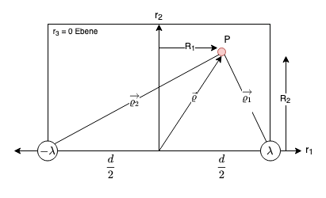
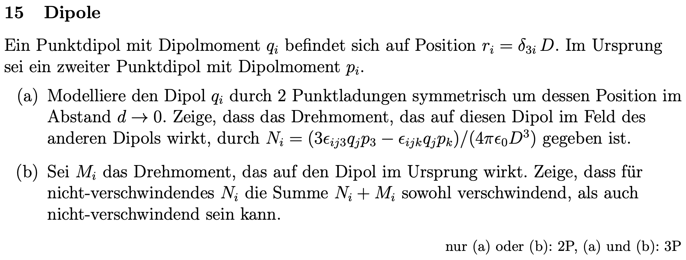
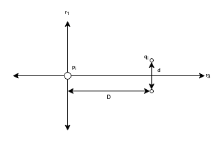

## 5. Problem Set - 06.04.2022
Elektrodynamik I - 136.015

**Gerechnete Beispiele:**
13) a) & b)
14) a) & b)
15) b)

### 13 Ionisation von Helium

#### a)

In der Angabe ist die Dichte je Elektron proportional angegeben: $\rho(r)\propto e^{-\frac{4\cdot r}{a_0}}$. Daher müssen wir im ersten Schritt den Proportionalitätsfaktor $K$ berechnen. Nachdem wir wissen, dass die Ladung eines Elektrons $e^{-}$ entspricht, können wir somit gleichtsetzen:
$$Q_{e^{-}}=\int_V\rho(r)\,dV=e^{-}$$
Eingesetzt in die Formel folgt mit Proportionalitätsfaktor $K$:
$$=\int_VK\cdot e^{-\frac{4\cdot r}{a_0}}\,dV$$
$$=\int_0^{2\pi}\int_0^{\pi}\int_0^{\infty}K\cdot e^{-\frac{4\cdot r}{a_0}}\cdot r^2\cdot\sin{\vartheta}\,drd\vartheta\varphi$$
Wie bereits mehrmals ermittelt entspricht die Integration nach $\varphi$ und $\vartheta$:
$$=4\pi\cdot\int_0^{\infty}K\cdot e^{-\frac{-4\cdot r}{a_0}}\cdot r^2\,dr$$
Mit der Linearität der Integration kann auch geschrieben werden:
$$=4\pi\cdot K\cdot\int_0^{\infty}e^{-\frac{-4\cdot r}{a_0}}\cdot r^2\,dr$$
Der Ausdruck kann nun zwei mal partiell integriert werden:
$$f=r^2\rightarrow f'=2\cdot r$$
$$g=-\frac{a_0}{4}\cdot e^{-\frac{4\cdot r}{a_0}}\rightarrow g'=e^{-\frac{4\cdot r}{a_0}}$$
$$=r^2\cdot\left(-\frac{a_0}{4}\right)\cdot e^{-\frac{4\cdot r}{a_0}}-2\cdot-\frac{a_0}{4}\cdot\int r\cdot e^{-\frac{4\cdot r}{a_0}}\,dr\Biggl\vert_0^{\infty}$$
Die zweite partielle Integration folgt zu:
$$f=r\rightarrow f'=1$$
$$g=-\frac{a_0}{4}\cdot e^{-\frac{4\cdot r}{a_0}}\rightarrow g'=e^{-\frac{4\cdot r}{a_0}}$$
Kombiniert ergibt sich somit:
$$=r^2\cdot\left(-\frac{a_0}{4}\right)\cdot e^{-\frac{4\cdot r}{a_0}}+2\cdot\frac{a_0}{4}\cdot\left(r\cdot-\frac{a_0}{4}\cdot e^{-\frac{4\cdot r}{a_0}}+\frac{a_0}{4}\cdot\int e^{-\frac{4\cdot r}{a_0}}\,dr\right)\Biggl\vert_0^{\infty}$$
$$=r^2\cdot\left(-\frac{a_0}{4}\right)\cdot e^{-\frac{4\cdot r}{a_0}}+\cancel{2}\cdot\frac{a_0}{\cancel{4}}\cdot\left(r\cdot-\frac{a_0}{4}\cdot e^{-\frac{4\cdot r}{a_0}}+\frac{a_0}{4}\cdot\left(-\frac{a_0}{4}\right)\cdot e^{-\frac{4\cdot r}{a_0}}\right)\Biggl\vert_0^{\infty}$$
$$=-r^2\cdot\frac{a_0}{4}\cdot e^{-\frac{4\cdot r}{a_0}}+\frac{a_0}{2}\cdot\left(-\frac{a_0\cdot r}{4}\cdot e^{-\frac{4\cdot r}{a_0}}-\frac{a_0^2}{16}\cdot e^{-\frac{4\cdot r}{a_0}}\right)\Biggl\vert_0^{\infty}$$
$$=e^{-\frac{4\cdot r}{a_0}}\cdot\left(-\frac{r^2\cdot a_0}{4}-\frac{a_0^2\cdot r}{8}-\frac{a_0^3}{32}\right)\Biggl\vert_0^{\infty}$$
$$=-\frac{(8\cdot a_0\cdot r^2+4\cdot a_0^2\cdot r+a_0^3)\cdot e^{-\frac{4\cdot r}{a_0}}}{32}\Biggl\vert_0^{\infty}$$
Dieser Ausdruck kann wiederum vereinfacht werden zu:
$$=-\frac{a_0\cdot(8\cdot r^2+4\cdot a_0\cdot r+a_0^2)\cdot e^{-\frac{4\cdot r}{a_0}}}{32}\Biggl\vert_0^{\infty}$$
Nun können die Grenzen für $r$ angewendet werden. Nachdem wir im Zähler den Ausruck $e^{-\frac{4\cdot r}{a_0}}$ haben, welcher sich mit $r=\infty$ zu $0$ approximieren lässt, ergibt sich somit:
$$=0-\left(-\frac{a_0\cdot(8\cdot0+4\cdot a_0\cdot0+a_0^2)\cdot e^{-\frac{4\cdot0}{a_0}}}{32}\right)=\frac{a_0\cdot(a_0^2)\cdot 1}{32}=\frac{a_0^3}{32}$$
Mit den zuvor heraus gehobenen linearen Faktoren folgt somit:
$$Q_{e^{-}}=e^{-}=4\pi\cdot K\cdot\frac{a_0^3}{32}$$
Der Proportionalitätsfaktor $K$ kann somit bestimmt werden als:
$$K=\frac{\cancel{32}\cdot e^{-}}{\cancel{4}\pi\cdot a_0^3}=\frac{8\cdot e^{-}}{\pi\cdot a_0^3}$$
Daraus folgt wiederum für die Dichte:
$$\rho(r)=\frac{8\cdot e^{-}}{\pi\cdot a_0^3}\cdot e^{-\frac{4\cdot r}{a_0}}$$
Das Gauß'sche Gesetz besagt: $\vec{\nabla}\cdot\vec{E}=\frac{\rho}{\epsilon_0}$. Damit können wir basierend auf der berechneten Dichte anschreiben:
$$\int_{\partial V}E(r)\,dA=\frac{1}{\epsilon_0}\cdot\int_V\rho(r)\,dV$$
Nun kann erneut das Integral über das Volumen der Kugel berechnet werden:
$$\int_{\partial V}E(r)\,dA=\frac{1}{\epsilon_0}\cdot\int_0^{2\pi}\int_0^{\pi}\int_0^{r'}\underbrace{\frac{8\cdot e^{-}}{\pi\cdot a_0^3}\cdot e^{-\frac{4\cdot r}{a_0}}}_{\rho(r)}\cdot r^2\cdot\sin{\vartheta}\,drd\vartheta\varphi$$
Analog zu der Berechnung des Proporionalitätsfaktors der Dichte kann auch hier zwei mal partiell integriert werden. Dadurch ergibt sich:
$$=\frac{4\pi}{\epsilon_0}\cdot\int_0^{r'}\frac{8\cdot e^{-}}{\pi\cdot a_0^3}\cdot e^{-\frac{4\cdot r}{a_0}}\cdot r^2\,dr$$
$$=-\frac{(8\cdot r^2+4\cdot a_0\cdot r+a_0^2)\cdot\cancel{a_0}\cdot e^{-}\cdot e^{-\frac{4\cdot r}{a_0}}}{4\pi\cdot a_0^{\cancel{3}}}\Biggl\vert_0^{r'}$$
$$=-\frac{(8\cdot r'^2+4\cdot a_0\cdot r'+a_0^2)\cdot e^{-}\cdot e^{-\frac{4\cdot r'}{a_0}}}{4\pi\cdot a_0^{2}}-\left(-\frac{a_0^2\cdot e^{-}\cdot1}{4\pi\cdot a_0^2}\right)$$
$$=\frac{e^{-}}{4\pi\cdot a_0^2}\cdot\left(a_0^2-e^{-\frac{4\cdot r'}{a_0}}\cdot(8\cdot r'^2+4\cdot a_0\cdot r'+a_0^2)\right)$$
Mit der eingangs formulierten Beziehung basierend auf dem Gauß'schen Gesetz folgt somit:
$$\int_{\partial V}E(r)\,dA=\int_0^{2\pi}\int_0^{\pi}E(r)\cdot r^2\cdot\sin{\vartheta}\,d\vartheta d\varphi=E(r)\cdot4\pi\cdot r^2$$
$$E(r)\cdot4\pi\cdot r^2=\frac{\cancel{4\pi}}{\epsilon_0}\cdot\frac{e^{-}}{\cancel{4\pi}\cdot a_0^2}\cdot\left(a_0^2-e^{-\frac{4\cdot r}{a_0}}\cdot(8\cdot r^2+4\cdot a_0\cdot r+a_0^2)\right)$$
$$\implies E(r)=\frac{e^{-}}{4\pi\cdot\epsilon_0\cdot a_0^2}\cdot\left(\frac{a_0^2}{r^2}-e^{-\frac{4\cdot r}{a_0}}\cdot\left(8+\frac{4\cdot a_0}{r}+\frac{a_0^2}{r^2}\right)\right)$$
Nachdem wir nun das elektrische Feld bestimmt haben, kann folgend die Spannung über den Zusammenhang $U(r)=\int E(r)\,dr$ bestimmt werden:
$$U(r)=\int\frac{e^{-}}{4\pi\cdot\epsilon_0\cdot a_0^2}\cdot\left(\frac{a_0^2}{r^2}-e^{-\frac{4\cdot r}{a_0}}\cdot\left(8+\frac{4\cdot a_0}{r}+\frac{a_0^2}{r^2}\right)\right)\,dr$$
(Mit Unterstützung von Matlab berechnet!)
$$U(r)=\frac{e^{-}}{4\pi\cdot\epsilon_0\cdot a_0^\cancel{2}}\cdot\left(-\cancel{a_0}\cdot\left(\frac{a_0-a_0\cdot e^{-\frac{4\cdot r}{a_0}}}{r}-2\cdot e^{-\frac{4\cdot r}{a_0}}\right)\right)$$
$$U(r)=\frac{e^{-}}{4\pi\cdot\epsilon_0\cdot a_0}\cdot\left(-\frac{a_0}{r}+e^{-\frac{4\cdot r}{a_0}}\cdot\left(\frac{a_0}{r}+2\right)\right)$$
Nachdem wir $U(r)$ bestimmt haben, können wir die gefragte Abstoßungsenergie wie folgt berechnen:
$$E_{ee}=q\cdot U$$
$q$ entspricht dabei der Ladung des zweiten Elektrons, das abgestoßen wird. Um die Energie $E_{ee}$ im gesamten Raum zu berechnen, muss erneut über das Volumen integriert werden. Dabei werden die Fälle "unmittelbar nebeneinander" und "unendlich weit entfernt" betrachtet, wobei sich die Elektronen einander annähern:
$$E_{ee}=4\pi\cdot\int_{\infty}^0r^2\cdot\frac{8\cdot e^{-}}{\pi\cdot a_0^3}\cdot e^{-\frac{4\cdot r}{a_0}}\cdot\frac{e^{-}}{4\pi\cdot\epsilon_0\cdot a_0}\cdot\left(-\frac{a_0}{r}+e^{-\frac{4\cdot r}{a_0}}\cdot\left(\frac{a_0}{r}+2\right)\right)\,dr$$
$$E_{ee}=\cancel{4\pi}\cdot\frac{8\cdot{e^{-}}^2}{\cancel{4\pi}\cdot\pi\cdot\epsilon_0\cdot a_0^4}\cdot\int_{\infty}^0r^2\cdot e^{-\frac{4\cdot r}{a_0}}\cdot\left(-\frac{a_0}{r}+e^{-\frac{4\cdot r}{a_0}}\cdot\left(\frac{a_0}{r}+2\right)\right)\,dr$$
(Mit Unterstützung von Matlab berechnet!)
$$E_{ee}=\frac{\cancel{8}\cdot{e^{-}}^2}{\pi\cdot\epsilon_0\cdot a_0^{\cancel{4}}}\cdot\left(\frac{5\cdot\cancel{a_0^3}}{\cancel{128}}\right)$$
Damit ergibt sich final das zu zeigende Ergebnis für die elektrostatische Abstoßungsenergie $E_{ee}$:
$$E_{ee}=\frac{5}{16}\cdot\frac{{e^{-}}^2}{\pi\cdot\epsilon_0\cdot a_0}$$

#### b)
Gemäß der Angabe gilt für die Gesamtenergie des Heliummodelles:
$$E_{ges}=2\cdot E_{kin}+2\cdot E_{en}+E_{ee}$$
Unter Berücksichtigung der Beziehung $2\cdot E_{kin}=-E_{en}$ des Virialtheoremes folgt:
$$E_{ges}=-E_{en}+2\cdot E_{en}+E_{ee}=E_{en}+E_{ee}$$
Die Abstoßungsenergie $E_{ee}$ wurde bereits im Unterpunkt a) bestimmt und entspricht $\frac{5\cdot e^2}{16\cdot\pi\cdot\epsilon_0\cdot a_0}$. Demnach muss nur noch die elektrostatische Anziehungsenergie zu dem Kern berechnet werden. Diese entspricht:
$$E_{en}=\underbrace{2\cdot e^{+}}_{=q}\cdot\underbrace{\int_0^{\infty}E(r)\,dr}_{=U(r)}$$
Das Integral über $E(r)$ kann ausgeschrieben werden zu:
$$E_{en}=2\cdot e^{+}\cdot[U(\infty)-U(0)]$$
Mit dem Ergebnis für $U(r)$ aus Unterpunkt a) folgt:
$$=\frac{\cancel{2}\cdot e^{+}\cdot e^{-}}{\cancel{4}\pi\cdot\epsilon_0\cdot a_0}\cdot\left( \underbrace{\lim_{r\rightarrow\infty}\left[-\frac{a_0}{r}+e^{-\frac{4\cdot r}{a_0}}\cdot\left(\frac{a_0}{r}+2\right)\right]}_{=0}-\lim_{r\rightarrow0}\left[-\frac{a_0}{r}+e^{-\frac{4\cdot r}{a_0}}\cdot\left(\frac{a_0}{r}+2\right)\right]\right)$$
$$=\frac{e^{+}\cdot e^{-}}{2\pi\cdot\epsilon_0\cdot a_0}\cdot\Biggl(-\lim_{r\rightarrow0}\Biggl[\underbrace{2\cdot\underbrace{e^{-\frac{4\cdot r}{a_0}}}_{=1}}_{=2}\Biggl]-\lim_{r\rightarrow0}\left[-\frac{a_0}{r}+\frac{a_0}{r}\cdot e^{-\frac{4\cdot r}{a_0}}\right]\Biggl)$$
$$=\frac{-e^{2}}{2\pi\cdot\epsilon_0\cdot a_0}\cdot\Biggl(-2-a_0\cdot\lim_{r\rightarrow0}\left[\frac{-1+e^{-\frac{4\cdot r}{a_0}}}{r}\right]\Biggl)$$
Mit $\lim_{r\rightarrow0}$ würde sich der Limes zu $\frac{0}{0}$ ergeben. Dadurch können wir die Regel von de L’Hospital anwenden:
$$=\frac{e^{2}}{2\pi\cdot\epsilon_0\cdot a_0}\cdot\Biggl(2+a_0\cdot\lim_{r\rightarrow0}\left[\frac{-\frac{4}{a_0}\cdot e^{-\frac{4\cdot r}{a_0}}}{1}\right]\Biggl)$$
$$=\frac{e^{2}}{2\pi\cdot\epsilon_0\cdot a_0}\cdot\Biggl(2+\cancel{a_0}\cdot\left(-\frac{4}{\cancel{a_0}}\right)\cdot1\Biggl)$$
$$=\frac{e^{2}}{2\pi\cdot\epsilon_0\cdot a_0}\cdot\Biggl(2-4\Biggl)$$
$$=\frac{e^{2}}{\cancel{2}\pi\cdot\epsilon_0\cdot a_0}\cdot\left(-\cancel{2}\right)$$
$$E_{en}=-\frac{e^{2}}{\pi\cdot\epsilon_0\cdot a_0}$$
Damit ergibt sich die Gesamtenergie des Heliummodelles zu:
$$E_{ges}=E_{en}+E_{ee}=\frac{5\cdot e^2}{16\cdot\pi\cdot\epsilon_0\cdot a_0}-\frac{e^{2}}{\pi\cdot\epsilon_0\cdot a_0}$$
$$=\frac{e^2}{\pi\cdot\epsilon_0\cdot a_0}\cdot\left(\frac{5}{16}-\frac{16}{16}\right)$$
$$=\frac{e^2}{\pi\cdot\epsilon_0\cdot a_0}\cdot\left(-\frac{11}{16}\right)$$
Somit ergibt sich für die Gesamtenergie des Heliummodelles:
$$E_{ges}=-74.8497\,eV$$
Weiters soll nun gezeigt werden, dass die Energie für die Entnahme eines Elektrons $20.409\,eV$ benötigt. Bei einem Helium-Atom mit nur einem Elektron entspricht die Gesamtenergie:
$$E_{ges}=E_{kin}+E_{en}$$
Die Hälfte der kinetischen Energie geht verloren und die Hälfte der elektrostatischen Anziehungsenergie zu dem Kern geht ebenfalls verloren. Die elektrostatische Abstoßungsenergie der zwei Elektronen fällt durch den Verlust eines Elektrons komplett weg. Die Differenz der beiden Gesamtenergien (zwei Elektronen vs. ein Elektron) entspricht dabei der Energie für die Entnahme eines Elektrons. Somit folgt:
$$E_{Ent}=\underbrace{E_{kin}+E_{en}}_{ein\,e^{-}}-\underbrace{\left(2\cdot E_{kin}+2\cdot E_{en}+E_{ee}\right)}_{zwei\,e^{-}}$$
$$=-E_{kin}-E_{en}-E_{ee}$$
Unter Berücksichtigung des Virialtheoremes folgt:
$$=-\frac{E_{en}}{2}-E_{ee}$$
Durch Einsetzen der voran gegangenen Berechnung ergibt sich:
$$E_{Ent}=\frac{1}{2}\cdot\frac{e^{2}}{\pi\cdot\epsilon_0\cdot a_0}-\frac{5\cdot e^2}{16\cdot\pi\cdot\epsilon_0\cdot a_0}$$
$$=\frac{e^2}{\pi\cdot\epsilon_0\cdot a_0}\cdot\left(\frac{1}{2}-\frac{5}{16}\right)$$
$$=\frac{e^2}{\pi\cdot\epsilon_0\cdot a_0}\cdot\left(\frac{3}{16}\right)$$
Eingesetzt ergibt sich somit final das zu zeigende Ergebnis für die Entnahme eines Elektrons aus dem Helium-Atom (=die Ionisierung eines Helium-Atoms):
$$E_{Ent}=20.407\,eV$$
Die Energie muss aufgewendet bzw. zugeführt werden.

### 14 Parallele Drähte - Testaufgabe 2019

#### a)

Um das elektrische Feld auf die Ebene in $r_3=0$ zu ermitteln, kann ein fiktiver Punkt $P$ auf dieser Fläche angenommen werden. Dadurch kann das elektrische Feld in diesem Punkt bestimmt werden. Der Punkt kann nun entlang der Fläche der Ebene $r_3=0$ verschoben werden.

Gemäß der Vorlesung gilt für das elektrische Feld eines Liniendipols:
$$\vec{E}(\vec{\varrho})=\frac{\lambda}{2\pi\cdot\epsilon_0}\cdot\frac{\tilde{\varrho}}{|\vec{\varrho}|^2}$$
Gemäß der Skizze sind die Vektoren $\vec{\varrho_1}$ und $\vec{\varrho_2}$ definiert zu:
$$\vec{\varrho}_1=R_1\cdot\vec{e}_x+R_2\cdot\vec{e}_y-\frac{d}{2}\cdot\vec{e}_x=\left(R_1-\frac{d}{2}\right)\cdot\vec{e}_x+R_2\cdot\vec{e}_y$$
$$\implies|\vec{\varrho}_1|=\sqrt{\left(R_1-\frac{d}{2}\right)^2+R_2^2}$$
$$\vec{\varrho}_2=R_1\cdot\vec{e}_x+R_2\cdot\vec{e}_y-\left(-\frac{d}{2}\right)\cdot\vec{e}_x=\left(R_1+\frac{d}{2}\right)\cdot\vec{e}_x+R_2\cdot\vec{e}_y$$
$$\implies|\vec{\varrho}_2|=\sqrt{\left(R_1+\frac{d}{2}\right)^2+R_2^2}$$
Eingesetzt in die Formel für das elektrische Feld folgt somit:
$$\vec{E}(\vec{\varrho})=\frac{\lambda}{2\pi\cdot\epsilon_0}\cdot\left(\frac{\vec{\varrho}_1}{{|\vec{\varrho}_1|}^2}-\frac{\vec{\varrho}_2}{{|\vec{\varrho}_2|}^2}\right)$$
$$=\frac{\lambda}{2\pi\cdot\epsilon_0}\cdot\left(\frac{\left(R_1-\frac{d}{2}\right)\cdot\vec{e}_x+R_2\cdot\vec{e}_y}{\left(R_1-\frac{d}{2}\right)^2+R_2^2}-\frac{\left(R_1+\frac{d}{2}\right)\cdot\vec{e}_x+R_2\cdot\vec{e}_y}{\left(R_1+\frac{d}{2}\right)^2+R_2^2}\right)$$
Mit Wolfram Alpha ergibt sich die Vereinfachung zu:
$$=\frac{\lambda}{2\pi\cdot\epsilon_0}\cdot\left(\frac{d}{4}\cdot\frac{(-d^2+4\cdot R_1^2-4\cdot R_2^2)\cdot\vec{e}_x+(8\cdot R_1\cdot R_2)\cdot\vec{e}_y}{\left(\frac{d^2}{4}-d\cdot R_1+R_1^2+R_2^2\right)\cdot\left(\frac{d^2}{4}+d\cdot R_1+R_1^2+R_2^2\right)}\right)$$

#### b)
Das elektrische Feld entspricht gemäß Unterpunkt a):
$$\vec{E}(\vec{\varrho})=\frac{\lambda}{2\pi\cdot\epsilon_0}\cdot\left(\frac{\left(R_1-\frac{d}{2}\right)\cdot\vec{e}_x+R_2\cdot\vec{e}_y}{\left(R_1-\frac{d}{2}\right)^2+R_2^2}-\frac{\left(R_1+\frac{d}{2}\right)\cdot\vec{e}_x+R_2\cdot\vec{e}_y}{\left(R_1+\frac{d}{2}\right)^2+R_2^2}\right)$$
Mit $a=\left(R_1-\frac{d}{2}\right)^2+R_2^2$ und $b=\left(R_1+\frac{d}{2}\right)^2+R_2^2$ lässt sich der Ausdruck vereinfachen zu:
$$=\frac{\lambda}{2\pi\cdot\epsilon_0}\cdot\left(\frac{\left(R_1-\frac{d}{2}\right)\cdot\vec{e}_x+R_2\cdot\vec{e}_y}{a}-\frac{\left(R_1+\frac{d}{2}\right)\cdot\vec{e}_x+R_2\cdot\vec{e}_y}{b}\right)$$
$$=\frac{\lambda}{2\pi\cdot\epsilon_0}\cdot\left(\frac{1}{a\cdot b}\cdot\left[b\cdot\left(R_1-\frac{d}{2}\right)\cdot\vec{e}_x+b\cdot R_2\cdot\vec{e}_y-a\cdot\left(R_1+\frac{d}{2}\right)\cdot\vec{e}_x-a\cdot R_2\cdot\vec{e}_y\right]\right)$$
$$=\frac{\lambda}{2\pi\cdot\epsilon_0\cdot a\cdot b}\cdot\left(\left[b\cdot\left(R_1-\frac{d}{2}\right)-a\cdot\left(R_1+\frac{d}{2}\right)\right]\cdot\vec{e}_x+\left[b\cdot R_2-a\cdot R_2\right]\cdot\vec{e}_y\right)$$
$$=\frac{1}{2\pi\cdot\epsilon_0\cdot a\cdot b}\cdot\left(\left[b\cdot\left(\lambda\cdot R_1-\frac{\overbrace{\lambda\cdot d}^{=\alpha}}{2}\right)-a\cdot\left(\lambda\cdot R_1+\frac{\overbrace{\lambda\cdot d}^{=\alpha}}{2}\right)\right]\cdot\vec{e}_x+\left[b-a\right]\cdot R_2\cdot\lambda\cdot\vec{e}_y\right)$$
Nun kann der Limes $\lim_{d\rightarrow0}$ gebildet werden. Dadurch sind $a=\left(\left(R_1-0\right)^2+R_2^2\right)$ und $b=\left(R_1-0\right)^2+R_2^2$ gleich, wodurch die $\vec{e}_y$ Komponente ($b-a$) wegfällt.
Weiters folgt:
$$=\frac{1}{2\pi\cdot\epsilon_0\cdot a\cdot b}\cdot\left(b\cdot\lambda\cdot R_1-\frac{b\cdot\alpha}{2}-a\cdot\lambda\cdot R_1-\frac{a\cdot\alpha}{2}\right)\cdot\vec{e}_x$$
Nachdem $a$ und $b$ mit $\lim_{d\rightarrow0}$ gleich sind, folgt:
$$=\frac{1}{2\pi\cdot\epsilon_0\cdot a^2}\cdot\left(\cancel{a\cdot\lambda\cdot R_1}-\frac{a\cdot\alpha}{2}\cancel{-a\cdot\lambda\cdot R_1}-\frac{a\cdot\alpha}{2}\right)\cdot\vec{e}_x$$
$$=\frac{1}{2\pi\cdot\epsilon_0\cdot a^2}\cdot\left(-\frac{\cancel{2}\cdot a\cdot\alpha}{\cancel{2}}\right)\cdot\vec{e}_x$$
$$=\frac{1}{2\pi\cdot\epsilon_0\cdot a^{\cancel{2}}}\cdot\left(-\cancel{a}\cdot\alpha\right)\cdot\vec{e}_x$$
Somit folgt für $E_i(r_1,r_2,0)$ im Grenzfall $d\rightarrow0$:
$$\vec{E}(\vec{\varrho})\Biggl\vert_{d\rightarrow0}=\frac{-\alpha}{2\pi\cdot\epsilon_0\cdot a}\cdot\vec{e}_x=-\frac{\alpha}{2\pi\cdot\epsilon_0}\cdot\frac{1}{R_1^2+R_2^2}\cdot\vec{e}_x$$

### 15 Dipole

#### a)

#### b)
Es soll gezeigt werden, dass die Summe $N_i+M_i$ sowohl verschwindend, als auch nicht verschwindend sein kann. $M_i$ ist gleich zu $N_i$ mit dem Unterschied, dass $p$ auf $q$ wirkt. Die Summe entspricht:
$$N_i+M_i=\frac{3\cdot\epsilon_{ij3}\cdot q_j\cdot p_3-\epsilon_{ijk}\cdot q_j\cdot p_k}{4\pi\cdot\epsilon_0\cdot D^3}+\frac{3\cdot\epsilon_{ij3}\cdot p_j\cdot q_3-\epsilon_{ijk}\cdot p_j\cdot q_k}{4\pi\cdot\epsilon_0\cdot D^3}$$
Beziehungsweise zusammengefasst:
$$=\frac{1}{4\pi\cdot\epsilon_0\cdot D^3}\cdot\left(3\cdot\epsilon_{ij3}\cdot q_j\cdot p_3-\epsilon_{ijk}\cdot q_j\cdot p_k+3\cdot\epsilon_{ij3}\cdot p_j\cdot q_3-\epsilon_{ijk}\cdot p_j\cdot q_k\right)$$
Für $\epsilon_{ij3}\cdot q_j\cdot p_3$ gilt:
$$\epsilon_{ij3}\cdot q_j\cdot p_3=\left[{\begin{array}{cc} q_1 \\ q_2 \\ q_3 \\ \end{array} }\right]\times\left[{\begin{array}{cc} 0 \\ 0 \\ p_3 \\ \end{array} }\right]=\left[{\begin{array}{cc} q_2\cdot p_3 \\ 0-q_1\cdot p_3 \\ 0 \\ \end{array} }\right]$$
Für $\epsilon_{ij3}\cdot p_j\cdot q_3$ gilt:
$$\epsilon_{ij3}\cdot p_j\cdot q_3=\left[{\begin{array}{cc} p_1 \\ p_2 \\ p_3 \\ \end{array} }\right]\times\left[{\begin{array}{cc} 0 \\ 0 \\ q_3 \\ \end{array} }\right]=\left[{\begin{array}{cc} p_2\cdot q_3 \\ 0-p_1\cdot q_3 \\ 0 \\ \end{array} }\right]$$
Für $\epsilon_{ijk}\cdot q_j\cdot p_k$ gilt gewohnt:
$$\epsilon_{ijk}\cdot q_j\cdot p_k=\left[{\begin{array}{cc} q_1 \\ q_2 \\ q_3 \\ \end{array} }\right]\times\left[{\begin{array}{cc} p_1 \\ p_2 \\ p_3 \\ \end{array} }\right]=\left[{\begin{array}{cc} q_2\cdot p_3-q_3\cdot p_2 \\ q_3\cdot p_1-q_1\cdot p_3 \\ q_1\cdot p_2-q_2\cdot p_1 \\ \end{array} }\right]$$
Und für $\epsilon_{ijk}\cdot p_j\cdot q_k$:
$$\epsilon_{ijk}\cdot p_j\cdot q_k=\left[{\begin{array}{cc} p_1 \\ p_2 \\ p_3 \\ \end{array} }\right]\times\left[{\begin{array}{cc} q_1 \\ q_2 \\ q_3 \\ \end{array} }\right]=\left[{\begin{array}{cc} p_2\cdot q_3-p_3\cdot q_2 \\ p_3\cdot q_1-p_1\cdot q_3 \\ p_1\cdot q_2-p_2\cdot q_1 \\ \end{array} }\right]$$
Die Summe aus $-\epsilon_{ijk}\cdot q_j\cdot p_k$ und $-\epsilon_{ijk}\cdot p_j\cdot q_k$ entspricht dabei $0$:
$$-\epsilon_{ijk}\cdot q_j\cdot p_k-\epsilon_{ijk}\cdot p_j\cdot q_k=\left[{\begin{array}{cc} q_3\cdot p_2-q_2\cdot p_3 \\ q_1\cdot p_3-q_3\cdot p_1 \\ q_2\cdot p_1-q_1\cdot p_2 \\ \end{array} }\right]+\left[{\begin{array}{cc} p_3\cdot q_2-p_2\cdot q_3 \\ p_1\cdot q_3-p_3\cdot q_1 \\ p_2\cdot q_1-p_1\cdot q_2 \\ \end{array} }\right]=\vec{0}$$
Demnach folgt für $N_i+M_i$:
$$=\frac{1}{4\pi\cdot\epsilon_0\cdot D^3}\cdot\left(3\cdot\epsilon_{ij3}\cdot q_j\cdot p_3+3\cdot\epsilon_{ij3}\cdot p_j\cdot q_3\right)$$
$$=\frac{3}{4\pi\cdot\epsilon_0\cdot D^3}\cdot\left(\epsilon_{ij3}\cdot q_j\cdot p_3+\epsilon_{ij3}\cdot p_j\cdot q_3\right)$$
Und mit den eingesetzten Kreuzprodukten von oben ergibt sich:
$$=\frac{3}{4\pi\cdot\epsilon_0\cdot D^3}\cdot\left(\left[{\begin{array}{cc} q_2\cdot p_3 \\ -q_1\cdot p_3 \\ 0 \\ \end{array} }\right]+\left[{\begin{array}{cc} p_2\cdot q_3 \\ -p_1\cdot q_3 \\ 0 \\ \end{array} }\right]\right)$$
$$N_i+M_i=\frac{3}{4\pi\cdot\epsilon_0\cdot D^3}\cdot\left(\left[{\begin{array}{cc} q_2\cdot p_3+p_2\cdot q_3 \\ -(q_1\cdot p_3+p_1\cdot q_3) \\ 0 \\ \end{array} }\right]\right)$$
Somit lässt sich durch Lösen des Gleichungssystems ermitteln, dass sich die Summe aus $N_i$ und $M_i$ zu $0$ ergibt (also verschwindet), wenn gilt:
$$q_i=\left[{\begin{array}{cc} p_1 \\ p_2 \\ -p_3 \\ \end{array} }\right]\,oder\,q_i=\left[{\begin{array}{cc} -p_1 \\ -p_2 \\ p_3 \\ \end{array} }\right]$$
In diesem Fall heben sich die Dipolmomente $q_i$ und $p_i$ auf. In allen anderen Fällen ist die Summe ungleich $0$, also nicht-verschwindend.