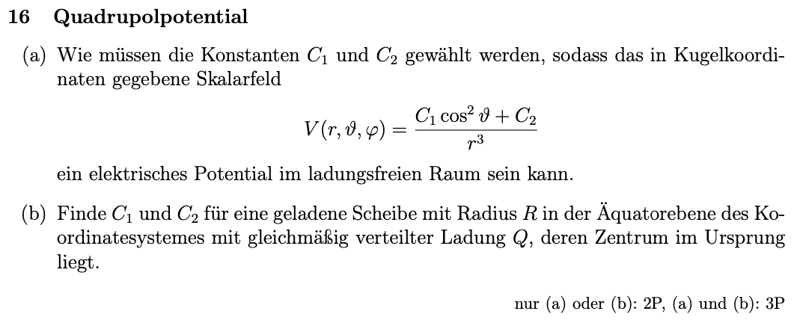
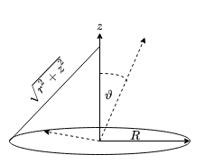
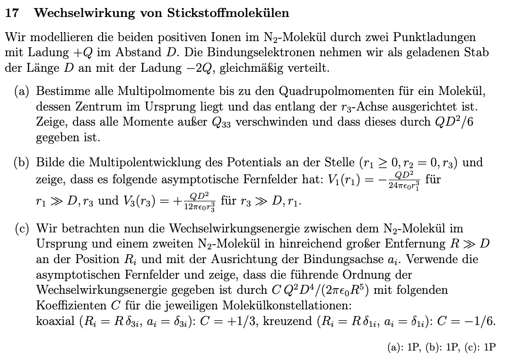
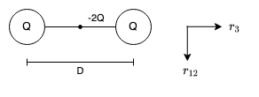
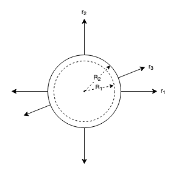
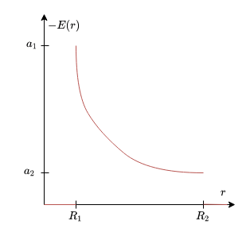
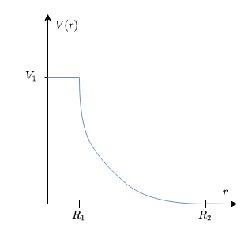

## 6. Problem Set - 04.05.2022
Elektrodynamik I - 136.015

**Gerechnete Beispiele:**
16) a) & b)
17) a) & b)
18) a) & b) & c)

### 16 Quadrupolpotential

#### a)
Gemäß der Angabe gehen wir von einem Skalarfeld der folgenden Form aus:
$$V(r,\vartheta,\varphi)=\frac{C_1\cdot\cos^2{\vartheta}+C_2}{r^3}$$
Für einen ladungsfreien Raum muss gelten:
$$\underbrace{-\nabla^2V=\frac{\rho}{\epsilon_0}}_{Poisson\,Gleichung}=0$$
$\nabla^2$ ist in dabei der Laplace-Operator. Wir können demnach den Laplace in Kugelkoordinaten anschreiben: (die Formel entstammt der Formelsammlung für den ersten Test)
$$\nabla^2V=\frac{1}{r^2}\cdot\partial_r(r^2\cdot\partial_rV)+\frac{1}{r^2\cdot\sin{\vartheta}}\cdot\partial_{\vartheta}(\sin{\vartheta}\cdot\partial_{\vartheta}V)+\frac{1}{r^2\sin^2{\vartheta}}\cdot\partial_{\varphi}\partial_{\varphi}V$$

---

$\partial_rV$ entspricht dabei:
$$\partial_rV=-3\cdot\frac{C_1\cdot\cos^2{\vartheta}+C_2}{r^4}$$
Damit folgt für den Term $\partial_r(r^2\cdot\partial_rV)$:
$$\partial_r(r^2\cdot\partial_rV)=\partial_r\left(\cancel{r^2}\cdot(-3)\cdot\frac{C_1\cdot\cos^2{\vartheta}+C_2}{r^{\cancel{4}}}\right)$$
$$=\partial_r\left((-3)\cdot\frac{C_1\cdot\cos^2{\vartheta}+C_2}{r^{2}}\right)=6\cdot\frac{C_1\cdot\cos^2{\vartheta}+C_2}{r^{3}}$$
Für das gesamte erste Glied folgt somit:
$$\frac{1}{r^2}\cdot\partial_r(r^2\cdot\partial_rV)=6\cdot\frac{C_1\cdot\cos^2{\vartheta}+C_2}{r^{5}}$$

---

Weiters entspricht $\partial_{\vartheta}V$:
$$\partial_{\vartheta}V=\partial_{\vartheta}\left(\frac{C_1\cdot\cos^2{\vartheta}+C_2}{r^3}\right)=\partial_{\vartheta}\left(\frac{C_1\cdot(\cos{\vartheta}\cdot\cos{\vartheta})+C_2}{r^3}\right)$$
Für $\cos{\vartheta}\cdot\cos{\vartheta}$ kann die Produktregel der Ableitung angewandt werden:
$$=\frac{C_1\cdot(-\sin{\vartheta}\cdot\cos{\vartheta}-\cos{\vartheta}\cdot\sin{\vartheta})}{r^3}=-2\cdot\frac{C_1\cdot(\sin{\vartheta}\cdot\cos{\vartheta})}{r^3}$$
Für den Term $\partial_{\vartheta}(\sin{\vartheta}\cdot\partial_{\vartheta}V)$ folgt damit:
$$\partial_{\vartheta}(\sin{\vartheta}\cdot\partial_{\vartheta}V)=\partial_{\vartheta}\left(-2\cdot\frac{C_1\cdot(\sin^2{\vartheta}\cdot\cos{\vartheta})}{r^3}\right)\partial_{\vartheta}\left(-2\cdot\frac{C_1\cdot((\sin{\vartheta}\cdot\sin{\vartheta})\cdot\cos{\vartheta})}{r^3}\right)$$
Erneut kann die Produktregel für Ableitungen angewandt werden:
$$=-2\cdot\frac{C_1\cdot((\cos{\vartheta}\cdot\sin{\vartheta}+\sin{\vartheta}\cdot\cos{\vartheta})\cdot\cos{\vartheta}-\sin{\vartheta}\cdot\sin{\vartheta}\cdot\sin{\vartheta})}{r^3}$$
$$\partial_{\vartheta}(\sin{\vartheta}\cdot\partial_{\vartheta}V)=-2\cdot\frac{C_1\cdot(2\cdot\sin{\vartheta}\cdot\cos^2{\vartheta}-\sin^3{\vartheta})}{r^3}$$
Somit folgt für das zweite Glied:
$$\frac{1}{r^2\cdot\sin{\vartheta}}\cdot\partial_{\vartheta}(\sin{\vartheta}\cdot\partial_{\vartheta}V)=\frac{1}{r^2\cdot\sin{\vartheta}}\cdot(-2)\cdot\frac{C_1\cdot(2\cdot\sin{\vartheta}\cdot\cos^2{\vartheta}-\sin^3{\vartheta})}{r^3}$$
$$=-2\cdot\frac{C_1\cdot(2\cdot\cos^2{\vartheta}-\sin^2{\vartheta})}{r^5}$$

---

Zuletzt entspricht $\partial_{\varphi}V$ gleich $0$.

---

Aus den vorherigen Berechnungen folgt für für die eingangs aufgestellte Bedingung $-\nabla^2V=0$:
$$-\nabla^2V=6\cdot\frac{C_1\cdot\cos^2{\vartheta}+C_2}{r^{5}}-2\cdot\frac{C_1\cdot(2\cdot\cos^2{\vartheta}-\sin^2{\vartheta})}{r^5}=0$$
$$=\cancel{\frac{1}{r^5}}\cdot(C_1\cdot(\underbrace{2\cdot\cos^2{\vartheta}+2\cdot\sin^2{\vartheta}}_{=2})+6\cdot C_2)=0$$
$$=2\cdot C_1+6\cdot C_2=0$$
Daraus folgt für $C_1$ und $C_2$:
$$C_1=-3\cdot C_2$$
$$C_2=-\frac{1}{3}\cdot C_1$$

#### b)

Für die geladene Scheibe kann die Raumladungsdichte $\rho(R,\varphi,z)$ wie folgt angenommen werden:
$$\rho(R,\varphi,z)=\sigma\cdot\delta(R-|r|)=\frac{Q}{R^2\cdot\pi}\cdot\delta(R-|r|)$$
Damit kann weiters das elektrische Potential der Scheibe ermittelt werden. $\sqrt{r^2+z^2}$ entspricht dabei dem Punkt zwischen einem Betrachtungspunkt auf der z-Achse und dem Radius der Scheibe.
$$V(R,\varphi,z)=\frac{1}{4\pi\cdot\epsilon_0}\cdot\int\frac{\rho(R,\varphi,z)}{\sqrt{r^2+z^2}}\,d^3r$$
Mit der Integration über die Zylinderkoordinaten und dem Volumenselement $dV=r\,dr\,d\varphi$ folgt daraus:
$$=\frac{1}{4\pi\cdot\epsilon_0}\cdot\int_0^{2\pi}\int_0^R\frac{\sigma}{\sqrt{r^2+z^2}}\cdot r\,dr\,d\varphi$$
Der Term $r^2+z^2$ kann für die Integration wie folgt substituiert werden:
$$u=r^2+z^2\rightarrow du=2\cdot r\,dr\rightarrow dr=\frac{du}{2\cdot r}$$
Damit ergibt sich das elektrische Potential zu:
$$=\frac{\sigma}{4\pi\cdot\epsilon_0}\cdot\int_0^{2\pi}\int_0^R\frac{\cancel{r}}{\sqrt{u}}\,\frac{du}{2\cdot\cancel{r}}\,d\varphi=\frac{\sigma}{4\pi\cdot\epsilon_0}\cdot\int_0^{2\pi}\sqrt{u}\,\Biggl\vert_0^R\,d\varphi$$
$$=\frac{\sigma}{4\pi\cdot\epsilon_0}\cdot\int_0^{2\pi}\sqrt{r^2+z^2}\,\Biggl\vert_0^R\,d\varphi=\frac{\sigma}{4\pi\cdot\epsilon_0}\cdot\int_0^{2\pi}\sqrt{R^2+z^2}-\sqrt{z^2}\,d\varphi$$
$$=\frac{\sigma}{\cancel{4\pi}\cdot\epsilon_0}\cdot\left(\sqrt{R^2+z^2}-\sqrt{z^2}\right)\cdot\cancel{2\pi}$$
$$=\frac{\sigma}{2\cdot\epsilon_0}\cdot\left(\sqrt{R^2+z^2}-\sqrt{z^2}\right)$$
Dieser Ausdruck kann nun mit dem Ausdruck für das elektrische Potential aus dem Unterpunkt a) gleichgesetzt werden:
$$V(R,\varphi,z)=\frac{\sigma}{2\cdot\epsilon_0}\cdot\left(\sqrt{R^2+z^2}-\sqrt{z^2}\right)=\frac{C_1\cdot\cos^2{\vartheta}+C_2}{r^3}$$
Nachdem wir das elektrische Potential in der z-Achse betrachten, muss $\vartheta$ mit $0$ angenommen werden. (siehe Skizze)
$$\frac{\sigma}{2\cdot\epsilon_0}\cdot\left(\sqrt{R^2+z^2}-\sqrt{z^2}\right)=\frac{C_1\cdot\overbrace{\cos^2{0}}^{=1}+C_2}{r^3}=\frac{C_1+C_2}{r^3}$$
Mit dem Zusammenhang $C_2=-\frac{1}{3}\cdot C_1$ aus Unterpunkt a) kann der rechte Ausruck weiter vereinfacht werden zu:
$$\frac{\sigma}{2\cdot\epsilon_0}\cdot\left(\sqrt{R^2+z^2}-\sqrt{z^2}\right)=\frac{C_1-\frac{1}{3}\cdot C_1}{r^3}=\frac{2}{3}\cdot\frac{C_1}{r^3}$$
Für $C_1$ einer geladenen Scheibe, gemäß der Angabe, ergibt sich somit final:
$$C_1=\frac{3}{4}\cdot\frac{\sigma\cdot r^3}{\epsilon_0}\cdot\left(\sqrt{R^2+z^2}-|z|\right)$$
Dadurch folgt für $C_2$ final:
$$C_2=-\frac{1}{3}\cdot C_1=-\frac{1}{\cancel{3}}\cdot\frac{\cancel{3}}{4}\cdot\frac{\sigma\cdot r^3}{\epsilon_0}\cdot\left(\sqrt{R^2+z^2}-|z|\right)$$

### 17 Wechselwirkung von Stickstoffmolekülen

#### a)

Die gesamte Multipol-Entwicklung entspricht:
$$V(\boldsymbol{x})=\frac{1}{4\pi\cdot\epsilon_0}\cdot\left[\frac{Q}{r}+\frac{\boldsymbol{\hat{r}}\cdot\boldsymbol{p}}{r^2}+\frac{\boldsymbol{\hat{r}}\cdot\mathcal{Q}_2\cdot\boldsymbol{\hat{r}}}{r^3}\right]$$
Der Term $Q$ entspricht dabei dem Multipol-Anteil. In unserem Fall ergibt sich dieser zu:
$$Q=\sum_{n=1}^{N=3}q_n=Q+Q-2\cdot Q=0$$
Für den Dipol-Anteil $\boldsymbol{p}$ folgt analog:
$$\boldsymbol{p}=\sum_{n=1}^{N=3}q_n\cdot\boldsymbol{x}_n=Q\cdot\frac{D}{2}\cdot(\underbrace{\vec{e}_3-\vec{e}_3}_{=\vec{0}})+q_3\cdot\boldsymbol{x}_3$$
Aus der Symmetrie des Stabes $q_3$ bzgl. der $r_{12}$-Ebene folgt, dass $q_3\cdot\boldsymbol{x}_3$ ebenfalls $0$ ergibt. Somit folgt für den Dipol-Anteil:
$$\boldsymbol{p}=Q\cdot\frac{D}{2}\cdot(\underbrace{\vec{e}_3-\vec{e}_3}_{=\vec{0}})+\underbrace{q_3\cdot\boldsymbol{x}_3}_{=0}=0$$
Der Multipol-Anteil $\mathcal{Q}$ folgt zu:
$$\mathcal{Q}_2=\frac{1}{2}\cdot\sum_{n=1}^{N=3}\frac{q_n}{2}\cdot\left(3\cdot\boldsymbol{x}_n\cdot\boldsymbol{x}_n-r^2_n\cdot\boldsymbol{I}\right)$$
Aus dem Plenum ist zusätzlich der folgende Ausdruck für den Quadrupol bekannt (spurbehaftet):
$$P_{ij}=\frac{1}{2}\cdot\int\rho(\boldsymbol{x})\cdot\boldsymbol{x}_i\cdot\boldsymbol{x}_j\,d^3x$$

---

Die Raumladungsdichte $\rho(\boldsymbol{x})$ kann in diesem Beispiel aus zwei Komponenten zusammengesetzt werden. Die erste Komponente sind die positiven Punktladungen $Q$:
$$\rho_P(\boldsymbol{r})=\left(\delta(r_1)\cdot\delta(r_2)\cdot\delta\left(r_3\pm\frac{D}{2}\right)\right)\cdot Q$$
Für die Raumladungsdichte des geladenen Stabs gilt:
$$\rho_S(\boldsymbol{r})=\left(\delta(r_1)\cdot\delta(r_2)\cdot\Theta\left(\frac{D}{2}-|r_3|\right)\right)\cdot\left(-\frac{2\cdot Q}{D}\right)$$
In Summe kann die Raumladungsdichte somit angeschrieben werden als:
$$\rho(\boldsymbol{r})=\rho_P(\boldsymbol{r})+\rho_S(\boldsymbol{r})$$
$$=\delta(r_1)\cdot\delta(r_2)\cdot\left(Q\cdot\delta\left(r_3\pm\frac{D}{2}\right)+\Theta\left(\frac{D}{2}-|r_3|\right)\cdot\left(-\frac{2\cdot Q}{D}\right)\right)$$
Weiter vereinfacht ergibt sich somit:
$$=Q\cdot\delta(r_1)\cdot\delta(r_2)\cdot\left(\delta\left(r_3+\frac{D}{2}\right)+\delta\left(r_3-\frac{D}{2}\right)-\frac{2}{D}\cdot\Theta\left(\frac{D}{2}-|r_3|\right)\right)$$

*Die folgendenden Berechnungen wurden unter Zuhilfenahme von Wolfram Alpha berechnet!*

Mit der ermittelten Raumladungsdichte $\rho(\boldsymbol{r})$ kann nun das Quadrupolmoment gemäß der eingangs beschriebenen Formel aus dem Plenum berechnet werden: (Die Parameter der Heaviside-Funktion können in Integralsgrenzen überführt werden.)
$$P_{11}=\frac{Q}{2}\cdot\left[\left(\int_{-\infty}^{\infty}\delta(r_1)\cdot r_1^2\,dr_1\right)\cdot\left(\int_{-\infty}^{\infty}\delta(r_2)\,dr_2\right)\cdot\left(\int_{-\infty}^{\infty}\delta\left(r_3-\frac{D}{2}\right)\,dr_3+\int_{-\infty}^{\infty}\delta\left(r_3+\frac{D}{2}\right)\,dr_3-\frac{2}{D}\cdot\int_{-\frac{D}{2}}^{\frac{D}{2}}1\,dr_3\right)\right]$$
Die Integrale über $\delta(r)$ ergeben gemäß der Definition der Delta-Distribution jeweils $1$. Die Integrale nach $dr_3$ ergeben jedoch in Summe $0$, wodurch das gesamte Ergebnis für $P_{11}$ zu $0$ wird.
$$P_{11}=\frac{Q}{2}\cdot\left[\left(\int_{-\infty}^{\infty}\delta(r_1)\cdot r_1^2\,dr_1\right)\cdot\left(\int_{-\infty}^{\infty}\delta(r_2)\,dr_2\right)\cdot(\underbrace{1+1-2}_{=0})\right]=0$$
$P_{22}$ kann analog zu $P_{11}$ berechnet werden:
$$P_{22}=\frac{Q}{2}\cdot\left[\left(\int_{-\infty}^{\infty}\delta(r_1)\,dr_1\right)\cdot\left(\int_{-\infty}^{\infty}\delta(r_2)\cdot r_2^2\,dr_2\right)\cdot\left(\int_{-\infty}^{\infty}\delta\left(r_3-\frac{D}{2}\right)\,dr_3+\int_{-\infty}^{\infty}\delta\left(r_3+\frac{D}{2}\right)\,dr_3-\frac{2}{D}\cdot\int_{-\frac{D}{2}}^{\frac{D}{2}}1\,dr_3\right)\right]$$
Auch hier ergeben die Integrale nach $dr_3$ in Summe $0$, wodurch das Ergebnis für $P_{22}$ ebenfalls zu $0$ ausfällt:
$$P_{22}=\frac{Q}{2}\cdot\left[\left(\int_{-\infty}^{\infty}\delta(r_1)\,dr_1\right)\cdot\left(\int_{-\infty}^{\infty}\delta(r_2)\cdot r_2^2\,dr_2\right)\cdot(\underbrace{1+1-2}_{=0})\right]=0$$
Somit kann $P_{33}$ angeschrieben werden:
$$\begin{align}P_{33}=\frac{Q}{2}\cdot\Biggl[\Biggl(\underbrace{\int_{-\infty}^{\infty}\delta(r_1)\,dr_1}_{=1}\Biggl)\cdot\Biggl(\underbrace{\int_{-\infty}^{\infty}\delta(r_2)\,dr_2}_{=1}\Biggl)\cdot\Biggl(\underbrace{\int_{-\infty}^{\infty}\delta\Biggl(r_3-\frac{D}{2}\Biggl)\cdot r_3^2\,dr_3}_{=\frac{D^2}{4}}+\underbrace{\int_{-\infty}^{\infty}\delta\Biggl(r_3+\frac{D}{2}\Biggl)\cdot r_3^2\,dr_3}_{=\frac{D^2}{4}}-\frac{2}{D}\cdot\int_{-\frac{D}{2}}^{\frac{D}{2}}1\cdot r_3^2\,dr_3\Biggl)\Biggl]\end{align}$$
Der letzte Term kann nun noch manuell integriert werden:
$$\frac{2}{D}\cdot\int_{-\frac{D}{2}}^{\frac{D}{2}}1\cdot r_3^2\,dr_3=\frac{2}{D}\cdot\left(\frac{1}{3}\cdot r_3^3\right)\Biggl\vert_{-\frac{D}{2}}^{+\frac{D}{2}}=\frac{2}{D}\cdot\left(\frac{\frac{D^3}{8}}{3}+\frac{\frac{D^3}{8}}{3}\right)$$
$$=\frac{\cancel{2}}{\cancel{D}}\cdot\left(\frac{2\cdot D^{\cancel{3}}}{\cancel{24}}\right)=\frac{D^2}{6}$$
Für $P_{33}$ folgt somit final:
$$=\frac{Q}{2}\cdot\Biggl[1\cdot1\cdot\Biggl(\underbrace{\frac{D^2}{4}+\frac{D^2}{4}}_{=\frac{D^2}{2}}-\frac{D^2}{6}\Biggl)\Biggl]=\frac{Q}{2}\cdot\frac{2\cdot D^2}{6}$$
$$P_{33}=\frac{Q\cdot D^2}{6}$$
In diesem Beispiel müssen lediglich $P_{11}$, $P_{22}$ und $P_{33}$ betrachtet werden, da alle anderen Anteile, bei denen $i$ ungleich $j$ ist, in Summe $0$ ergeben. (Erneut aufgrund des Integrals nach $r_3$.)

#### b)
Die Multipolentwicklung des elektrischen Potentials kann anhand der in Unterpunkt a) angeführten Formel ermittelt werden. Diese lautet:
$$V(\boldsymbol{x})=\frac{1}{4\pi\cdot\epsilon_0}\cdot\left[\frac{Q}{r}+\frac{\boldsymbol{\hat{r}}\cdot\boldsymbol{p}}{r^2}+\frac{\boldsymbol{\hat{r}}\cdot\mathcal{Q}_2\cdot\boldsymbol{\hat{r}}}{r^3}\right]$$
Indem man nun die Berechnungen aus Unterpunkt a) einfügt, erhält man die folgende Formel: ($P_{11}$ und $P_{22}$ können gemäß Unterpunkt a) vernachlässigt werden, nachdem sie jeweils $0$ ergeben. Somit wird für $r_i$ und $r_j$ jeweils $r_3$ eingesetzt. Für $r^2$ kann $r_1^2+r_3^2$ eingesetzt werden, nachdem das Potential an der Stelle $r_1\geq0$, $r_2=0$, $r_3$ betrachtet werden soll. $r_2$ entfällt hier demnach, da es gemäß der Angabe gleich $0$ ist. $r^2=r_1^2+r_2^2+r_3^2$)
$$V_1(r_1)=\frac{1}{4\pi\cdot\epsilon_0}\cdot\left[\frac{0}{r}+\frac{0}{r^2}+\frac{Q\cdot D^2}{6}\cdot\frac{3\cdot r_i\cdot r_j-r^2\cdot\delta_{ij}}{r^5}+\mathcal{O}(r^{-4})\right]$$
$$=\frac{1}{4\pi\cdot\epsilon_0}\cdot\left[\frac{Q\cdot D^2}{6}\cdot\frac{3\cdot r_i\cdot r_j-r^2\cdot\delta_{ij}}{r^5}\right]$$
$$=\frac{Q\cdot D^2}{24\pi\cdot\epsilon_0}\cdot\left[\frac{3\cdot r_3^2-r^2}{r^5}\right]=\frac{Q\cdot D^2}{24\pi\cdot\epsilon_0}\cdot\left[\frac{3\cdot r_3^2-(r_1^2+r_3^2)}{(r_1^2+r_3^2)^{\frac{5}{2}}}\right]$$
$$=\frac{Q\cdot D^2}{24\pi\cdot\epsilon_0}\cdot\left[\frac{-r_1^2+2\cdot r_3^2}{(r_1^2+r_3^2)^{\frac{5}{2}}}\right]$$
Gemäß der Angabe gilt für $V_1(r_1)$: $r_1>>r_3$. Damit folgt für $V_1(r_1)$:
$$V_1(r_1)=\frac{Q\cdot D^2}{24\pi\cdot\epsilon_0}\cdot\left[\frac{-r_1^2}{(r_1^2)^{\frac{5}{2}}}\right]=\frac{Q\cdot D^2}{24\pi\cdot\epsilon_0}\cdot\frac{-\cancel{r_1^{2}}}{r_1^{\cancel{5}}}=-\frac{Q\cdot D^2}{24\pi\cdot\epsilon_0}\cdot\frac{1}{r_1^{3}}$$

---

Die Berechnung von $V_3(r_3)$ erfolgt analog zu $V_1(r_1)$:
$$V_3(r_3)=\frac{Q\cdot D^2}{24\pi\cdot\epsilon_0}\cdot\left[\frac{3\cdot r_3^2-(r_1^2+r_3^2)}{(r_1^2+r_3^2)^{\frac{5}{2}}}\right]$$
$$=\frac{Q\cdot D^2}{24\pi\cdot\epsilon_0}\cdot\left[\frac{-r_1^2+2\cdot r_3^2}{(r_1^2+r_3^2)^{\frac{5}{2}}}\right]$$
Für $V_3(r_3)$ gilt gemäß der Angabe $r_3>>r_1$: Daraus folgt:
$$V_3(r_3)=\frac{Q\cdot D^2}{\cancel{24}\pi\cdot\epsilon_0}\cdot\left[\frac{\cancel{2}\cdot r_3^2}{(r_3^2)^{\frac{5}{2}}}\right]=\frac{Q\cdot D^2}{12\pi\cdot\epsilon_0}\cdot\Biggl[\underbrace{\frac{\cancel{r_3^2}}{r_3^{\cancel{5}}}}_{=\frac{1}{r_3^3}}\Biggl]$$
$$V_3(r_3)=\frac{Q\cdot D^2}{12\pi\cdot\epsilon_0}\cdot\frac{1}{r_3^3}$$

### 18 Metallkugeln

#### a)

Die Poisson-Gleichung ist allgemein definiert als:
$$-\nabla^2V(r)=\frac{\rho}{\epsilon_0}$$
Im ladungsfreien Raum außerhalb der Kugel gilt weiters:
$$-\nabla^2V(r)=0$$
$\nabla^2$ ist in dabei der Laplace-Operator. Wir können demnach den Laplace in Kugelkoordinaten anschreiben: (die Formel entstammt der Formelsammlung für den ersten Test)
$$\nabla^2V(r)=\frac{1}{r^2}\cdot\partial_r(r^2\cdot\partial_rV(r))+\frac{1}{r^2\cdot\sin{\vartheta}}\cdot\partial_{\vartheta}(\sin{\vartheta}\cdot\partial_{\vartheta}V(r))+\frac{1}{r^2\sin^2{\vartheta}}\cdot\partial_{\varphi}\partial_{\varphi}V(r)$$
Nachdem wir in diesem Unterpunkt das elektrische Potential in Abhängigkeit von $r$ betrachten wollen, können wir ausschließlich den Term $\frac{1}{r^2}\cdot\partial_r(r^2\cdot\partial_rV)$ betrachten. Dieser kann wie bereits die Poisson-Gleichung gleich $0$ gesetzt werden:
$$\cancel{\frac{1}{r^2}}\cdot\partial_r(r^2\cdot\partial_rV(r))=0$$
Durch beidseitige Integration folgt:
$$\partial_r(r^2\cdot\partial_rV(r))=0\,\Biggl\vert\,\int$$
$$r^2\cdot\partial_rV(r)=C_1$$
Dieser Term kann umgeformt werden zu:
$$\partial_rV(r)=\frac{C_1}{r^2}$$
Das Ergebnis kann erneut beidseitig integriert werden:
$$\partial_rV(r)=\frac{C_1}{r^2}\,\Biggl\vert\,\int$$
Damit ergibt sich die Form für das elektrische Potential zu:
$$\implies V(r)=\int\frac{C_1}{r^2}\,dr=-\frac{C_1}{r}+C_2=0$$

---

Im Zwischenraum der Kugel kommen die beiden Randbedingungen $V(R_2)=0$ und $V(R_1)\neq0$, aus der Angabe, zum Tragen. Daraus folgt für $V(R_2)$:
$$V(R_2)=0=-\frac{C_1}{R_2}+C_2\implies C_2=\frac{C_1}{R_2}$$
Für $V(R_1)$ ergibt sich damit:
$$V(R_1)\neq0=-\frac{C_1}{R_1}+\underbrace{C_2}_{\frac{C_1}{R_2}}=-\frac{C_1}{R_1}+\frac{C_1}{R_2}$$
$$V(R_1)=C_1\cdot\left(\frac{1}{R_2}-\frac{1}{R_1}\right)$$
$$=C_1\cdot\left(\frac{R_1-R_2}{R_1\cdot R_2}\right)$$
$$\implies C_1=V(R_1)\cdot\frac{R_1\cdot R_2}{R_1-R_2}$$
Damit folgt für $C_2$ gemäß dem eingangs festgestellten Zusammenhang zwischen $C_2$ und $C_1$:
$$C_2=\frac{C_1}{R_2}=V(R_1)\cdot\left(\frac{R_1}{R_1-R_2}\right)$$
Nun können die Ergebnisse für $C_1$ und $C_2$ in die Form für $V_(r)$ eingesetzt werden, wodurch folgt:
$$V(r)=V(R_1)\cdot\left(-\frac{1}{r}\cdot\frac{R_1\cdot R_2}{R_1-R_2}+\frac{R_1}{R_1-R_2}\right)$$

---

Das elektrische Feld im Zwischenraum der Kugeln kann nun über den Zusammenhang zwischen $E$ und $V$ bestimmt werden:
$$E(r)=-\nabla V(r)$$
Damit folgt für $E(r)$ im Zwischenraum der Kugeln:
$$E(r)=-\partial_r\left(V(R_1)\cdot\left(-\frac{1}{r}\cdot\frac{R_1\cdot R_2}{R_1-R_2}+\frac{R_1}{R_1-R_2}\right)\right)$$
$$=-V(R_1)\cdot\left(\frac{1}{r^2}\cdot\frac{R_1\cdot R_2}{R_1-R_2}+0\right)$$
$$E(r)=-\frac{V(R_1)}{r^2}\cdot\frac{R_1\cdot R_2}{R_1-R_2}$$

---

Für das elektrische Feld im Innenraum der Kugel gilt aufgrund der Symmetrie:
$$E(r)=0$$
(Dieser Zusammenhang wurde bereits in vergangenen Problem-Sets nachgewiesen.)

---

Für den Außenraum entspricht das elektrische Potential $V(r)$:
$$V(r)=\frac{1}{4\pi\cdot\epsilon_0}\cdot\int_V\frac{\rho(r')}{|r-r'|}d^3r'$$
Nachdem wir den ladungsfreien Raum betrachten, ist auch hier $V(r)=0$.
Über den eingangs aufgestellten Zusammenhang zu $V(r)$ folgt somit:
$$V(r)=-\frac{C_1}{r}+C_2=0$$
Betrachtet man diesen Zusammenhang im Unendlichen, folgt:
$$\lim_{r\rightarrow0}\left(-\frac{C_1}{r}+C_2\right)=0$$
Der Term $-\frac{C_1}{r}$ ergibt sich mit $\lim_{r\rightarrow0}$ zu $0$. Somit folgt für $C_2$:
$$C_2=0$$
Weiters kann aus der Randbedingung $V(R_2)$ abgeleitet werden:
$$V(R_2)=-\frac{C_1}{R_2}+\underbrace{C_2}_{=0}=0$$
$$\implies-\frac{C_1}{R_2}=0$$
Somit ergibt sich auch $C_1$ zu $0$.
Für das elektrische Feld im ladungsfreien Außenraum abseits der Kugeloberfläche folgt somit final:
$$E(r)=-\nabla V(r)$$
Für $V(r)=0$ entpricht das elektrische Feld $E$ somit:
$$E(r)=0$$

---

Skizziert verläuft $E(r)$ wie folgt:

Die Faktoren $a_1$ und $a_2$ entsprechen dabei:
$$a(r)=-\frac{R_2\cdot V(R_1)}{(R_1-R_2)\cdot r}$$
$$a_1=a(R_1)=-\frac{R_2\cdot V(R_1)}{(R_1-R_2)\cdot R_1}$$
$$a_2=a(R_2)=-\frac{R_2\cdot V(R_1)}{(R_1-R_2)\cdot R_2}$$
Das elektrische Potential $V(r)$ entspricht skizziert:

#### b)
Aufgrund der Sprungbedingungen für die Normalprojektion der elektrischen Flußdichte folgt: (Quelle: Vorlesungen über die Grundlagen der Elektrotechnik Band 1 von Adalbert Prechtl, Seite 273)
$$[|D_n|]=\sigma$$
Aus dem Zusammenhang $D=\epsilon_0\cdot E$ folgt:
$$[|\epsilon_0\cdot E_n|]=\frac{Q}{A}$$
Somit kann die Ladung $Q$ wie folgt berechnet werden:
$$Q=A\cdot\epsilon_0\cdot E(r)$$
$$=\left(4\pi\cdot\cancel{r^2}\right)\cdot\epsilon_0\cdot\left(-\frac{V(R_1)}{\cancel{r^2}}\cdot\frac{R_1\cdot R_2}{R_1-R_2}\right)$$
$$=-4\pi\cdot\epsilon_0\cdot\frac{R_1\cdot R_2}{R_1-R_2}\cdot V(R_1)$$
Wie bei einem Kugelkondensator sind auch in diesem Fall die Ladungen gegengleich. Somit gilt:
$$Q_{innen}=-Q_{außen}$$

#### c)
Die elektrische Energie ist definiert durch:
$$W=\int\boldsymbol{F}\,ds$$
Durch den Zusammenhang, dass die Kraft $F$ gleich $q\cdot E$ ist, kann der Ausdruck umgeformt werden zu:
$$W=\int Q\cdot\boldsymbol{E}\,ds$$
Weiters gilt für das elektrische Potential und das elektrische Feld:
$$V=-\int\boldsymbol{E}\,ds$$
Somit folgt der Zusammenhang:
$$W=\int Q\cdot\boldsymbol{E}\,ds=-Q\cdot V$$
Eingesetzt ergibt sich die elektrische Energie somit zu:
$$W=-Q\cdot V(R_1)\cdot\left(-\frac{1}{r}\cdot\frac{R_1\cdot R_2}{R_1-R_2}+\frac{R_1}{R_1-R_2}\right)$$
Als Vielfaches von $Q_1\cdot V_1$ geschrieben, folgt somit für die elektrische Energie:
$$\frac{W}{Q_1\cdot V_1}=\frac{1}{r}\cdot\frac{R_1\cdot R_2}{R_1-R_2}-\frac{R_1}{R_1-R_2}$$
