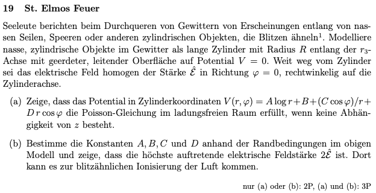
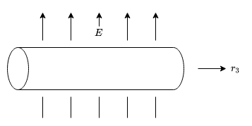
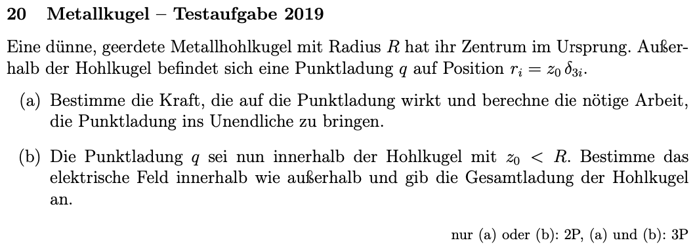
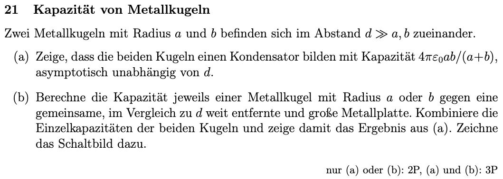
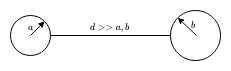
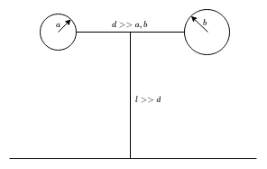
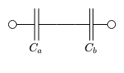

## 7. Problem Set - 11.05.2022
Elektrodynamik I - 136.015

**Gerechnete Beispiele:**
19) a) & b)
20) 
21) a) & b)

### 19 St. Elmos Feuer

#### a)

Das Potential in Zylinderkoordinaten entspricht gemäß der Angabe:
$$V(r,\varphi)=A\cdot\ln(r)+B+\frac{(C\cdot\cos{\varphi})}{r}+D\cdot r\cdot\cos{\varphi}$$
Die Poisson-Gleichung kann allgemein angeschrieben werden als:
$$-\nabla^2V=\frac{\rho}{\epsilon_0}$$
Im ladungsfreien Raum gilt $\rho=0$, daher folgt für die Poisson-Gleichung:
$$-\nabla^2V=0$$
Nachdem $\nabla^2$ dem Laplaceoperator entspricht, können wir weiters den Laplace in Zylinderkoordinaten anschreiben: (siehe die Formelsammlung des 1. Tests)
$$\nabla^2V=\frac{1}{r}\cdot\partial_r(r\cdot\partial_rV)+\frac{1}{r^2}\cdot(\partial_{\varphi}\partial_{\varphi}V)+\partial_z\partial_zV$$

---

Die Poisson-Gleichung kann mit diesen Bedingungen wie folgt angeschrieben werden:
$$-\left[\frac{1}{r}\cdot\partial_r(r\cdot\partial_rV)+\frac{1}{r^2}\cdot(\partial_{\varphi}\partial_{\varphi}V)+\partial_z\partial_zV\right]=0$$

---

Der erste Term ergibt sich entsprechend zu:
$$\frac{1}{r}\cdot\partial_r(r\cdot\partial_rV)=\frac{1}{r}\cdot\partial_r\Biggl(r\cdot\partial_r\Biggl(A\cdot\ln(r)+\underbrace{B}_{=0}+\frac{(C\cdot\cos{\varphi})}{r}+D\cdot r\cdot\cos{\varphi}\Biggl)\Biggl)$$
Der Term $B$ fällt direkt weg, da er nicht von $r$ abhängig ist. Mit der Ableitung der restlichen Terme folgt somit:
$$=\frac{1}{r}\cdot\partial_r\Biggl(r\cdot\Biggl(A\cdot\frac{1}{r}-\frac{(C\cdot\cos{\varphi})}{r^2}+D\cdot\cos{\varphi}\Biggl)\Biggl)$$
$$=\frac{1}{r}\cdot\partial_r\Biggl(A-\frac{(C\cdot\cos{\varphi})}{r}+D\cdot r\cdot\cos{\varphi}\Biggl)$$
Somit kann die zweite Ableitung nach $r$ erfolgen:
$$=\frac{1}{r}\cdot\Biggl(+\frac{(C\cdot\cos{\varphi})}{r^{2}}+D\cdot\cos{\varphi}\Biggl)$$
Final ergibt sich somit für den ersten Term:
$$\frac{1}{r}\cdot\partial_r(r\cdot\partial_rV)=\frac{C\cdot\cos{\varphi}}{r^3}+\frac{D\cdot\cos{\varphi}}{r}=\frac{\cos{\varphi}\cdot(C+r^2\cdot D)}{r^3}$$

---

Weiters kann nun der zweite Term aufgelöst werden:
$$\frac{1}{r^2}\cdot(\partial_{\varphi}\partial_{\varphi}V)=\frac{1}{r^2}\cdot\Biggl(\partial_{\varphi}\partial_{\varphi}\Biggl(\underbrace{A\cdot\ln(r)}_{=0}+\underbrace{B}_{=0}+\frac{(C\cdot\cos{\varphi})}{r}+D\cdot r\cdot\cos{\varphi}\Biggl)\Biggl)$$
Auch hier fallen zwei Terme direkt weg, da sie nicht von $\varphi$ abhängig sind:
$$=\frac{1}{r^2}\cdot\Biggl(\partial_{\varphi}\Biggl(-\frac{C\cdot\sin{\varphi}}{r}-D\cdot r\cdot\sin{\varphi}\Biggl)\Biggl)$$
$$=\frac{1}{r^2}\cdot\left(-\frac{C\cdot\cos{\varphi}}{r}-D\cdot r\cdot\cos{\varphi}\right)$$
$$\frac{1}{r^2}\cdot(\partial_{\varphi}\partial_{\varphi}V)=\frac{1}{r^2}\cdot\left(-\frac{\cos{\varphi\cdot(C+r^2\cdot D)}}{r}\right)=-\frac{\cos{\varphi\cdot(C+r^2\cdot D)}}{r^3}$$

---

Somit kann der dritte Term berechnet werden:
$$\partial_z\partial_zV=\partial_z\partial_z\Biggl(\underbrace{A\cdot\ln(r)}_{=0}+\underbrace{B}_{=0}+\underbrace{\frac{(C\cdot\cos{\varphi})}{r}}_{=0}+\underbrace{D\cdot r\cdot\cos{\varphi}}_{=0}\Biggl)$$
Nachdem keine Komponente von $z$ abhängig ist, ergibt sich dieser Term komplett zu $0$.

---

Somit folgt final für die Poisson-Gleichung:
$$\underbrace{\frac{\cos{\varphi}\cdot(C+r^2\cdot D)}{r^3}-\frac{\cos{\varphi}\cdot(C+r^2\cdot D)}{r^3}}_{=0}=0$$
Damit wurde gezeigt, dass das Potential in Zylinderkoordinaten die Poisson-Gleichung im ladungsfreien Raum erfüllt.

#### b)
In der Angabe sind die folgenden Randbedingungen definiert:
$$V(R)=0$$
$$E(r)\Biggl\vert_{\varphi=0,r\rightarrow\infty}=\hat{\mathcal{E}}$$
$$V(R)=0$$
Allgemein ist das elektrische Feld $E$ der negative Gradient des elektrischen Potentials $V$:
$$E=-\nabla V$$
Entsprechend ergibt sich für das elektrische Feld zu: ($V$ wird nach $dr$, $d\varphi$ und $dz$ abgeleitet)
$$E=-\left[\left(\frac{A}{r}-\frac{C\cdot\cos{\varphi}}{r^2}+D\cdot\cos{\varphi}\right)\cdot\vec{e}_r+\left(-\frac{C\cdot\sin{\varphi}}{r}-D\cdot r\cdot\sin{\varphi}\right)\cdot\vec{e}_{\varphi}+0\cdot\vec{e}_z\right]$$
Basierend auf der Randbedingung $E(r)\Biggl\vert_{\varphi=0,r\rightarrow\infty}=\hat{\mathcal{E}}$  kann $D$ ermittelt werden:
$$E(r)\Biggl\vert_{\varphi=0,r\rightarrow\infty}=\hat{\mathcal{E}}=-\Biggl[\Biggl(\underbrace{\frac{A}{\infty}}_{=0}-\underbrace{\frac{C\cdot\cos{0}}{{\infty}^2}}_{=0}+\underbrace{D\cdot\cos{0}}_{=D}\Biggl)\cdot\vec{e}_r+\Biggl(\underbrace{-\frac{C\cdot\sin{0}}{\infty}}_{=0}-D\cdot\infty\cdot\sin{0}\Biggl)\cdot\vec{e}_{\varphi}\Biggl]$$
Für den Term $D\cdot\infty\cdot\sin{0}$ kann die Regel von de L’Hospital genutzt werden:
$$D\cdot\infty\cdot\sin{0}=D\cdot\infty\cdot0=D\cdot\frac{\sin{0}}{\frac{1}{r}}=D\cdot(\sin{0}\cdot r)=0$$
Somit folgt für $E(r)\Biggl\vert_{\varphi=0,r\rightarrow\infty}$:
$$\hat{\mathcal{E}}=-\left[D\cdot\vec{e}_r-0\cdot\vec{e}_{\varphi}\right]=-D\cdot\vec{e}_r$$
Wie in der Angabe beschrieben gilt die Bedingung rechtwinklig auf die Zylinderachse. Entsprechend kann man schreiben:
$$\hat{\mathcal{E}}\cdot\cancel{\vec{e}_r}=-D\cdot\cancel{\vec{e}_r}$$
Daraus folgt für $D$:
$$D=-\hat{\mathcal{E}}$$

---

Für die Bestimmung der restlichen Konstanten nutzen wir erneut die Formel für $E$, jedoch diesmal mit dem Radius $R$:
$$E(R)=-\left[\left(\frac{A}{R}-\frac{C\cdot\cos{\varphi}}{R^2}+D\cdot\cos{\varphi}\right)\cdot\vec{e}_r+\left(-\frac{C\cdot\sin{\varphi}}{R}-D\cdot R\cdot\sin{\varphi}\right)\cdot\vec{e}_{\varphi}\right]$$
Mit dem Radius $R$ und der Randbedingung $V(R)=0$ gilt:
$$E(R)=-\nabla V(R)=\vec{0}$$
Zusätzlich können wir in diesem Fall gemäß dem Plenum annehmen, dass $\varphi=90°$ gilt. Damit ergibt sich $E(R)$ zu:
$$E(R)=\vec{0}=-\Biggl[\Biggl(\frac{A}{R}-\frac{C\cdot\overbrace{\cos{\varphi}}^{=0}}{R^2}+D\cdot\overbrace{\cos{\varphi}}^{=0}\Biggl)\cdot\vec{e}_r+\Biggl(-\frac{C\cdot\overbrace{\sin{\varphi}}^{=1}}{R}-D\cdot R\cdot\overbrace{\sin{\varphi}}^{=1}\Biggl)\cdot\vec{e}_{\varphi}\Biggl]$$
$$=-\frac{A}{R}\cdot\vec{e}_r+\left(\frac{C}{R}+D\cdot R\right)\cdot\vec{e}_\varphi=\vec{0}$$
Betrachtet man nur die $\vec{e}_r$ Ebene, folgt:
$$-\frac{A}{R}=0\rightarrow A=0$$
Für die $\vec{e}_{\varphi}$ Ebene gilt:
$$\frac{C}{R}+D\cdot R=0$$
Daraus folgt:
$$C=-D\cdot R^2$$
Mit dem Ergebnis für $D$ kann $C$ wie folgt geschrieben werden:
$$C=\hat{\mathcal{E}}\cdot R^2$$

---

Als letzte fehlende Konstante kann nun der Wert für $B$ ermittelt werden. Dafür kann erneut die Beziehung $V(R)=0$ genutzt werden. Für $\varphi$ kann erneut $90°$ eingesetzt werden:
$$V(R,90°)=0=\overbrace{A}^{=0}\cdot\ln(r)+B+\frac{(C\cdot\overbrace{\cos{\varphi}}^{=0})}{r}+D\cdot r\cdot\overbrace{\cos{\varphi}}^{=0}$$
Damit folgt für $B$:
$$B=0$$

---

Als letzter Teil soll nun gezeigt werden, dass die höchste auftretende Feldstärke $2\cdot\hat{\mathcal{E}}$ ist. Dort kann es gemäß der Angabe zur blitzähnlichen Ionisierung der Luft kommen. Entsprechend gilt für diesen Fall $r=R$ und $\varphi=0$:
$$E(R)=-\left[\left(\frac{A}{R}-\frac{C\cdot\cos{\varphi}}{R^2}+D\cdot\cos{\varphi}\right)\cdot\vec{e}_r+\left(-\frac{C\cdot\sin{\varphi}}{R}-D\cdot R\cdot\sin{\varphi}\right)\cdot\vec{e}_{\varphi}\right]$$
Indem man die ermittelten Werte für die Konstanten einsetzt kommt man auf:
$$E(R)=-\left[\left(0-\frac{C\cdot1}{R^2}+D\cdot1\right)\cdot\vec{e}_r+\left(-\frac{C\cdot0}{r}-D\cdot r\cdot0\right)\cdot\vec{e}_{\varphi}\right]$$
$$E(R)=\left(\frac{C}{R^2}-D\right)\cdot\vec{e}_r=\left(\frac{\hat{\mathcal{E}}\cdot\cancel{R^2}}{\cancel{R^2}}+\hat{\mathcal{E}}\right)\cdot\vec{e}_r=2\cdot\hat{\mathcal{E}}\cdot\vec{e}_r$$
Nachdem $\hat{\mathcal{E}}$ wie in der Angabe beschrieben normal auf die Zylinderachse steht und sich somit in Richtung $\vec{e}_{r}$ ausbreitet, wurde der Zusammenhang gezeigt:
$$E_{max}(R)=2\cdot\hat{\mathcal{E}}$$

### 20 

%%
https://www.tpi.uni-jena.de/qfphysics/homepage/wipf/lectures/ed/ed3.pdf
%%

### 21 Kapazität von Metallkugeln

#### a)

Die elektrische Kapazität eines Kondensators ist allgemein definiert als: ($U$ entspricht der elektrischen Spannung)
$$C=\frac{Q}{U}$$
Die elektrische Spannung $U$ ist weiters die Differenz zweiter Potentiale $V_1$ und $V_2$:
$$U=V_2-V_1$$
In unserem Fall soll die Kapazität der beiden Metallkugeln berechnet werden. Entsprechend ist die Spannung die Differenz zwischen dem Potential der linken Kugel und dem Potential der rechten Kugel.

Das elektrische Potential ist allgemein definiert als:
$$V(x)=-\int_{\Gamma}E\,ds=-\frac{Q}{4\pi\cdot\epsilon_0}\cdot\int_{\Gamma}\frac{1}{x^2}\,dx$$
(Das elektrische Feld wurde über das gauß'sche Gesetz in Integralform ermittelt.)
In unserem Fall möchten wir das Potential am Rand der beiden Kugeln berechnen. Die Differenz daraus ist die elektrische Spannung $U$. Entsprechend können wir als Anfangs- und Endpunkt für das Potential $a$ bzw. $b$ (der Rand der Kugel) und $0$ (den Ursprung der Kugel) wählen. Damit folgt für das Potential der linken Kugel:
$$V_l=-\frac{Q}{4\pi\cdot\epsilon_0}\cdot\int_{a}^{0}\frac{1}{x^2}\,dx=-\frac{Q}{4\pi\cdot\epsilon_0}\cdot\left(-\frac{1}{a}+0\right)=\frac{Q}{4\pi\cdot\epsilon_0}\cdot\frac{1}{a}$$
Analoges gilt für das Potential der rechten Kugel, wobei hierbei die Ladung entsprechend einem Kondensator gegengleich zu der Ladung der linken Kugel sein muss.
Somit gilt:
$$V_r=-\frac{-Q}{4\pi\cdot\epsilon_0}\cdot\int_{b}^{0}\frac{1}{x^2}\,dx=\frac{Q}{4\pi\cdot\epsilon_0}\cdot\left(-\frac{1}{b}+0\right)=-\frac{Q}{4\pi\cdot\epsilon_0}\cdot\frac{1}{b}$$
Wie eingangs beschrieben kann nun die elektrische Spannung ermittelt werden:
$$U=V_l-V_r=\frac{Q}{4\pi\cdot\epsilon_0}\cdot\frac{1}{a}-\left(-\frac{Q}{4\pi\cdot\epsilon_0}\cdot\frac{1}{b}\right)$$
$$=\frac{Q}{4\pi\cdot\epsilon_0}\cdot\frac{1}{a}+\frac{Q}{4\pi\cdot\epsilon_0}\cdot\frac{1}{b}=\frac{Q}{4\pi\cdot\epsilon_0}\cdot\left(\frac{1}{a}+\frac{1}{b}\right)$$
Den Ausdruck in der Klammer kann man in weiterer Folge auf den selben Nenner bringen:
$$U=\frac{Q}{4\pi\cdot\epsilon_0}\cdot\left(\frac{a+b}{a\cdot b}\right)$$
Über die eingangs beschrieben Beziehung zwischen Ladung und Spannung kann nun die Kapazität ermittelt werden:
$$C=\frac{Q}{U}=\frac{\cancel{Q}}{\frac{\cancel{Q}}{4\pi\cdot\epsilon_0}\cdot\left(\frac{a+b}{a\cdot b}\right)}=\frac{4\pi\cdot\epsilon_0}{\frac{a+b}{a\cdot b}}=\frac{4\pi\cdot\epsilon_0\cdot a\cdot b}{a+b}$$

#### b)

Analog zu Unterpunkt a) kann auch hier die Kapazität über das Verhältnis aus Ladung und elektrischem Potential berechnet werden. Dabei gilt: (Quelle:  Formel 4.3 aus Electromagnetism 1, Gerald L. Pollack & Daniel R. Stump)
$$C=\frac{Q}{V}$$
$V$ entspricht hierbei dem elektrischen Potential.

Das elektrische Potential zwischen der Kugel mit Radius $a$ und der Metallplatte kann analog zu Unterpunkt a) berechnet werden:
$$V_a=-\int_{\Gamma}E\,ds=-\int_{\Gamma}\frac{Q}{4\pi\cdot\epsilon_0}\cdot\frac{1}{r^2}\,dr$$
Der Weg $\Gamma$ entspricht hierbei der Strecke zwischen dem Rand der Kugel mit Radius $a$ und der Metallplatte:
$$V_a=-\frac{Q}{4\pi\cdot\epsilon_0}\cdot\int_a^l\frac{1}{r^2}\,dr=-\frac{Q}{4\pi\cdot\epsilon_0}\cdot\left(-\frac{1}{r}\right)\Biggl\vert_a^l$$
Somit folgt für das Potential $V_a$:
$$V_a=-\frac{Q}{4\pi\cdot\epsilon_0}\cdot\left(-\frac{1}{a}+\frac{1}{l}\right)$$
Nachdem gemäß der Angabe $l$ viel größer ist als $d$, was wiederum viel größer ist als $a$ bzw. $b$, kann man $l$ auch als $\infty$ annehmen. Entsprechend folgt für das Potential $V_a$:
$$V_a=-\frac{Q}{4\pi\cdot\epsilon_0}\cdot\Biggl(-\frac{1}{a}+\underbrace{\frac{1}{\infty}}_{=0}\Biggl)=\frac{Q}{4\pi\cdot\epsilon_0}\cdot\frac{1}{a}$$
Analog zu der Berechnung von $V_a$ kann auch $V_b$ berechnet werden, wobei hierbei der Radius $b$ betrachetet werden muss. Damit folgt:
$$V_b=\frac{Q}{4\pi\cdot\epsilon_0}\cdot\frac{1}{b}$$
Die Kapazität kann nun über den eingangs beschriebenen Zusammenhang zwischen Ladung und elektrischem Potential ermittelt werden:
$$C_a=\frac{Q}{V_a}=\frac{\cancel{Q}}{\frac{\cancel{Q}}{4\pi\cdot\epsilon_0}\cdot\frac{1}{a}}=\frac{1}{\frac{1}{4\pi\cdot\epsilon_0}\cdot\frac{1}{a}}=4\pi\cdot\epsilon_0\cdot a$$
$$C_b=\frac{Q}{V_b}=4\pi\cdot\epsilon_0\cdot b$$
Die Gesamtkapazität kann nun über die Formel für eine **Reihenschaltung** zweier Kondensatoren ermittelt werden:
$$C=\frac{C_a\cdot C_b}{C_a+C_b}=\frac{\left(4\pi\cdot\epsilon_0\cdot b\right)\cdot\left(4\pi\cdot\epsilon_0\cdot a\right)}{\left(4\pi\cdot\epsilon_0\cdot b\right)+\left(4\pi\cdot\epsilon_0\cdot a\right)}$$
$$C=\frac{(4\pi\cdot\epsilon_0)^{\cancel{2}}\cdot(a\cdot b)}{\cancel{4\pi\cdot\epsilon_0}\cdot(a+b)}=4\pi\cdot\epsilon_0\cdot\frac{a\cdot b}{a+b}$$
Wie bereits beschrieben bildet das System eine Reihenschaltung. Das Schaltbild entspricht demnach:
