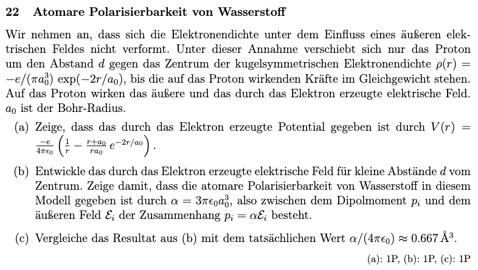
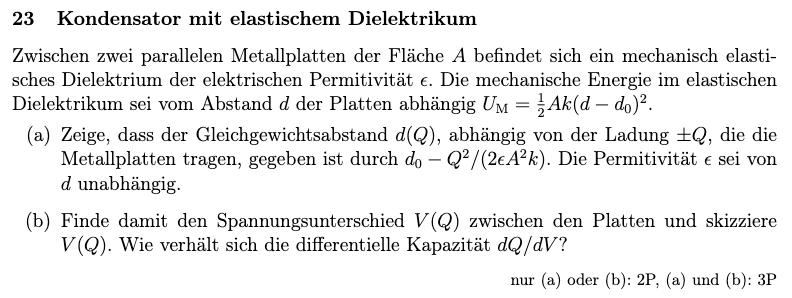
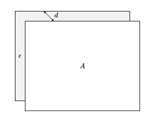
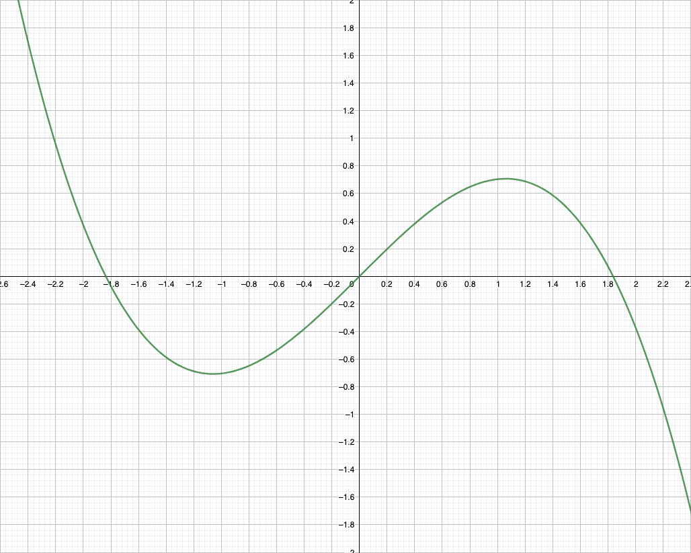
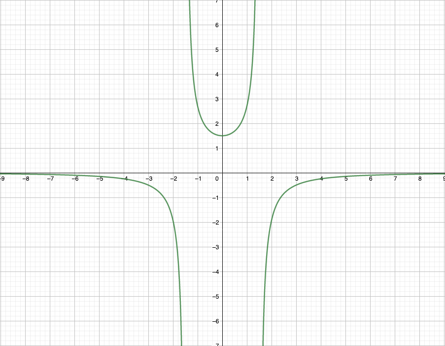
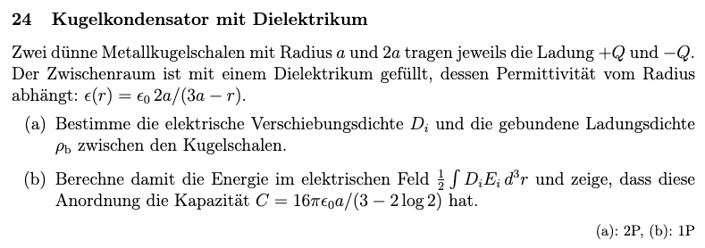
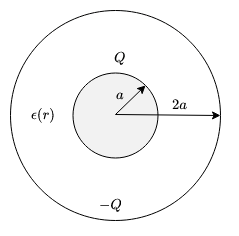

## 8. Problem Set - 18.05.2022
Elektrodynamik I - 136.015

**Gerechnete Beispiele:**
22) 
23) a) & b)
24) a) & b)

### 22 Atomare Polarisierbarkeit von Wasserstoff

#### a)

#### b)

#### c)

### 23 Kondensator mit elastischem Dielektrikum

#### a)

Es soll der Gleichgewichtsabstand $d(Q)$ ermittelt werden. Entsprechend muss zwischen der mechanischen Kraft $F_m$ und der elektrischen Kraft $F_e$ ein Gleichgewicht herrschen:
$$F_e-F_m=0$$
Die mechanische Kraft ist demnach gleich zu der elektrischen Kraft $F_e$:
$$F_m=F_e$$
---

Allgemein ist die mechanische Arbeit (also die mechanische Energie) dadurch definiert, dass sie gegeben ist, wenn ein Körper einen Weg zurücklegt und dabei eine Kraft auf ihn wirkt. Die Berechnung erfolgt gemäß der folgenden Form:
$$U_m=\int_C\boldsymbol{F}_m\,d\boldsymbol{s}$$
Über diesen Zusammenhang, kann die Kraft $\boldsymbol{F}_m$ wie folgt angeschrieben werden:
$$\boldsymbol{F}_m=\frac{\partial U_m}{\partial\boldsymbol{s}}$$
Da in unserem Beispiel der Weg $s$ der Abschand $d$ zwischen den Platten ist, folgt daraus für die Berechnung der Kraft:
$$F_m=\frac{\partial U_m}{\partial d}$$
Mit dem in der Angabe definierten Ausdruck für die mechanische Energie $U_m$ folgt für die mechanische Kraft $F_m$:
$$F_m=\partial_dU_m=\partial_d\left(\frac{1}{2}\cdot A\cdot k\cdot(d-d_0)^2\right)=\frac{1}{\cancel{2}}\cdot\cancel{2}\cdot A\cdot k\cdot(d-d_0)\cdot1$$
$$F_m=A\cdot k\cdot(d-d_0)$$

---

Die elektrische Kraft $F_e$ ist wie folgt definiert:
$$\boldsymbol{F}_e=q\cdot\boldsymbol{E}$$
Nachdem das elektrische Feld $\boldsymbol{E}$ in diesem Beispiel unbekannt ist, kann die elektrische Kraft $F_e$ auch aus der elektrischen Energie $U_e$ hergeleitet werden. Die elektrische Energie ist u.a. definiert als:
$$U_e=q\cdot V$$
Weiters gilt, dass das elektrische Feld $\boldsymbol{E}$ der negative Gradient des elektrischen Potentials $V$ ist:
$$\boldsymbol{E}=-\boldsymbol{\nabla}V$$
Über diese Beziehungen folgt, dass die elektrische Kraft $\boldsymbol{F}_e$ gleich der Ableitung von $U_e$ nach dem Weg (in unserem Fall dem Abstand der Platten, also $d$) ist:
$$\boldsymbol{F}_e=q\cdot(-\boldsymbol{\nabla}V)=-\boldsymbol{\nabla}(\underbrace{q\cdot V}_{=U_e})$$
Somit folgt für die elektrische Kraft:
$$\boldsymbol{F}_e=-\frac{\partial U_e}{\partial d}$$
Die elektrische Energie $U_e$ ist in einem Kondensator u.a. definiert als:
$$U_e=\frac{1}{2}\cdot\frac{Q^2}{C}$$
Weiters gilt für die Kapazität $C$ eines Plattenkondensators:
$$C=\epsilon\cdot\frac{A}{d}$$
Diese Ausdrücke kombiniert ergeben:
$$U_e=\frac{1}{2}\cdot\frac{Q^2\cdot d}{\epsilon\cdot A}$$
Daraus lässt sich nun wie folgt die elektrische Kraft $F_e$ ableiten:
$$F_e=-\frac{\partial U_e}{\partial d}=-\frac{1}{2}\cdot\frac{Q^2}{\epsilon\cdot A}$$

---

Mit dem eingangs beschriebenen Zusammenhang zwischen der elektrischen und der mechanischen Kraft, bei der Verschiebung einer Ladung $Q$ in einem elektrischen Feld $E$ folgt:
$$F_m=F_e$$
$$\implies A\cdot k\cdot(d-d_0)=-\frac{1}{2}\cdot\frac{Q^2}{\epsilon\cdot A}$$
Daraus folgt für den Abstand $d$ in Abhängigkeit von der Ladung $Q$:
$$d(Q)=d_0-\frac{1}{2}\cdot\frac{Q^2}{\epsilon\cdot A^2\cdot k}$$

#### b)
In einem Kondensator gilt allgemein die folgende Beziehung zwischen dem Spannungsunterschied (= der Spannung) $V$, der Ladung $Q$ und der Kapazität $C$:
$$Q=C\cdot V$$
Daraus folgt für die Berechnung des Spannungsunterschiedes:
$$V=\frac{Q}{C}$$
Für die Kapazität $C$ kann erneut die Formel zur Berechnung der Kapazität eines Plattenkondensators eingesetzt werden: (siehe Unterpunkt a) )
$$V=\frac{Q\cdot d}{\epsilon\cdot A}$$
Für den Abstand der Platten $d$ kann nun weiters die in Unterpunkt a) ermittelte Formel eingesetzt werden. Daraus folgt:
$$V(Q)=\frac{Q\cdot d(Q)}{\epsilon\cdot A}=\frac{Q}{\epsilon\cdot A}\cdot\left(d_0-\frac{1}{2}\cdot\frac{Q^2}{\epsilon\cdot A^2\cdot k}\right)$$
---

Skizziert entspricht der Verlauf des Spannungsunterschiedes $V(Q)$:

(Auf der y-Achse ist $V(Q)$ aufgetragen und auf der x-Achse die Ladung $Q$. Für die Skizze wurden für $A$ der Wert $1.5$, für $d_0$ der Wert $1.5$ und für $k$ der Wert $1$ angenommen.)

---

Die differenzielle Kapazität entspricht:
$$\frac{\partial Q}{\partial V}=\left(\frac{\partial V}{\partial Q}\right)^{-1}$$
$$=\left(\partial_Q\left(\frac{Q}{\epsilon\cdot A}\cdot\left(d_0-\frac{1}{2}\cdot\frac{Q^2}{\epsilon\cdot A^2\cdot k}\right)\right)\right)^{-1}$$
Damit folgt für $\left(\frac{\partial V}{\partial Q}\right)^{-1}$: *(Mit Wolfram Alpha berechnet)*
$$\left(\frac{\partial V}{\partial Q}\right)^{-1}=-\frac{3\cdot Q^2-2\cdot A^2\cdot d_0\cdot\epsilon\cdot k}{2\cdot A^3\cdot\epsilon^2\cdot k}$$
Die differenzielle Kapazität entspricht somit:
$$\frac{\partial Q}{\partial V}=-\frac{2\cdot A^3\cdot\epsilon^2\cdot k}{3\cdot Q^2-2\cdot A^2\cdot d_0\cdot\epsilon\cdot k}$$
Der skizzierte Verlauf sieht demnach wie folgt aus: (es wurden die Parameter aus der voran gegangenen Skizze angewandt)

### 24 Kugelkondensator mit Dielektrikum

#### a)

Für die elektrische Verschiebungsdichte $\boldsymbol{D}$ gilt eine Abwandlung des gauß'schen Gesetzes in Integralform. Diese entspricht:
$$\oint_S\boldsymbol{D}\cdot d\boldsymbol{A}=Q_{enclosed}$$
Aus dieser Beziehung kann die elektrische Verschiebungsdichte $\boldsymbol{D}$ ermittelt werden. Nachdem es sich bei der Oberfläche $S$ um eine Kugel handelt (die Oberfläche einer Kugel ist definiert durch $4\pi\cdot\boldsymbol{r}^2$), kann geschrieben werden:
$$\boldsymbol{D}\cdot(4\pi\cdot r^2)=Q_{enclosed}$$
Daraus folgt für die elektrische Verschiebungsdichte$\boldsymbol{D}$:
$$\boldsymbol{D}=\frac{Q_{enclosed}}{4\pi\cdot r^2}\cdot\vec{e}_r$$

---

Darüber hinaus soll die gebundene Ladungsdichte $\rho_b$ ermittelt werden. Diese entspricht der negativen Polarisierung $\boldsymbol{P}$:
$$\rho_b(\boldsymbol{x})=-\nabla\cdot\boldsymbol{P}$$
Die Polarisierung $\boldsymbol{P}$ kann aus dem folgenden Zusammenhang für die elektrische Verschiebungsdichte $\boldsymbol{D}$ ermittelt werden:
$$\boldsymbol{D}=\epsilon_0\cdot\boldsymbol{E}+\boldsymbol{P}$$
$$\boldsymbol{P}=\boldsymbol{D}-\epsilon_0\cdot\boldsymbol{E}$$
Mit dem zuvor beschriebenen Zusammenhang für die gebundene Ladungsdichte $\rho_b$ folgt:
$$\rho_b=-\nabla(\boldsymbol{D}-\epsilon_0\cdot\boldsymbol{E})$$
$$=-\nabla\boldsymbol{D}+\epsilon_0\cdot\nabla\boldsymbol{E}$$
Der Zusammenhang zwischen dem elektrischen Feld $\boldsymbol{E}$ und der elektrischen Verschiebungsdichte $\boldsymbol{D}$ ist definiert durch:
$$\boldsymbol{E}=\frac{\boldsymbol{D}}{\epsilon}$$
Gemäß der Angabe ist die Permittivität $\epsilon$ definiert durch:
$$\epsilon(r)=\frac{\epsilon_o\cdot2\cdot a}{3\cdot a-r}$$
Dadurch folgt für das elektrische Feld $\boldsymbol{E}$:
$$\boldsymbol{E}=\frac{Q_{enclosed}}{4\pi\cdot r^2}\cdot\frac{3\cdot a-r}{\epsilon_o\cdot2\cdot a}\cdot\vec{e}_r=\frac{Q_{enclosed}\cdot(3\cdot a-r)}{8\pi\cdot\epsilon_0\cdot a\cdot r^2}\cdot\vec{e}_r$$
Die Divergenz eines Vektorfeldes $\boldsymbol{F}$ in Kugelkoordinaten ist allgemein definiert als:
$$\nabla\boldsymbol{F}=\frac{1}{r^2}\cdot\frac{\partial}{\partial_r}(r^2\cdot F_r)+\frac{1}{r\cdot\sin{\theta}}\cdot\frac{\partial}{\partial_{\theta}}(F_{\theta}\cdot\sin{\theta})+\frac{1}{r\cdot\sin{\theta}}\cdot\frac{\partial F_{\varphi}}{\partial_{\varphi}}$$
Somit folgt für die Berechnung der gebundenen Ladungsdichte $\rho_b$ :
$$\rho_b=\epsilon_0\cdot\frac{1}{r^2}\cdot\partial_r(r^2\cdot \boldsymbol{E})-\frac{1}{r^2}\cdot\partial_r(r^2\cdot \boldsymbol{D})$$
Setzt man die Ergebnisse der vorangegangenen Berechnungen für das elektrische Feld $\boldsymbol{E}$ und die elektrische Verschiebungsdichte $\boldsymbol{D}$ ein, folgt:
$$\rho_b=\epsilon_0\cdot\frac{1}{r^2}\cdot\partial_r\left(\cancel{r^2}\cdot\frac{Q_{enclosed}\cdot(3\cdot a-r)}{8\pi\cdot\epsilon_0\cdot a\cdot\cancel{r^2}}\right)-\frac{1}{r^2}\cdot\partial_r\left(\cancel{r^2}\cdot\frac{Q_{enclosed}}{4\pi\cdot\cancel{r^2}}\right)$$
$$=\epsilon_0\cdot\frac{1}{r^2}\cdot\partial_r\left(\frac{Q_{enclosed}\cdot(3\cdot a-r)}{8\pi\cdot\epsilon_0\cdot a}\right)-\underbrace{\frac{1}{r^2}\cdot\partial_r\left(\frac{Q_{enclosed}}{4\pi}\right)}_{=0}$$
Nachdem in dem zweiten Term keine Abhängigkeit von $r$ besteht, ergibt dieser sich bei der Ableitung nach $r$ zu $0$:
$$\rho_b=\epsilon_0\cdot\frac{1}{r^2}\cdot\partial_r\left(\frac{Q_{enclosed}\cdot(3\cdot a-r)}{8\pi\cdot\epsilon_0\cdot a}\right)=\cancel{\epsilon_0}\cdot\frac{Q_{enclosed}}{8\pi\cdot\cancel{\epsilon_0}\cdot r^2\cdot a}\cdot\underbrace{\partial_r(3\cdot a-r)}_{=-1}$$
Daraus folgt final für die gebundene Ladungsdichte $\rho_b$:
$$\rho_b=-\frac{Q}{8\pi\cdot r^2\cdot a}$$

#### b)
Die Energie $U$ im elektrischen Feld kann gemäß der Angabe über den folgenden Zusammenhang berechnet werden:
$$U=\frac{1}{2}\cdot\int D_iE_i\,d^3r$$
Durch Einsetzen der Berechnungen aus Unterpunkt a) folgt für die Energie $U$:
$$U=\frac{1}{2}\cdot\int\frac{Q}{4\pi\cdot r^2}\cdot\frac{Q\cdot(3\cdot a-r)}{8\pi\cdot\epsilon_0\cdot a\cdot r^2}\,d^3r$$
Durch die Linearität der Integration folgt:
$$U=\frac{1}{2}\cdot\frac{Q^2}{32\cdot\pi^2\cdot\epsilon_0\cdot a}\cdot\int\frac{3\cdot a-r}{r^4}\,d^3r$$
Weiters kann nun für die Volumensintegration einer Kugel eingesetzt werden:
$$dV=r^2\cdot\sin{\theta}\,dr\,d\theta\,d\varphi$$
Damit folgt für die Energie $U$:
$$U=\frac{1}{2}\cdot\frac{Q^2}{32\cdot\pi^2\cdot\epsilon_0\cdot a}\cdot\int_0^{2\pi}\int_0^{\pi}\int_a^{2a}\frac{3\cdot a-r}{r^{\cancel{4}}}\cdot \cancel{r^2}\cdot\sin{\theta}\,dr\,d\theta\,d\varphi$$
$$=\frac{Q^2}{\cancel{64}^{16}\cdot\pi^{\cancel{2}}\cdot\epsilon_0\cdot a}\cdot\cancel{4}\cancel{\pi}\cdot\int_a^{2a}\frac{3\cdot a-r}{r^2}\,dr$$
$$=\frac{Q^2}{16\cdot\pi\cdot\epsilon_0\cdot a}\cdot\int_a^{2a}\frac{3\cdot a-r}{r^2}\,dr$$
Das Integral $\int_a^{2a}\frac{3\cdot a-r}{r^2}\,dr$ kann separat berechnet werden:
$$\int_a^{2a}\frac{3\cdot a-r}{r^2}\,dr=\int_a^{2a}\frac{3\cdot a}{r^2}\,dr-\int_a^{2a}\frac{1}{r}\,dr$$
$$=\left(-\frac{3\cdot a}{r}\right)\Biggl\vert_a^{2a}-\ln{r}\Biggl\vert_a^{2a}$$
Damit folgt für den Term:
$$\int_a^{2a}\frac{3\cdot a-r}{r^2}\,dr=\underbrace{-\frac{3\cdot\cancel{a}}{2\cdot\cancel{a}}+\frac{3\cdot\cancel{a}}{\cancel{a}}}_{=-\frac{3}{2}+\frac{6}{2}=\frac{3}{2}}-\underbrace{\ln{(2\cdot a)}+\ln{(a)}}_{=\ln{(\frac{a}{2\cdot a})=\ln{(\frac{1}{2})}}}$$
$$=\frac{3}{2}+\ln{\frac{1}{2}}=\frac{3}{2}-\ln{2}$$
Eingesetzt in die Berechnung der Energie $U$ folgt somit final:
$$U=\frac{Q^2}{16\cdot\pi\cdot\epsilon_0\cdot a}\cdot\left(\frac{3}{2}-\ln{2}\right)$$
Im letzten Schritt soll gezeigt werden, dass diese Anordnung die in der Angabe bezeichnete Kapazität hat. Die Kapazität $C$ kann über den folgenden Zusammenhang zwischen der Energie $U$ und der Kapazität $C$ ermittelt werden:
$$U=\frac{1}{2}\cdot\frac{Q^2}{C}$$
Damit folgt für die Berechnung der Kapazität $C$:
$$C=\frac{1}{2}\cdot\frac{Q^2}{U}$$
In diesen Zusammenhang kann nun die voran gegangene Berechnung für die Energie $U$ eingesetzt werden:
$$C=\frac{\cancel{Q^2}\cdot16\cdot\pi\cdot\epsilon_0\cdot a}{2\cdot\cancel{Q^2}\cdot(\frac{3}{2}-\ln{2})}=\frac{16\cdot\pi\cdot\epsilon_0\cdot a}{2\cdot(\frac{3}{2}-\ln{2})}$$
Somit wurde gezeigt, dass die Kapazität $C$ dem in der Angabe beschriebenen Term entspricht:
$$C=\frac{16\cdot\pi\cdot\epsilon_0\cdot a}{3-2\cdot\ln{2}}$$
